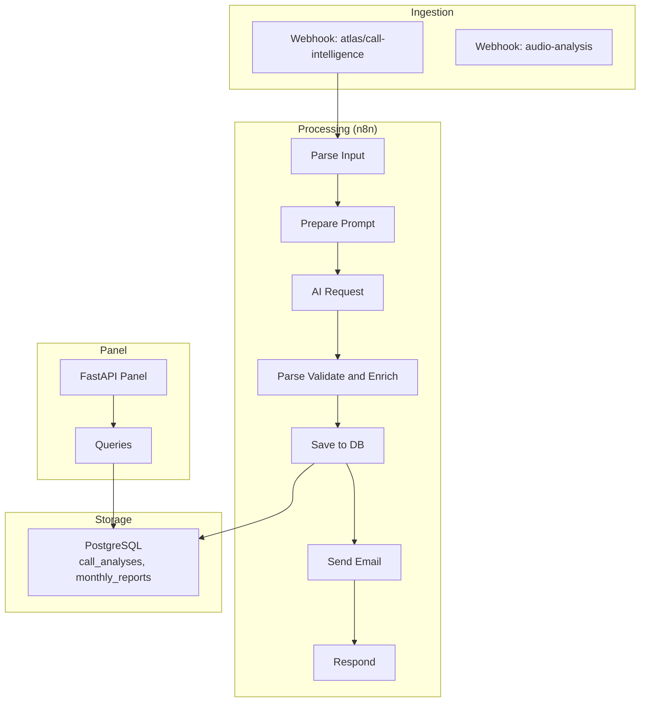
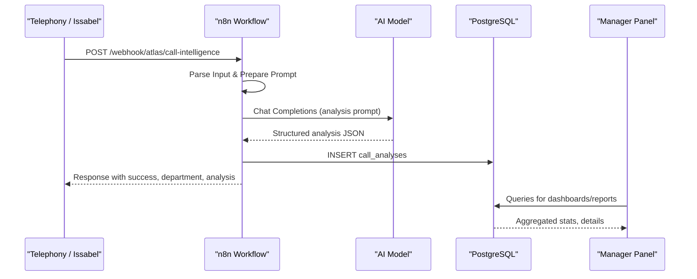
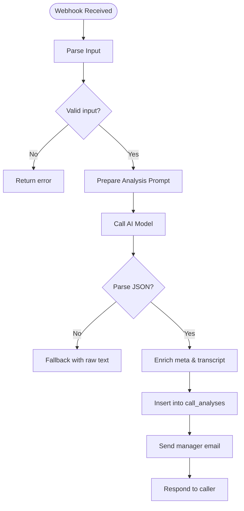
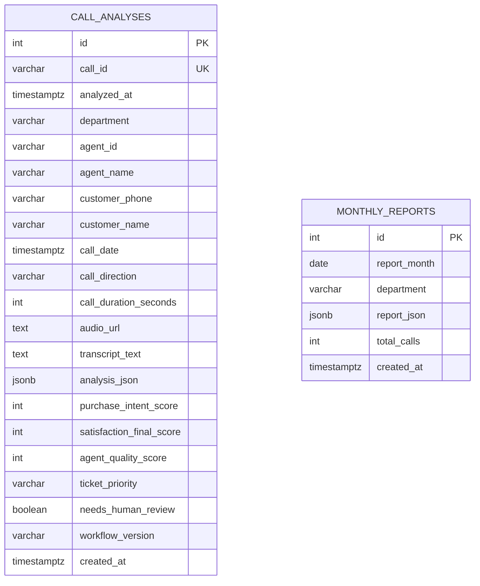
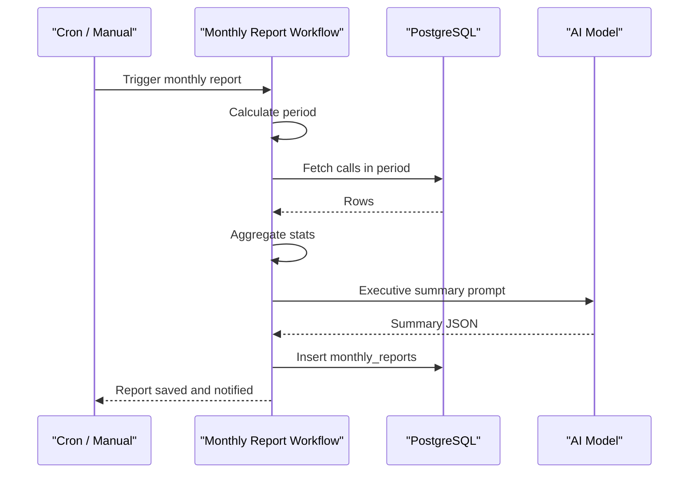
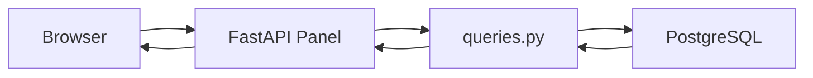
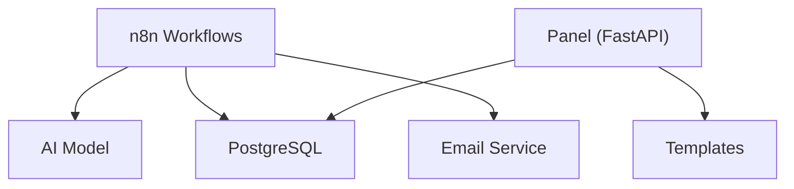

# Atlas Call Intelligence

<cite>
**Referenced Files in This Document**
- [README.md](file://03_Products/Atlas Call Intelligence/V1/README.md)
- [schema.json](file://03_Products/Atlas Call Intelligence/V1/schema.json)
- [atlas-call-intelligence-v1.json](file://docker/n8n/workflows/atlas-call-intelligence-v1.json)
- [audio-analysis-workflow.json](file://docker/n8n/workflows/audio-analysis-workflow.json)
- [atlas-call-intelligence-monthly-report.json](file://docker/n8n/workflows/atlas-call-intelligence-monthly-report.json)
- [001_call_intelligence.sql](file://docker/postgres/init/001_call_intelligence.sql)
- [main.py](file://docker/panel/app/main.py)
- [queries.py](file://docker/panel/app/queries.py)
- [db.py](file://docker/panel/app/db.py)
- [send-real-call-analysis.py](file://docker/scripts/send-real-call-analysis.py)
- [test-result-final.json](file://docker/scripts/test-result-final.json)
</cite>

## Table of Contents
1. Introduction
2. Project Structure
3. Core Components
4. Architecture Overview
5. Detailed Component Analysis
6. Dependency Analysis
7. Performance Considerations
8. Troubleshooting Guide
9. Conclusion
10. Appendices

## Introduction
Atlas Call Intelligence is an AI-powered call analysis and transcription product designed for accounting firms to improve customer service quality and sales team performance. It ingests audio recordings or transcripts, performs automated transcription (optional), analyzes sentiment and intent, evaluates agent performance, and stores structured results for reporting and dashboards. The system supports monthly aggregated reports and provides a manager panel to visualize insights such as top performers, ready-to-buy leads, unhappy customers, and staff satisfaction.

Key capabilities:
- Call processing pipeline from telephony recording to AI analysis and storage
- Sentiment analysis and satisfaction scoring with initial/final deltas
- Performance metrics extraction for agents and departments
- Standardized JSON schema for consistent analytics
- Manager panel with dashboards and drill-down views
- Monthly reporting with executive summaries

## Project Structure
The product is composed of:
- Product documentation and schema definition under the product folder
- n8n workflows orchestrating call analysis and monthly reporting
- PostgreSQL database schema for call analyses and monthly reports
- A FastAPI-based manager panel for visualization and queries
- Scripts for testing and real-world call analysis examples

**Diagram sources**
- [atlas-call-intelligence-v1.json:11-158](file://docker/n8n/workflows/atlas-call-intelligence-v1.json#L11-L158)
- [001_call_intelligence.sql:4-44](file://docker/postgres/init/001_call_intelligence.sql#L4-L44)
- [main.py:68-186](file://docker/panel/app/main.py#L68-L186)
- [queries.py:6-259](file://docker/panel/app/queries.py#L6-L259)

**Section sources**
- [README.md:16-28](file://03_Products/Atlas Call Intelligence/V1/README.md#L16-L28)
- [atlas-call-intelligence-v1.json:11-158](file://docker/n8n/workflows/atlas-call-intelligence-v1.json#L11-L158)
- [001_call_intelligence.sql:4-44](file://docker/postgres/init/001_call_intelligence.sql#L4-L44)
- [main.py:68-186](file://docker/panel/app/main.py#L68-L186)

## Core Components
- Ingestion Webhooks: Accept call metadata, audio URLs, or transcripts; normalize inputs and route to analysis.
- AI Analysis: Build prompts tailored to sales/support context and call metadata; call LLM to produce standardized analysis.
- Data Persistence: Store full transcript, analysis JSON, and extracted KPIs into PostgreSQL for reporting.
- Notifications: Send manager emails summarizing tickets and key metrics.
- Reporting: Generate monthly reports by aggregating call data and producing AI-generated executive summaries.
- Manager Panel: Serve dashboards and detailed views over call analyses and monthly reports.

**Section sources**
- [atlas-call-intelligence-v1.json:11-158](file://docker/n8n/workflows/atlas-call-intelligence-v1.json#L11-L158)
- [atlas-call-intelligence-monthly-report.json:11-172](file://docker/n8n/workflows/atlas-call-intelligence-monthly-report.json#L11-L172)
- [001_call_intelligence.sql:4-44](file://docker/postgres/init/001_call_intelligence.sql#L4-L44)
- [main.py:68-186](file://docker/panel/app/main.py#L68-L186)

## Architecture Overview
End-to-end flow:
- Telephony system records calls and sends audio URL + metadata to the Atlas webhook.
- n8n parses input, builds an analysis prompt, calls the AI model, validates output, saves to DB, and optionally emails managers.
- Panel reads from PostgreSQL to render dashboards and detailed pages.
- Monthly report workflow aggregates past month’s data, generates AI summary, persists report, and notifies managers.

**Diagram sources**
- [atlas-call-intelligence-v1.json:11-158](file://docker/n8n/workflows/atlas-call-intelligence-v1.json#L11-L158)
- [001_call_intelligence.sql:4-44](file://docker/postgres/init/001_call_intelligence.sql#L4-L44)
- [main.py:68-186](file://docker/panel/app/main.py#L68-L186)

## Detailed Component Analysis

### Call Processing Pipeline
- Input normalization: Accepts multiple field names for audio URL, transcript, and metadata; validates required fields.
- Prompt construction: Injects product context, department hint, and metadata to guide the AI toward accurate analysis.
- AI request: Calls configured endpoint with model and messages; handles varied response formats.
- Validation and enrichment: Parses JSON, enriches meta fields, ensures transcript presence, and prepares notifications.
- Storage: Inserts normalized fields and full analysis JSON into call_analyses with upsert on call_id.
- Notification: Sends manager email with ticket summary and key scores.

**Diagram sources**
- [atlas-call-intelligence-v1.json:25-158](file://docker/n8n/workflows/atlas-call-intelligence-v1.json#L25-L158)

**Section sources**
- [atlas-call-intelligence-v1.json:25-158](file://docker/n8n/workflows/atlas-call-intelligence-v1.json#L25-L158)

### Transcription Handling
- Supports two modes:
  - Audio URL provided: external transcription can be performed upstream; the workflow expects transcript or audio URL.
  - Transcript provided directly: bypasses transcription step.
- Transcript segments and word counts are captured when available; otherwise full_text is stored.

Practical note: If your telephony system cannot provide transcripts, pre-process audio to text before calling the webhook.

**Section sources**
- [atlas-call-intelligence-v1.json:25-46](file://docker/n8n/workflows/atlas-call-intelligence-v1.json#L25-L46)
- [schema.json:33-51](file://03_Products/Atlas Call Intelligence/V1/schema.json#L33-L51)

### Sentiment Analysis Capabilities
- Customer sentiment is analyzed with overall classification and numeric score; voice indicators may be included if available.
- Satisfaction tracking includes initial and final scores with delta and resolution status.
- Quality control flags help identify low-quality transcripts or cases needing human review.

Benefits for accounting firms:
- Detect early signs of dissatisfaction and intervene proactively.
- Measure improvement in satisfaction across campaigns or training initiatives.

**Section sources**
- [schema.json:53-77](file://03_Products/Atlas Call Intelligence/V1/schema.json#L53-L77)
- [atlas-call-intelligence-v1.json:62-71](file://docker/n8n/workflows/atlas-call-intelligence-v1.json#L62-L71)

### Performance Metrics Extraction
- Agent performance metrics include response quality, communication skills, product knowledge, empathy, and process adherence.
- Sales-specific metrics: purchase intent score, price sensitivity, estimated discount to close, close probability, recommended next steps.
- Support-specific metrics: issue category, resolution status, first call resolution flag, retention risk.

Use cases:
- Identify top performers and coaching needs.
- Align incentives with measurable outcomes like satisfaction and intent.

**Section sources**
- [schema.json:79-118](file://03_Products/Atlas Call Intelligence/V1/schema.json#L79-L118)
- [queries.py:26-165](file://docker/panel/app/queries.py#L26-L165)

### Data Schema for Analyses and Reports
- call_analyses table stores per-call metadata, transcript, analysis JSON, and extracted KPIs with indexes for efficient querying.
- monthly_reports table stores aggregated monthly reports with JSON payload and total call counts.

**Diagram sources**
- [001_call_intelligence.sql:4-44](file://docker/postgres/init/001_call_intelligence.sql#L4-L44)

**Section sources**
- [001_call_intelligence.sql:4-44](file://docker/postgres/init/001_call_intelligence.sql#L4-L44)

### Monthly Reporting Workflow
- Triggered monthly via cron or manual webhook.
- Calculates period, fetches calls within range, aggregates statistics by department and agent.
- Generates AI executive summary and persists report JSON.
- Notifies managers with highlights and recommendations.

**Diagram sources**
- [atlas-call-intelligence-monthly-report.json:11-172](file://docker/n8n/workflows/atlas-call-intelligence-monthly-report.json#L11-L172)

**Section sources**
- [atlas-call-intelligence-monthly-report.json:11-172](file://docker/n8n/workflows/atlas-call-intelligence-monthly-report.json#L11-L172)

### Manager Panel and Dashboards
- FastAPI app serves login-protected pages for dashboard, top performers, ready-to-buy leads, unhappy customers, staff performance, call duration, satisfaction, successful sales, and monthly reports.
- Queries compute overview stats, rankings, and breakdowns from call_analyses and monthly_reports.

**Diagram sources**
- [main.py:40-186](file://docker/panel/app/main.py#L40-L186)
- [queries.py:6-259](file://docker/panel/app/queries.py#L6-L259)
- [db.py:8-30](file://docker/panel/app/db.py#L8-L30)

**Section sources**
- [main.py:40-186](file://docker/panel/app/main.py#L40-L186)
- [queries.py:6-259](file://docker/panel/app/queries.py#L6-L259)

### Practical Examples for Accounting Firms
- Improve customer service quality:
  - Use sentiment and satisfaction deltas to identify calls where customers left dissatisfied and schedule follow-ups.
  - Track first call resolution and retention risk to reduce churn.
- Enhance sales team performance:
  - Monitor purchase intent and close probability to prioritize hot leads.
  - Use estimated discount to close and recommended next steps to coach agents on pricing negotiations.
- Operational insights:
  - Review agent quality scores and strengths/improvements to tailor training.
  - Leverage monthly reports to benchmark departments and recognize top performers.

[No sources needed since this section provides general guidance]

## Dependency Analysis
- n8n workflows depend on:
  - AI model endpoint (configurable via environment variables)
  - PostgreSQL credentials for persistence
  - Optional mailer service for manager notifications
- Panel depends on:
  - PostgreSQL connection settings
  - Jinja2 templates for rendering
  - Optional AI insights endpoint for executive summaries

**Diagram sources**
- [atlas-call-intelligence-v1.json:47-119](file://docker/n8n/workflows/atlas-call-intelligence-v1.json#L47-L119)
- [atlas-call-intelligence-monthly-report.json:80-119](file://docker/n8n/workflows/atlas-call-intelligence-monthly-report.json#L80-L119)
- [main.py:16-186](file://docker/panel/app/main.py#L16-L186)
- [db.py:8-30](file://docker/panel/app/db.py#L8-L30)

**Section sources**
- [atlas-call-intelligence-v1.json:47-119](file://docker/n8n/workflows/atlas-call-intelligence-v1.json#L47-L119)
- [atlas-call-intelligence-monthly-report.json:80-119](file://docker/n8n/workflows/atlas-call-intelligence-monthly-report.json#L80-L119)
- [main.py:16-186](file://docker/panel/app/main.py#L16-L186)
- [db.py:8-30](file://docker/panel/app/db.py#L8-L30)

## Performance Considerations
- Indexing: call_analyses and monthly_reports have indexes on analyzed_at, agent_id, department, call_date, and report_month to optimize dashboard queries.
- Query efficiency: Panel queries aggregate using filters and groupings; ensure proper indexing and avoid scanning large datasets without filters.
- AI latency: Configure timeouts and consider caching or batching for high-volume scenarios.
- Storage growth: Archive older call_analyses periodically and retain only necessary fields for long-term reporting.

[No sources needed since this section provides general guidance]

## Troubleshooting Guide
Common issues and resolutions:
- Invalid input: Ensure either audioUrl or transcript is provided; check field name variations handled by parse logic.
- AI parse errors: If JSON parsing fails, fallback behavior preserves raw text; inspect logs and adjust prompts or model parameters.
- Database write failures: Verify PostgreSQL credentials and connectivity; confirm schema initialization.
- Email delivery: Check mailer endpoint availability and configuration; handle continueOnFail gracefully.

Diagnostic references:
- Example test result shows parse_error handling and notification structure.
- Real call analysis script demonstrates end-to-end analysis and email sending.

**Section sources**
- [atlas-call-intelligence-v1.json:62-119](file://docker/n8n/workflows/atlas-call-intelligence-v1.json#L62-L119)
- [test-result-final.json:1-17](file://docker/scripts/test-result-final.json#L1-L17)
- [send-real-call-analysis.py:17-214](file://docker/scripts/send-real-call-analysis.py#L17-L214)

## Conclusion
Atlas Call Intelligence delivers a robust, scalable pipeline for call analysis, sentiment evaluation, and performance metrics extraction tailored to accounting firms. With standardized schemas, reliable storage, and actionable dashboards, it enables continuous improvement in customer service and sales effectiveness. Monthly reporting and manager notifications ensure leadership visibility and timely interventions.

[No sources needed since this section summarizes without analyzing specific files]

## Appendices

### API Reference: Call Analysis
- Endpoint: POST /webhook/atlas/call-intelligence
- Inputs: audioUrl or transcript; optional metadata including call_id, department, agent info, customer info, direction, duration, date, product context.
- Output: success flag, call_id, department, stored_in_db indicator, analysis object, manager_notification.

**Section sources**
- [README.md:71-142](file://03_Products/Atlas Call Intelligence/V1/README.md#L71-L142)

### API Reference: Monthly Report
- Endpoint: POST /webhook/atlas/call-intelligence/monthly-report
- Body: year, month (optional); defaults to previous month if omitted.
- Output: aggregated stats, AI executive summary, report persisted to monthly_reports.

**Section sources**
- [README.md:144-161](file://03_Products/Atlas Call Intelligence/V1/README.md#L144-L161)
- [atlas-call-intelligence-monthly-report.json:11-172](file://docker/n8n/workflows/atlas-call-intelligence-monthly-report.json#L11-L172)