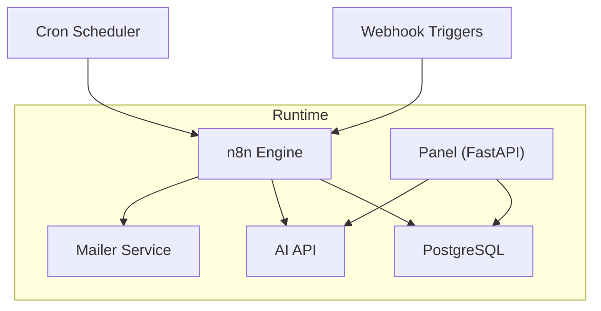
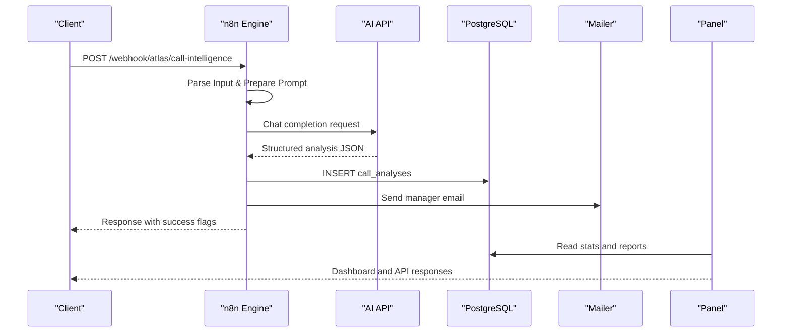
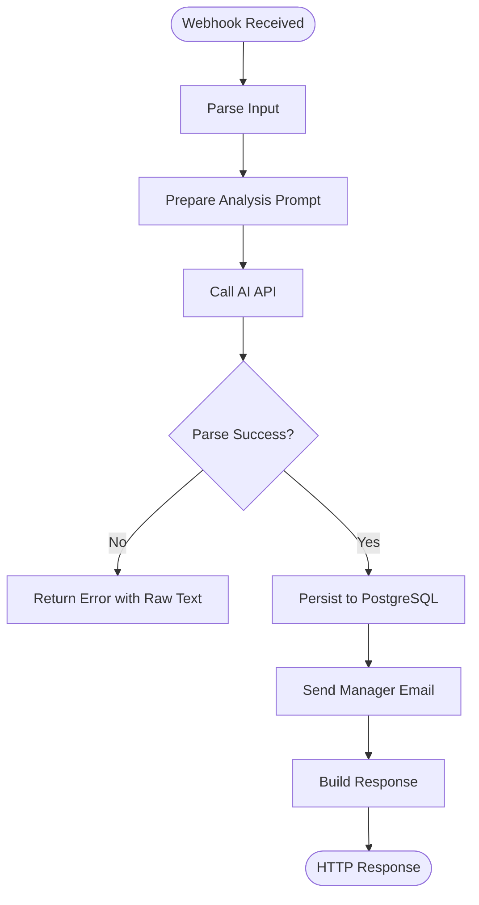
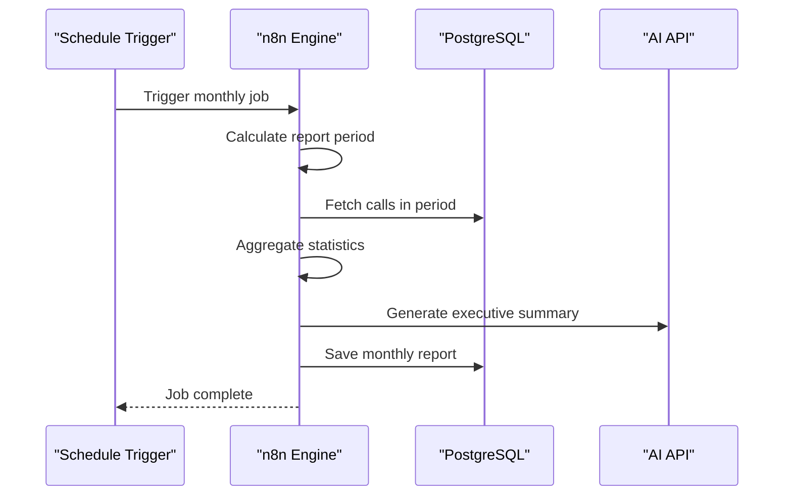
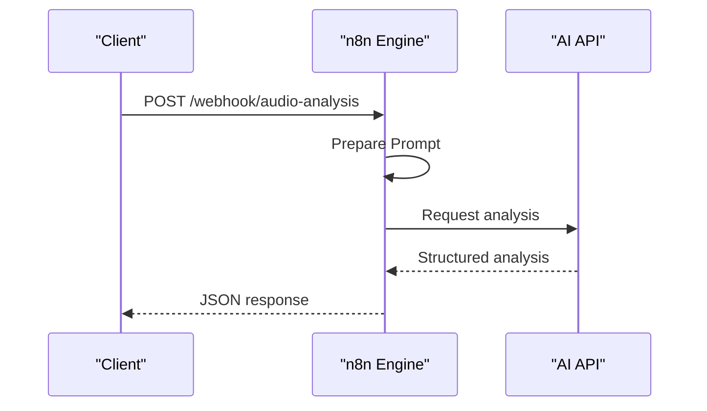
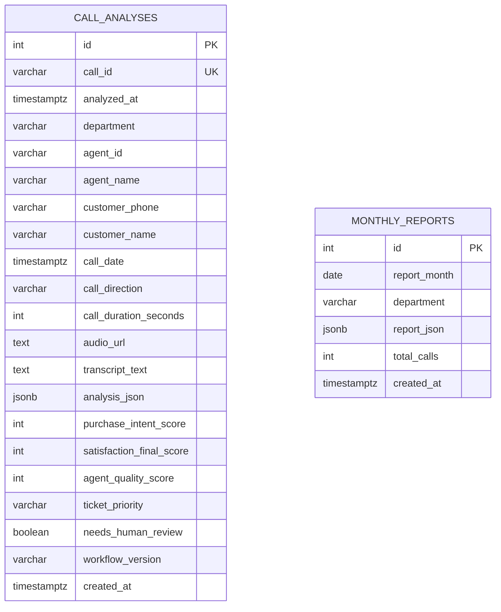
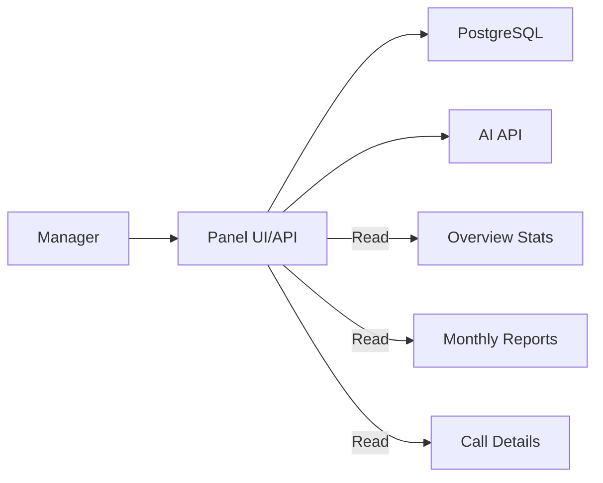
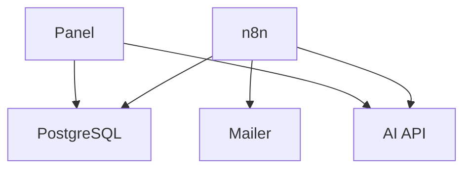

# Atlas Flow

<cite>
**Referenced Files in This Document**
- [docker-compose.yml](file://docker/docker-compose.yml)
- [atlas-call-intelligence-v1.json](file://docker/n8n/workflows/atlas-call-intelligence-v1.json)
- [atlas-call-intelligence-monthly-report.json](file://docker/n8n/workflows/atlas-call-intelligence-monthly-report.json)
- [audio-analysis-workflow.json](file://docker/n8n/workflows/audio-analysis-workflow.json)
- [001_call_intelligence.sql](file://docker/postgres/init/001_call_intelligence.sql)
- [postgres.json](file://docker/n8n/credentials/postgres.json)
- [main.py](file://docker/panel/app/main.py)
- [queries.py](file://docker/panel/app/queries.py)
- [run-test.ps1](file://docker/scripts/run-test.ps1)
- [Pain Points.md](file://Pain Points.md)
</cite>

## Table of Contents
1. [Introduction](#introduction)
2. [Project Structure](#project-structure)
3. [Core Components](#core-components)
4. [Architecture Overview](#architecture-overview)
5. [Detailed Component Analysis](#detailed-component-analysis)
6. [Dependency Analysis](#dependency-analysis)
7. [Performance Considerations](#performance-considerations)
8. [Troubleshooting Guide](#troubleshooting-guide)
9. [Conclusion](#conclusion)
10. [Appendices](#appendices)

## Introduction
Atlas Flow is the workflow automation and process mapping layer within Project Atlas. It orchestrates end-to-end automations by combining n8n workflows, a PostgreSQL data store, an AI service, and a manager panel for monitoring and reporting. The system focuses on flow automation, process mapping, and task scheduling to streamline operations typical in accounting firms—such as call analysis, ticket creation, monthly reporting, and manager notifications.

Key capabilities:
- Flow automation: Connect triggers (webhooks, schedules) to processing steps (AI calls, database writes, email).
- Process mapping: Visualize and maintain multi-step workflows with clear nodes and connections.
- Task scheduling: Run recurring tasks (e.g., monthly reports) via cron-based triggers.
- Status monitoring: Provide dashboards and APIs to inspect call analyses, agent performance, and report status.

## Project Structure
The Atlas Flow runtime is containerized and composed of:
- n8n: Workflow engine hosting webhooks, schedulers, code nodes, HTTP requests, and database integrations.
- PostgreSQL: Persistent storage for call analyses and monthly reports.
- Panel: FastAPI-based manager UI and API for insights and monitoring.
- Mailer: Lightweight service to send manager emails triggered by workflows.
- Scripts: Utilities to test and exercise flows.

**Diagram sources**
- [docker-compose.yml:26-61](file://docker/docker-compose.yml#L26-L61)
- [docker-compose.yml:80-98](file://docker/docker-compose.yml#L80-L98)
- [docker-compose.yml:62-79](file://docker/docker-compose.yml#L62-L79)

**Section sources**
- [docker-compose.yml:1-98](file://docker/docker-compose.yml#L1-L98)

## Core Components
- n8n Workflows: Define flow automation using webhook triggers, code transformations, AI requests, database persistence, and email notifications.
- Data Layer: PostgreSQL tables for per-call analysis and monthly aggregated reports.
- Manager Panel: Web UI and REST endpoints to view stats, top performers, unhappy customers, staff performance, and monthly reports.
- Email Notifications: Outbound emails to managers based on workflow outcomes.
- Test Utilities: Scripts to invoke webhooks and validate end-to-end behavior.

**Section sources**
- [atlas-call-intelligence-v1.json:1-159](file://docker/n8n/workflows/atlas-call-intelligence-v1.json#L1-L159)
- [atlas-call-intelligence-monthly-report.json:1-172](file://docker/n8n/workflows/atlas-call-intelligence-monthly-report.json#L1-L172)
- [001_call_intelligence.sql:1-45](file://docker/postgres/init/001_call_intelligence.sql#L1-L45)
- [main.py:85-204](file://docker/panel/app/main.py#L85-L204)
- [queries.py:1-33](file://docker/panel/app/queries.py#L1-L33)
- [run-test.ps1:1-37](file://docker/scripts/run-test.ps1#L1-L37)

## Architecture Overview
Atlas Flow composes event-driven flows that:
- Ingest events via webhooks or schedule triggers.
- Transform and enrich payloads using code nodes.
- Call AI services to analyze content and produce structured outputs.
- Persist results to PostgreSQL for analytics and reporting.
- Notify stakeholders via email.
- Expose read-only views through the Panel for monitoring and decision-making.

**Diagram sources**
- [atlas-call-intelligence-v1.json:10-159](file://docker/n8n/workflows/atlas-call-intelligence-v1.json#L10-L159)
- [atlas-call-intelligence-monthly-report.json:10-172](file://docker/n8n/workflows/atlas-call-intelligence-monthly-report.json#L10-L172)
- [001_call_intelligence.sql:4-45](file://docker/postgres/init/001_call_intelligence.sql#L4-L45)
- [main.py:85-204](file://docker/panel/app/main.py#L85-L204)

## Detailed Component Analysis

### Call Intelligence Flow Automation
This flow demonstrates end-to-end flow automation for call analysis:
- Triggered by a webhook endpoint.
- Parses and validates input, prepares prompts for AI.
- Calls AI to generate structured analysis including department classification, satisfaction scores, sales intent, and ticketing metadata.
- Persists results to PostgreSQL.
- Sends manager notifications via email.
- Returns a response indicating success and key fields.

**Diagram sources**
- [atlas-call-intelligence-v1.json:10-159](file://docker/n8n/workflows/atlas-call-intelligence-v1.json#L10-L159)

**Section sources**
- [atlas-call-intelligence-v1.json:10-159](file://docker/n8n/workflows/atlas-call-intelligence-v1.json#L10-L159)

### Monthly Report Task Scheduling
A scheduled task runs monthly to aggregate call data, generate executive summaries, and persist reports:
- Uses a cron-based schedule trigger and supports manual invocation via webhook.
- Calculates report period and fetches relevant records from PostgreSQL.
- Aggregates statistics by department and agent.
- Invokes AI to produce an executive summary in Persian.
- Builds a comprehensive report and stores it in the monthly_reports table.
- Optionally notifies managers.

**Diagram sources**
- [atlas-call-intelligence-monthly-report.json:10-172](file://docker/n8n/workflows/atlas-call-intelligence-monthly-report.json#L10-L172)

**Section sources**
- [atlas-call-intelligence-monthly-report.json:10-172](file://docker/n8n/workflows/atlas-call-intelligence-monthly-report.json#L10-L172)

### Audio Analysis Workflow
A simpler flow focused on summarizing audio transcripts:
- Receives transcript via webhook.
- Prepares a prompt for categorization and insight extraction.
- Calls AI to return structured output (category, sentiment, key takeaways).
- Responds immediately with the analysis.

**Diagram sources**
- [audio-analysis-workflow.json:1-139](file://docker/n8n/workflows/audio-analysis-workflow.json#L1-L139)

**Section sources**
- [audio-analysis-workflow.json:1-139](file://docker/n8n/workflows/audio-analysis-workflow.json#L1-L139)

### Data Model and Persistence
PostgreSQL schema defines:
- call_analyses: Stores per-call AI analysis, metadata, scores, and flags.
- monthly_reports: Stores aggregated monthly reports with totals and JSON payload.
- Indexes optimize queries for time ranges, departments, agents, and report months.

**Diagram sources**
- [001_call_intelligence.sql:4-45](file://docker/postgres/init/001_call_intelligence.sql#L4-L45)

**Section sources**
- [001_call_intelligence.sql:4-45](file://docker/postgres/init/001_call_intelligence.sql#L4-L45)

### Manager Panel Monitoring
The Panel provides:
- Dashboard with overview stats, top performers, recent calls, and department breakdown.
- Pages for ready-to-buy leads, unhappy customers, staff performance, call duration, successful sales.
- Monthly reports listing and detail views.
- AI insights endpoint to generate executive insights from context.
- Authentication middleware to protect sensitive pages.

**Diagram sources**
- [main.py:85-204](file://docker/panel/app/main.py#L85-L204)
- [queries.py:1-33](file://docker/panel/app/queries.py#L1-L33)

**Section sources**
- [main.py:85-204](file://docker/panel/app/main.py#L85-L204)
- [queries.py:1-33](file://docker/panel/app/queries.py#L1-L33)

## Dependency Analysis
Atlas Flow integrates multiple services with clear boundaries:
- n8n depends on PostgreSQL for persistence and on the AI API for analysis.
- Workflows depend on credentials configured for PostgreSQL.
- Panel depends on PostgreSQL for data and optionally on AI for insights.
- Mailer is invoked by workflows for notifications.

**Diagram sources**
- [docker-compose.yml:26-61](file://docker/docker-compose.yml#L26-L61)
- [docker-compose.yml:80-98](file://docker/docker-compose.yml#L80-L98)
- [postgres.json:1-14](file://docker/n8n/credentials/postgres.json#L1-L14)

**Section sources**
- [docker-compose.yml:26-61](file://docker/docker-compose.yml#L26-L61)
- [postgres.json:1-14](file://docker/n8n/credentials/postgres.json#L1-L14)

## Performance Considerations
- Use indexes on frequently queried columns (call_date, department, agent_id, report_month) to speed up dashboard and reporting queries.
- Keep AI model selection and temperature tuned for throughput and accuracy; lower temperature improves consistency for structured outputs.
- Enable continue-on-fail for non-critical steps (e.g., email) to avoid blocking core flows.
- Batch operations where possible; monthly aggregation reduces repeated AI calls.
- Monitor webhook timeouts and adjust mailer timeouts to handle network variability.

[No sources needed since this section provides general guidance]

## Troubleshooting Guide
Common issues and resolutions:
- Webhook not reachable: Verify n8n port exposure and path configuration.
- Database connection failures: Check credentials and environment variables for PostgreSQL host, user, password, and database name.
- AI API errors: Validate API_URL, API_KEY, and model settings; ensure network access from n8n container.
- Email delivery failures: Confirm SMTP settings and mailer service availability; use retry logic or fallback paths.
- Panel authentication: Ensure PANEL_PASSWORD is set if required; verify cookie and middleware behavior.

Useful references:
- Test script invokes the call intelligence webhook and logs results, aiding quick validation.
- Panel routes expose stats and report endpoints for inspection.

**Section sources**
- [run-test.ps1:1-37](file://docker/scripts/run-test.ps1#L1-L37)
- [docker-compose.yml:34-53](file://docker/docker-compose.yml#L34-L53)
- [docker-compose.yml:70-76](file://docker/docker-compose.yml#L70-L76)
- [main.py:57-82](file://docker/panel/app/main.py#L57-L82)

## Conclusion
Atlas Flow delivers robust flow automation, process mapping, and task scheduling for accounting firm operations. By leveraging n8n workflows, persistent analytics, and a manager panel, teams can automate repetitive tasks, gain actionable insights, and monitor performance effectively. The modular architecture allows easy extension to new processes while maintaining reliability and observability.

[No sources needed since this section summarizes without analyzing specific files]

## Appendices

### Practical Examples for Accounting Firms
- Contract renewal automation: Schedule reminders, draft renewal notices, update CRM, and notify accountants when contracts are due.
- Invoice reconciliation flow: Ingest bank statements, match transactions, flag discrepancies, and create tickets for review.
- Monthly financial reporting: Aggregate transaction data, run validations, generate reports, and distribute to stakeholders.

These examples align with identified pain points and demonstrate how Atlas Flow reduces manual effort and increases accuracy.

**Section sources**
- [Pain Points.md:1-7](file://Pain Points.md#L1-L7)