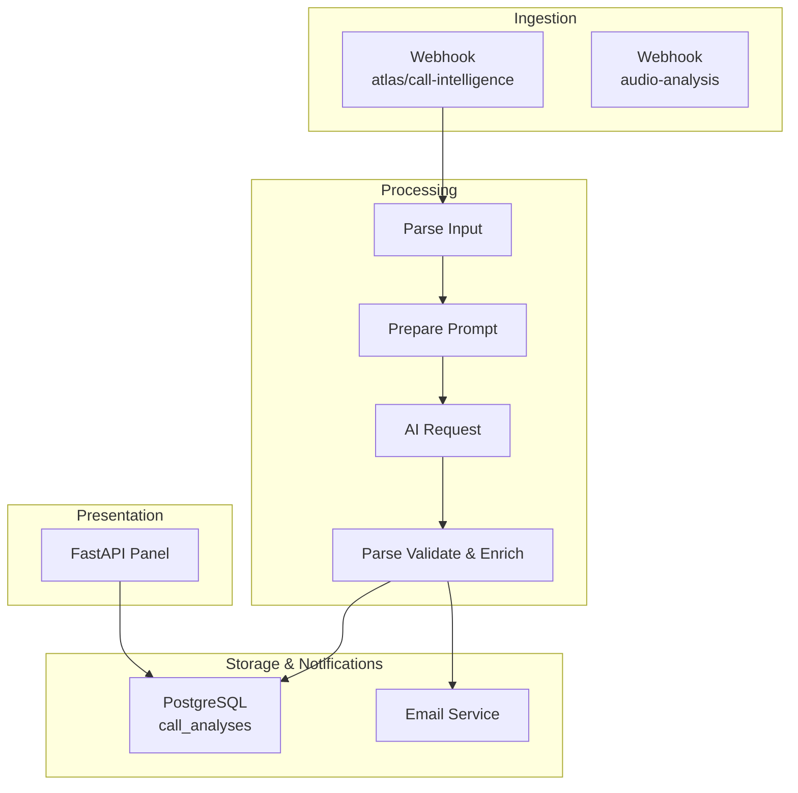
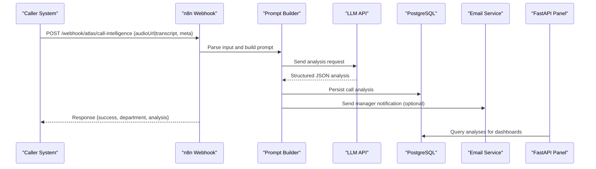
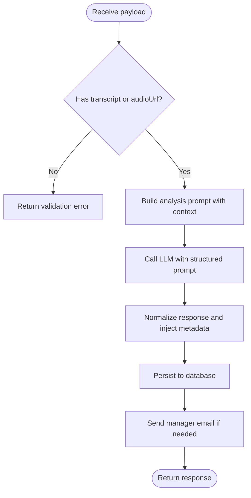
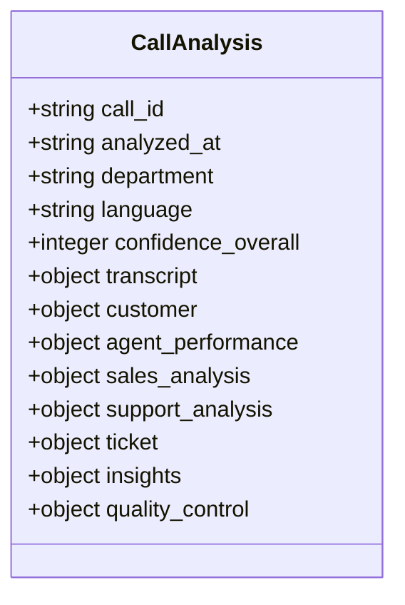
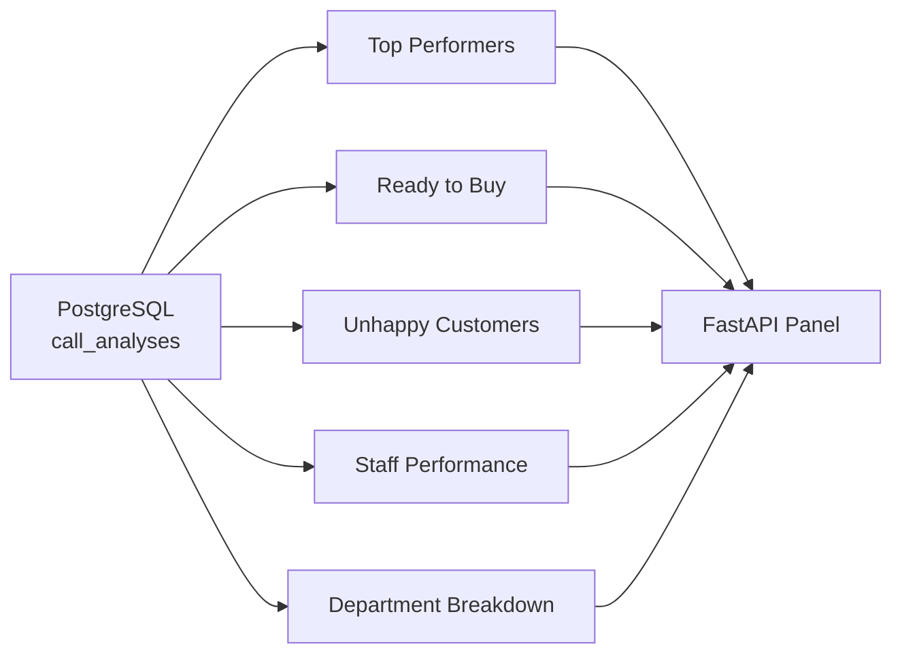
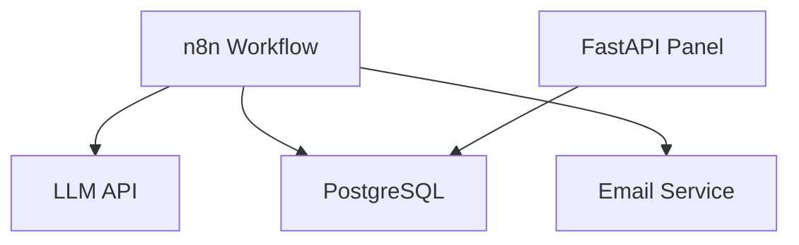

# Atlas Voice

<cite>
**Referenced Files in This Document**
- [Atlas Call Intelligence README](file://03_Products/Atlas Call Intelligence/V1/README.md)
- [Call Intelligence Schema](file://03_Products/Atlas Call Intelligence/V1/schema.json)
- [Call Intelligence Workflow v1](file://docker/n8n/workflows/atlas-call-intelligence-v1.json)
- [Audio Analysis Workflow](file://docker/n8n/workflows/audio-analysis-workflow.json)
- [PostgreSQL Schema](file://docker/postgres/init/001_call_intelligence.sql)
- [Panel Main](file://docker/panel/app/main.py)
- [Panel Queries](file://docker/panel/app/queries.py)
- [Real Voice Test Script](file://docker/scripts/run-real-voice-test.py)
- [Send Real Call Analysis Script](file://docker/scripts/send-real-call-analysis.py)
</cite>

## Table of Contents
1. [Introduction](#introduction)
2. [Project Structure](#project-structure)
3. [Core Components](#core-components)
4. [Architecture Overview](#architecture-overview)
5. [Detailed Component Analysis](#detailed-component-analysis)
6. [Dependency Analysis](#dependency-analysis)
7. [Performance Considerations](#performance-considerations)
8. [Troubleshooting Guide](#troubleshooting-guide)
9. [Conclusion](#conclusion)
10. [Appendices](#appendices)

## Introduction
Atlas Voice provides voice processing and speech recognition capabilities to transform recorded calls into structured, actionable insights. It integrates audio handling, transcription, and AI-driven analysis to deliver quality assessment, customer satisfaction evaluation, sales intent detection, and support issue classification. The system supports both direct transcript ingestion and end-to-end audio-to-insight workflows via webhooks, enabling automation of phone-based business processes and enhanced call intelligence for teams.

Key benefits:
- Automated transcription and segmentation of conversations
- Structured analysis with standardized JSON schema
- Quality assessment flags and human review triggers
- Sales and support analytics with next-step recommendations
- Manager notifications and CRM-ready tickets
- Reporting dashboards and monthly summaries

## Project Structure
The voice processing capability is implemented through a combination of n8n workflows, a FastAPI panel, PostgreSQL storage, and utility scripts for testing and real-call processing.

**Diagram sources**
- [Call Intelligence Workflow v1:1-160](file://docker/n8n/workflows/atlas-call-intelligence-v1.json#L1-L160)
- [Panel Main:85-187](file://docker/panel/app/main.py#L85-L187)
- [PostgreSQL Schema:1-34](file://docker/postgres/init/001_call_intelligence.sql#L1-L34)

**Section sources**
- [Atlas Call Intelligence README:16-28](file://03_Products/Atlas Call Intelligence/V1/README.md#L16-L28)
- [Call Intelligence Workflow v1:1-160](file://docker/n8n/workflows/atlas-call-intelligence-v1.json#L1-L160)
- [Panel Main:85-187](file://docker/panel/app/main.py#L85-L187)

## Core Components
- Webhook endpoints accept either an audio URL or a pre-transcribed transcript, along with metadata such as call ID, department hint, agent details, and customer information.
- A prompt builder prepares context-aware instructions for the AI model to produce a standardized analysis output.
- An AI request node calls a configured LLM endpoint to generate structured insights.
- Validation and enrichment normalize fields, set defaults, and prepare manager notifications.
- Storage persists transcripts and analysis results for reporting and dashboarding.
- Email notifications are sent to managers based on ticket priority and analysis outcomes.
- The panel exposes pages and APIs to view performance, satisfaction, and AI-generated insights.

**Section sources**
- [Call Intelligence Workflow v1:25-120](file://docker/n8n/workflows/atlas-call-intelligence-v1.json#L25-L120)
- [Panel Main:85-187](file://docker/panel/app/main.py#L85-L187)
- [PostgreSQL Schema:1-34](file://docker/postgres/init/001_call_intelligence.sql#L1-L34)

## Architecture Overview
The end-to-end flow ingests voice data, transcribes if needed, analyzes content, stores results, and notifies stakeholders.

**Diagram sources**
- [Call Intelligence Workflow v1:12-154](file://docker/n8n/workflows/atlas-call-intelligence-v1.json#L12-L154)
- [PostgreSQL Schema:1-34](file://docker/postgres/init/001_call_intelligence.sql#L1-L34)
- [Panel Main:85-187](file://docker/panel/app/main.py#L85-L187)

## Detailed Component Analysis

### Audio Handling and Transcription
- Accepts audio URLs from telephony systems or pre-transcribed text.
- Supports alternative field names for flexibility across integrations.
- Validates that at least one of transcript or audio URL is provided.
- For end-to-end audio, external transcription services can be used before invoking the workflow.

Practical example:
- A telephony platform records a call, posts the recording URL and metadata to the webhook, and receives a structured analysis result.

**Section sources**
- [Call Intelligence Workflow v1:25-35](file://docker/n8n/workflows/atlas-call-intelligence-v1.json#L25-L35)
- [Atlas Call Intelligence README:71-106](file://03_Products/Atlas Call Intelligence/V1/README.md#L71-L106)

### Speech Recognition and Prompt Engineering
- Builds a domain-specific prompt including product context, department hints, and metadata.
- Requests structured JSON output aligned to a fixed schema to ensure consistency.
- Normalizes responses by injecting required metadata and default values.

**Diagram sources**
- [Call Intelligence Workflow v1:25-79](file://docker/n8n/workflows/atlas-call-intelligence-v1.json#L25-L79)

**Section sources**
- [Call Intelligence Workflow v1:36-79](file://docker/n8n/workflows/atlas-call-intelligence-v1.json#L36-L79)

### Quality Assessment and Human Review
- Produces quality control flags indicating transcript quality and analysis confidence.
- Flags calls needing human review based on low confidence or anomalies.
- Stores scores for agent performance, customer satisfaction, and purchase intent.

**Diagram sources**
- [Call Intelligence Schema:1-153](file://03_Products/Atlas Call Intelligence/V1/schema.json#L1-L153)

**Section sources**
- [Call Intelligence Schema:8-150](file://03_Products/Atlas Call Intelligence/V1/schema.json#L8-L150)
- [Atlas Call Intelligence README:170-183](file://03_Products/Atlas Call Intelligence/V1/README.md#L170-L183)

### Integration with Call Intelligence and Reporting
- Persists all analyses with indexes for efficient querying.
- Panel queries aggregate metrics such as top performers, ready-to-buy leads, unhappy customers, staff performance, and department breakdowns.
- Monthly reports summarize trends and provide AI-generated executive insights.

**Diagram sources**
- [PostgreSQL Schema:1-34](file://docker/postgres/init/001_call_intelligence.sql#L1-L34)
- [Panel Queries:31-259](file://docker/panel/app/queries.py#L31-L259)
- [Panel Main:85-187](file://docker/panel/app/main.py#L85-L187)

**Section sources**
- [PostgreSQL Schema:1-34](file://docker/postgres/init/001_call_intelligence.sql#L1-L34)
- [Panel Queries:31-259](file://docker/panel/app/queries.py#L31-L259)
- [Panel Main:85-187](file://docker/panel/app/main.py#L85-L187)

### Practical Examples
- End-to-end test script transcribes an audio file using an external service and sends the transcript to the n8n webhook for analysis and email notification.
- Alternative script reads a saved transcript, runs analysis, and emails a formatted report.

Use cases:
- Automate post-call analysis for inbound sales calls to identify hot leads and recommended next steps.
- Flag support calls with high churn risk for immediate follow-up.
- Generate monthly performance reports for managers to coach agents.

**Section sources**
- [Real Voice Test Script:1-89](file://docker/scripts/run-real-voice-test.py#L1-L89)
- [Send Real Call Analysis Script:78-218](file://docker/scripts/send-real-call-analysis.py#L78-L218)

## Dependency Analysis
- n8n orchestrates the pipeline: webhook → parsing → prompt building → AI request → validation → storage → email → response.
- PostgreSQL stores structured analyses with indexes for reporting.
- FastAPI panel consumes stored data to render dashboards and expose APIs.
- External services include LLM endpoints and email delivery.

**Diagram sources**
- [Call Intelligence Workflow v1:47-120](file://docker/n8n/workflows/atlas-call-intelligence-v1.json#L47-L120)
- [PostgreSQL Schema:1-34](file://docker/postgres/init/001_call_intelligence.sql#L1-L34)
- [Panel Main:85-187](file://docker/panel/app/main.py#L85-L187)

**Section sources**
- [Call Intelligence Workflow v1:12-154](file://docker/n8n/workflows/atlas-call-intelligence-v1.json#L12-L154)
- [Panel Main:85-187](file://docker/panel/app/main.py#L85-L187)

## Performance Considerations
- Use indexes on frequently queried columns (analyzed_at, agent_id, department, call_date) to optimize dashboard performance.
- Batch or rate-limit AI requests to avoid timeouts; configure appropriate timeouts in HTTP nodes.
- Prefer sending transcripts when available to reduce latency compared to audio uploads.
- Cache or paginate heavy queries in the panel to improve UI responsiveness.

[No sources needed since this section provides general guidance]

## Troubleshooting Guide
Common issues and resolutions:
- Missing inputs: Ensure either transcript or audioUrl is provided; otherwise, the workflow returns a validation error.
- AI parse errors: If the LLM returns malformed JSON, the parser captures raw text and marks parse_error; check logs and adjust prompts.
- Database write failures: Verify credentials and connection; the workflow continues even on DB failure but may affect reporting.
- Email delivery failures: Confirm mailer endpoint availability and configuration; the workflow continues and still returns analysis.

Operational checks:
- Validate environment variables for LLM endpoint and keys.
- Confirm PostgreSQL credentials and schema initialization.
- Inspect webhook paths and active status in n8n.

**Section sources**
- [Call Intelligence Workflow v1:25-120](file://docker/n8n/workflows/atlas-call-intelligence-v1.json#L25-L120)
- [Atlas Call Intelligence README:60-69](file://03_Products/Atlas Call Intelligence/V1/README.md#L60-L69)

## Conclusion
Atlas Voice delivers a robust voice processing pipeline that transforms audio and transcripts into structured insights for sales and support operations. With standardized schemas, automated quality assessment, and integrated reporting, it enables teams to automate phone-based workflows, enhance customer interactions, and continuously improve agent performance.

[No sources needed since this section summarizes without analyzing specific files]

## Appendices

### API Reference Summary
- Endpoint: POST /webhook/atlas/call-intelligence
- Inputs: audioUrl or transcript, plus optional metadata (call_id, department, agent_name, customer_phone, call_direction, call_duration_seconds, call_date, product_context)
- Output: success flag, department, analysis JSON, and optional manager notification details

**Section sources**
- [Atlas Call Intelligence README:71-142](file://03_Products/Atlas Call Intelligence/V1/README.md#L71-L142)

### Data Model Overview
- call_analyses table stores per-call metadata, transcript text, full analysis JSON, and derived scores for reporting.
- monthly_reports table aggregates insights for periodic summaries.

**Section sources**
- [PostgreSQL Schema:1-34](file://docker/postgres/init/001_call_intelligence.sql#L1-L34)