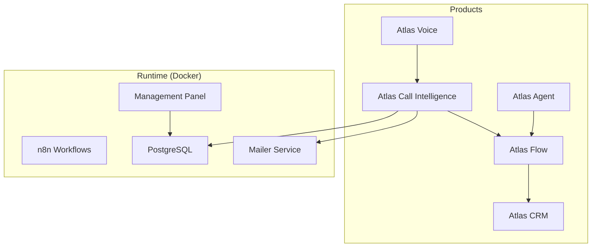
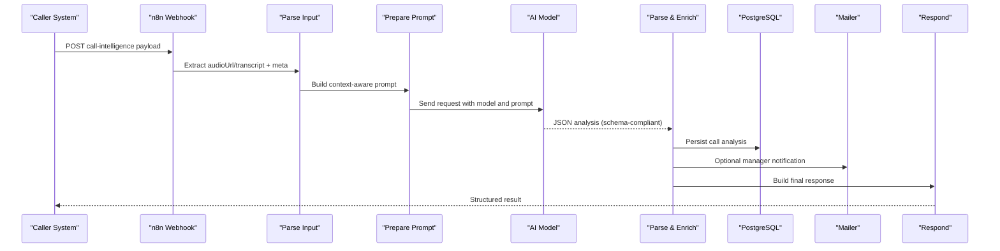
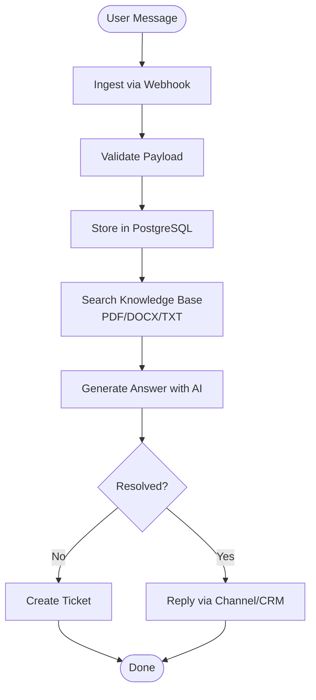
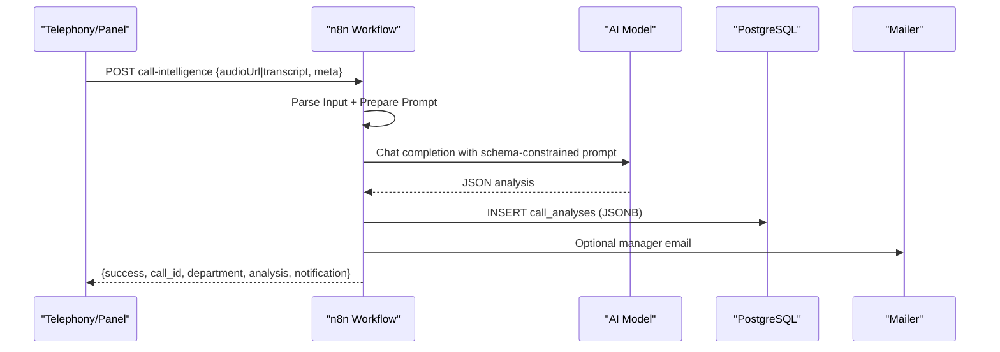
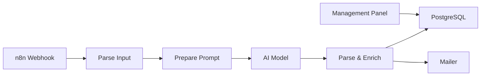

# Product Suite

<cite>
**Referenced Files in This Document**
- [Atlas Agent README](file://03_Products/Atlas%20Agent/V1/README.md)
- [Atlas Agent Architecture](file://03_Products/Atlas%20Agent/V1/Architecture.md)
- [Atlas Agent Features](file://03_Products/Atlas%20Agent/V1/Features.md)
- [Atlas Call Intelligence README](file://03_Products/Atlas%20Call%20Intelligence/V1/README.md)
- [Atlas Call Intelligence Schema](file://03_Products/Atlas%20Call%20Intelligence/V1/schema.json)
- [Atlas Call Intelligence Workflow](file://docker/n8n/workflows/atlas-call-intelligence-v1.json)
- [Audio Analysis Workflow](file://docker/n8n/workflows/audio-analysis-workflow.json)
- [Docker Compose](file://docker/docker-compose.yml)
- [Postgres Init SQL](file://docker/postgres/init/001_call_intelligence.sql)
</cite>

## Table of Contents
1. [Introduction](#introduction)
2. [Project Structure](#project-structure)
3. [Core Components](#core-components)
4. [Architecture Overview](#architecture-overview)
5. [Detailed Component Analysis](#detailed-component-analysis)
6. [Dependency Analysis](#dependency-analysis)
7. [Performance Considerations](#performance-considerations)
8. [Troubleshooting Guide](#troubleshooting-guide)
9. [Conclusion](#conclusion)
10. [Appendices](#appendices)

## Introduction
This document explains the Atlas product suite as a cohesive ecosystem of AI-powered tools for business automation, with a focus on how Atlas Agent, Atlas CRM, Atlas Voice, Atlas Flow, and Atlas Call Intelligence work together to automate customer interactions, analyze calls, and drive operational efficiency. It provides both conceptual overviews for understanding product strategy and technical details for implementing features such as agent configuration, call intelligence, and workflow automation. Practical examples illustrate how these products collaborate to solve real-world problems in accounting firms and software companies.

## Project Structure
The repository organizes product documentation under 03_Products by product name and version, while implementation artifacts (workflows, database schema, and services) live under docker/. The current codebase includes:
- Product documentation for Atlas Agent v1 and Atlas Call Intelligence v1
- n8n workflows that implement call analysis and audio summarization
- Docker services for PostgreSQL, n8n, a mailer, and a management panel
- Database initialization scripts for call analytics storage

**Diagram sources**
- [Atlas Call Intelligence Workflow:1-160](file://docker/n8n/workflows/atlas-call-intelligence-v1.json#L1-L160)
- [Docker Compose:1-98](file://docker/docker-compose.yml#L1-L98)
- [Postgres Init SQL:1-45](file://docker/postgres/init/001_call_intelligence.sql#L1-L45)

**Section sources**
- [Atlas Agent README:1-79](file://03_Products/Atlas%20Agent/V1/README.md#L1-L79)
- [Atlas Agent Architecture:1-97](file://03_Products/Atlas%20Agent/V1/Architecture.md#L1-L97)
- [Atlas Call Intelligence README:1-191](file://03_Products/Atlas%20Call%20Intelligence/V1/README.md#L1-L191)
- [Docker Compose:1-98](file://docker/docker-compose.yml#L1-L98)

## Core Components
- Atlas Agent: An intelligent support assistant that answers user questions from company documentation and escalates to ticket creation when needed. Integrates with messaging channels and can connect to CRM systems.
- Atlas CRM: The central system of record for contacts, accounts, tickets, and sales pipelines; designed to integrate with agents, voice, flow automation, and call intelligence outputs.
- Atlas Voice: Captures and processes voice interactions (recordings or live calls), enabling transcription and downstream analysis.
- Atlas Flow: Workflow automation layer (n8n-based) orchestrating data movement between systems, invoking AI models, and triggering actions like notifications or CRM updates.
- Atlas Call Intelligence: Analyzes recorded calls to extract structured insights including department classification, customer satisfaction, agent performance, sales/support analysis, and actionable tickets.

Integration patterns:
- Agent configuration drives knowledge retrieval and escalation rules.
- Voice recordings feed into Flow to trigger transcription and analysis via Call Intelligence.
- Call Intelligence results are stored in the database and can create CRM tickets or update records through Flow.
- The management panel visualizes metrics and reports derived from call analyses.

**Section sources**
- [Atlas Agent README:1-79](file://03_Products/Atlas%20Agent/V1/README.md#L1-L79)
- [Atlas Agent Architecture:1-97](file://03_Products/Atlas%20Agent/V1/Architecture.md#L1-L97)
- [Atlas Call Intelligence README:1-191](file://03_Products/Atlas%20Call%20Intelligence/V1/README.md#L1-L191)
- [Atlas Call Intelligence Schema:1-153](file://03_Products/Atlas%20Call%20Intelligence/V1/schema.json#L1-L153)
- [Atlas Call Intelligence Workflow:1-160](file://docker/n8n/workflows/atlas-call-intelligence-v1.json#L1-L160)
- [Docker Compose:1-98](file://docker/docker-compose.yml#L1-L98)

## Architecture Overview
The platform uses n8n as the orchestration backbone. For call intelligence, an HTTP webhook receives call metadata and either an audio URL or transcript. The workflow parses input, constructs an AI prompt aligned to a strict output schema, calls an AI model, validates and enriches the result, persists it to PostgreSQL, optionally emails managers, and returns a standardized response. A secondary audio analysis workflow demonstrates a simpler summarization path.

**Diagram sources**
- [Atlas Call Intelligence Workflow:1-160](file://docker/n8n/workflows/atlas-call-intelligence-v1.json#L1-L160)
- [Postgres Init SQL:1-45](file://docker/postgres/init/001_call_intelligence.sql#L1-L45)

**Section sources**
- [Atlas Call Intelligence README:1-191](file://03_Products/Atlas%20Call%20Intelligence/V1/README.md#L1-L191)
- [Atlas Call Intelligence Workflow:1-160](file://docker/n8n/workflows/atlas-call-intelligence-v1.json#L1-L160)
- [Docker Compose:1-98](file://docker/docker-compose.yml#L1-L98)

## Detailed Component Analysis

### Atlas Agent
Purpose:
- Provide intelligent, documentation-backed support responses across channels.
- Create tickets when issues cannot be resolved automatically.

Key capabilities:
- Message ingestion and persistence
- AI-driven answer generation from documents (PDF, DOCX, TXT)
- Channel integrations (e.g., Telegram)
- Future enhancements include multi-user, authentication, dashboard, search, and chat history

Implementation notes:
- Data flow includes webhook reception, validation, database storage, AI model invocation, knowledge base lookup, and response delivery to channels or CRM.
- Phase 2 introduces vector search (Qdrant), caching (Redis), and external model routing (OpenRouter).

**Diagram sources**
- [Atlas Agent Architecture:1-97](file://03_Products/Atlas%20Agent/V1/Architecture.md#L1-L97)
- [Atlas Agent Features:1-67](file://03_Products/Atlas%20Agent/V1/Features.md#L1-L67)

**Section sources**
- [Atlas Agent README:1-79](file://03_Products/Atlas%20Agent/V1/README.md#L1-L79)
- [Atlas Agent Architecture:1-97](file://03_Products/Atlas%20Agent/V1/Architecture.md#L1-L97)
- [Atlas Agent Features:1-67](file://03_Products/Atlas%20Agent/V1/Features.md#L1-L67)

### Atlas Call Intelligence
Purpose:
- Transform recorded calls into structured insights for sales and support teams, especially in accounting contexts.

Capabilities:
- Auto-detect department (sales/support/mixed)
- Standardized JSON output validated against a fixed schema
- Customer satisfaction scoring and sentiment indicators
- Agent performance evaluation
- Actionable ticket generation and manager notifications
- Monthly reporting and personnel ranking

Workflow highlights:
- Webhook receives call metadata and either audio URL or transcript
- Prompt is constructed with context and hints for department-specific analysis
- AI model returns schema-compliant JSON
- Results are persisted to PostgreSQL and optionally emailed to managers
- Response includes success flags, analysis object, and notification status

**Diagram sources**
- [Atlas Call Intelligence Workflow:1-160](file://docker/n8n/workflows/atlas-call-intelligence-v1.json#L1-L160)
- [Postgres Init SQL:1-45](file://docker/postgres/init/001_call_intelligence.sql#L1-L45)

**Section sources**
- [Atlas Call Intelligence README:1-191](file://03_Products/Atlas%20Call%20Intelligence/V1/README.md#L1-L191)
- [Atlas Call Intelligence Schema:1-153](file://03_Products/Atlas%20Call%20Intelligence/V1/schema.json#L1-L153)
- [Atlas Call Intelligence Workflow:1-160](file://docker/n8n/workflows/atlas-call-intelligence-v1.json#L1-L160)
- [Postgres Init SQL:1-45](file://docker/postgres/init/001_call_intelligence.sql#L1-L45)

### Atlas Voice
Purpose:
- Capture and route voice recordings or live call streams to downstream processing.

Integration pattern:
- Telephony systems (e.g., Issabel) record calls and provide URLs or metadata to the platform.
- Atlas Flow triggers transcription and analysis based on available inputs (audio URL or transcript).
- Outputs feed into Call Intelligence and CRM for follow-up actions.

Note:
- Implementation specifics are not fully detailed in this repository; integration relies on existing telephony panels and webhooks.

**Section sources**
- [Atlas Call Intelligence README:163-168](file://03_Products/Atlas%20Call%20Intelligence/V1/README.md#L163-L168)
- [Docker Compose:1-98](file://docker/docker-compose.yml#L1-L98)

### Atlas Flow
Purpose:
- Orchestrate cross-system automations using n8n workflows.

Current implementations:
- Call Intelligence workflow: end-to-end pipeline from webhook to AI analysis, database persistence, and notifications.
- Audio Analysis workflow: lightweight summarization endpoint for quick insights.

Extensibility:
- New nodes can be added to integrate with CRM APIs, ticketing systems, or custom services.
- Environment variables configure API endpoints, models, and credentials.

**Section sources**
- [Atlas Call Intelligence Workflow:1-160](file://docker/n8n/workflows/atlas-call-intelligence-v1.json#L1-L160)
- [Audio Analysis Workflow:1-139](file://docker/n8n/workflows/audio-analysis-workflow.json#L1-L139)
- [Docker Compose:1-98](file://docker/docker-compose.yml#L1-L98)

### Atlas CRM
Purpose:
- Centralize customer and sales data, manage tickets, and serve as the system of record for all product interactions.

Integration points:
- Receive tickets generated by Agent and Call Intelligence via Flow.
- Update contact records with call outcomes, satisfaction scores, and next steps.
- Expose APIs for other products to read/write relevant entities.

Note:
- Detailed API and architecture are pending in this repository; integration patterns are defined conceptually and will leverage Flow for connectivity.

**Section sources**
- [Atlas Call Intelligence README:185-189](file://03_Products/Atlas%20Call%20Intelligence/V1/README.md#L185-L189)
- [Atlas Agent Architecture:55-64](file://03_Products/Atlas%20Agent/V1/Architecture.md#L55-L64)

## Dependency Analysis
The runtime stack centers on n8n for workflow orchestration, PostgreSQL for persistent analytics, and optional services for email and dashboards.

**Diagram sources**
- [Atlas Call Intelligence Workflow:1-160](file://docker/n8n/workflows/atlas-call-intelligence-v1.json#L1-L160)
- [Docker Compose:1-98](file://docker/docker-compose.yml#L1-L98)
- [Postgres Init SQL:1-45](file://docker/postgres/init/001_call_intelligence.sql#L1-L45)

**Section sources**
- [Docker Compose:1-98](file://docker/docker-compose.yml#L1-L98)
- [Atlas Call Intelligence Workflow:1-160](file://docker/n8n/workflows/atlas-call-intelligence-v1.json#L1-L160)

## Performance Considerations
- Use schema-constrained prompts to reduce parsing overhead and ensure consistent outputs.
- Cache frequent knowledge retrievals in Phase 2 components (Qdrant, Redis) to lower latency.
- Batch or queue heavy operations (e.g., monthly report generation) to avoid blocking webhooks.
- Monitor AI model response times and set timeouts in workflow nodes.
- Index frequently queried fields in PostgreSQL (already present for analyzed_at, agent_id, department, call_date).

[No sources needed since this section provides general guidance]

## Troubleshooting Guide
Common issues and resolutions:
- Invalid input: Ensure either audioUrl or transcript is provided; the workflow enforces this during parse.
- AI parse errors: If JSON parsing fails, the workflow captures raw text and flags the result; inspect logs and adjust prompts.
- Database write failures: Check Postgres credentials and connection; the workflow continues even if DB insert fails due to continueOnFail settings.
- Email delivery: Verify SMTP settings and manager email configuration; the mailer service must be reachable.

Operational checks:
- Confirm environment variables for AI endpoints, model selection, and credentials.
- Validate n8n workspace imports and node connections.
- Review PostgreSQL schema initialization and indexes.

**Section sources**
- [Atlas Call Intelligence Workflow:25-35](file://docker/n8n/workflows/atlas-call-intelligence-v1.json#L25-L35)
- [Atlas Call Intelligence Workflow:63-71](file://docker/n8n/workflows/atlas-call-intelligence-v1.json#L63-L71)
- [Atlas Call Intelligence Workflow:73-93](file://docker/n8n/workflows/atlas-call-intelligence-v1.json#L73-L93)
- [Atlas Call Intelligence Workflow:105-120](file://docker/n8n/workflows/atlas-call-intelligence-v1.json#L105-L120)
- [Docker Compose:34-50](file://docker/docker-compose.yml#L34-L50)
- [Postgres Init SQL:1-45](file://docker/postgres/init/001_call_intelligence.sql#L1-L45)

## Conclusion
Atlas integrates Agent, CRM, Voice, Flow, and Call Intelligence into a unified automation platform. Agents handle documentation-backed support and ticketing; Voice captures interactions; Flow orchestrates data flows and AI tasks; Call Intelligence extracts actionable insights from calls; CRM serves as the system of record. Together, they enable accounting firms and software companies to automate customer engagement, improve agent performance, and drive revenue through intelligent workflows.

[No sources needed since this section summarizes without analyzing specific files]

## Appendices

### Practical Examples

- Accounting firm scenario:
  - Voice records client calls about tax filing issues.
  - Flow triggers transcription and Call Intelligence analysis.
  - Insights generate a high-priority support ticket and update CRM with customer needs and satisfaction score.
  - Agent config references tax docs to auto-answer common queries; unresolved cases escalate to CRM.

- Software company scenario:
  - Sales calls are analyzed for purchase intent and objections.
  - Estimated discount and close probability guide next steps.
  - Flow creates CRM opportunities and schedules follow-ups; Agent responds to prospect questions using product docs.

[No sources needed since this section provides conceptual examples]