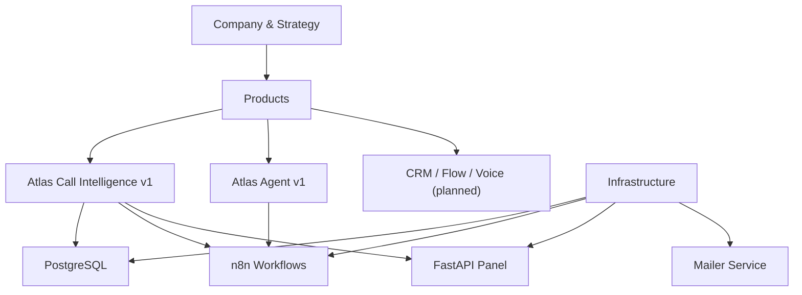
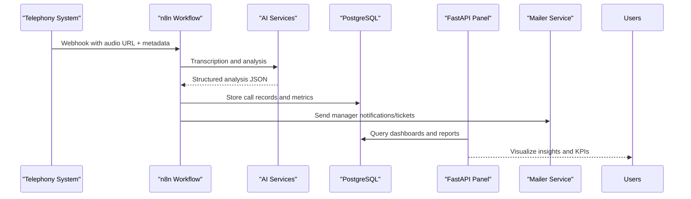
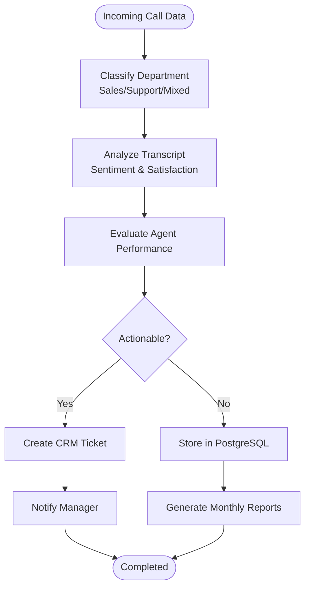
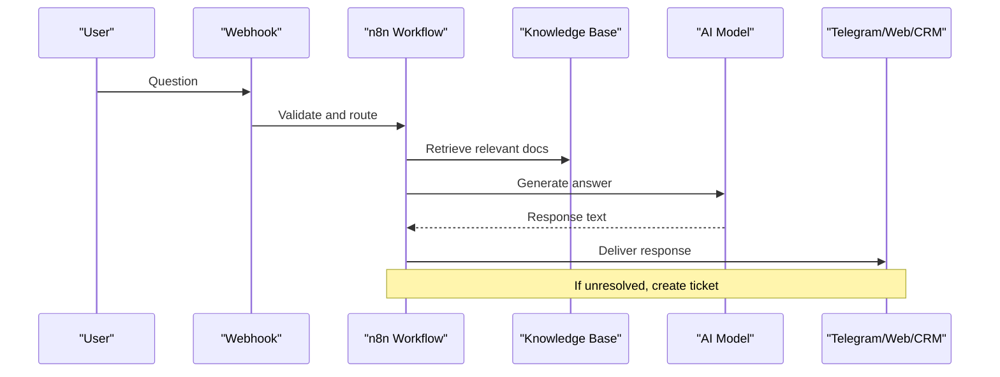
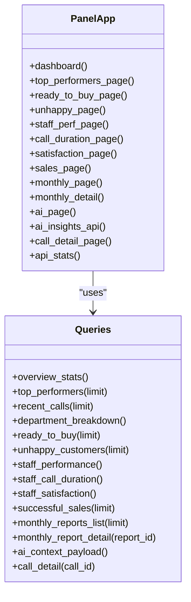
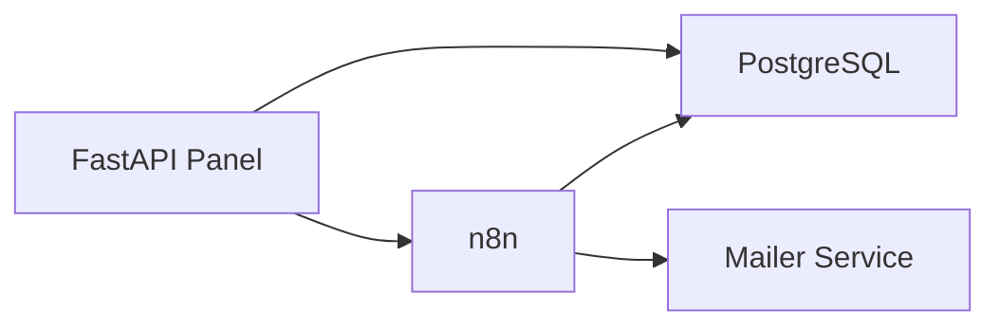

# Introduction and Goals

<cite>
**Referenced Files in This Document**
- [README.md](file://README.md)
- [Mission.md](file://00_Company/Mission.md)
- [Vision.md](file://00_Company/Vision.md)
- [Roadmap.md](file://01_Strategy/Roadmap.md)
- [PainPoints.md](file://01_Strategy/PainPoints.md)
- [Business Ideas.md](file://Business Ideas.md)
- [Atlas Call Intelligence README](file://03_Products/Atlas Call Intelligence/V1/README.md)
- [Atlas Agent README](file://03_Products/Atlas Agent/V1/README.md)
- [Atlas Agent Architecture](file://03_Products/Atlas Agent/V1/Architecture.md)
- [Call Intelligence Schema](file://03_Products/Atlas Call Intelligence/V1/schema.json)
- [docker-compose.yml](file://docker/docker-compose.yml)
- [Panel Main](file://docker/panel/app/main.py)
</cite>

## Table of Contents
1. [Introduction](#introduction)
2. [Project Structure](#project-structure)
3. [Core Components](#core-components)
4. [Architecture Overview](#architecture-overview)
5. [Detailed Component Analysis](#detailed-component-analysis)
6. [Dependency Analysis](#dependency-analysis)
7. [Performance Considerations](#performance-considerations)
8. [Troubleshooting Guide](#troubleshooting-guide)
9. [Conclusion](#conclusion)
10. [Appendices](#appendices)

## Introduction
Atlas is an AI-powered call intelligence platform designed to automate repetitive work, reduce costs, and increase productivity for businesses—particularly Iranian accounting companies and software vendors. The project’s mission is to help businesses eliminate repetitive tasks using AI and automation, with a vision to become the leading AI business automation company in Iran and expand globally. Atlas positions itself as a comprehensive solution that combines intelligent call analysis with workflow automation to drive measurable business transformation.

The core goals are:
- Solve critical pain points in call management, customer support, and sales follow-up through automated transcription, classification, and insight generation.
- Deliver actionable outputs such as CRM-ready tickets, performance metrics, and monthly reports to streamline operations.
- Provide a scalable, containerized stack (PostgreSQL, n8n, FastAPI panel, mailer) that integrates with telephony systems and AI services to enable end-to-end automation.

This foundation sets the stage for building an AI automation company from zero, starting with call intelligence as the flagship capability and expanding into broader automation products over time.

**Section sources**
- [README.md:1-7](file://README.md#L1-L7)
- [Mission.md:17-22](file://00_Company/Mission.md#L17-L22)
- [Vision.md:17-22](file://00_Company/Vision.md#L17-L22)
- [Roadmap.md:5-18](file://01_Strategy/Roadmap.md#L5-L18)

## Project Structure
Atlas organizes its strategy, products, and infrastructure to support rapid iteration and deployment:
- Company and Strategy: Mission, Vision, Roadmap, Pain Points, and ICP define positioning and priorities.
- Products:
  - Atlas Call Intelligence v1: Automated call transcription, department classification, satisfaction scoring, agent performance evaluation, ticket creation, and monthly reporting.
  - Atlas Agent v1: Intelligent support assistant that answers user questions from documentation and creates tickets when needed.
  - Additional product areas (CRM, Flow, Voice) are planned to extend automation capabilities.
- Infrastructure: Docker Compose orchestrates PostgreSQL, n8n workflows, a FastAPI-based management panel, and a mailer service.

**Diagram sources**
- [Atlas Call Intelligence README:1-28](file://03_Products/Atlas Call Intelligence/V1/README.md#L1-L28)
- [Atlas Agent Architecture:17-84](file://03_Products/Atlas Agent/V1/Architecture.md#L17-L84)
- [docker-compose.yml:1-98](file://docker/docker-compose.yml#L1-L98)

**Section sources**
- [Atlas Call Intelligence README:1-28](file://03_Products/Atlas Call Intelligence/V1/README.md#L1-L28)
- [Atlas Agent README:1-79](file://03_Products/Atlas Agent/V1/README.md#L1-L79)
- [Atlas Agent Architecture:17-84](file://03_Products/Atlas Agent/V1/Architecture.md#L17-L84)
- [docker-compose.yml:1-98](file://docker/docker-compose.yml#L1-L98)

## Core Components
- Atlas Call Intelligence v1:
  - Ingests audio or transcripts, classifies calls into sales/support/mixed, analyzes sentiment and satisfaction, evaluates agent performance, generates CRM-ready tickets, stores results in PostgreSQL, and produces monthly reports.
  - Provides a standardized JSON schema for consistent downstream integration and reporting.
- Atlas Agent v1:
  - Answers user questions from company documentation (PDF/DOCX/TXT), integrates via webhooks, and escalates to tickets when necessary.
  - Uses n8n, PostgreSQL, and optional vector search (Qdrant) and caching (Redis) in later phases.
- Management Panel:
  - FastAPI-based dashboard for viewing call details, top performers, ready-to-buy leads, unhappy customers, staff performance, satisfaction metrics, successful sales, and monthly reports.
  - Integrates with AI to generate executive insights and exposes API endpoints for stats and insights.

These components collectively deliver call intelligence and automation that transform how businesses manage customer interactions and internal processes.

**Section sources**
- [Atlas Call Intelligence README:1-28](file://03_Products/Atlas Call Intelligence/V1/README.md#L1-L28)
- [Atlas Call Intelligence README:71-142](file://03_Products/Atlas Call Intelligence/V1/README.md#L71-L142)
- [Atlas Agent README:17-69](file://03_Products/Atlas Agent/V1/README.md#L17-L69)
- [Atlas Agent Architecture:17-84](file://03_Products/Atlas Agent/V1/Architecture.md#L17-L84)
- [Panel Main:68-187](file://docker/panel/app/main.py#L68-L187)

## Architecture Overview
Atlas uses a containerized architecture to orchestrate call intelligence and automation:
- Telephony recording system sends audio URLs and metadata to n8n via webhook.
- n8n triggers transcription, AI analysis, and workflow actions (ticket creation, email notifications).
- Results are stored in PostgreSQL and visualized in the FastAPI panel.
- Monthly reports are generated via cron-triggered workflows.

**Diagram sources**
- [Atlas Call Intelligence README:16-28](file://03_Products/Atlas Call Intelligence/V1/README.md#L16-L28)
- [Atlas Call Intelligence README:163-168](file://03_Products/Atlas Call Intelligence/V1/README.md#L163-L168)
- [docker-compose.yml:26-59](file://docker/docker-compose.yml#L26-L59)
- [docker-compose.yml:80-98](file://docker/docker-compose.yml#L80-L98)
- [Panel Main:68-187](file://docker/panel/app/main.py#L68-L187)

## Detailed Component Analysis

### Atlas Call Intelligence v1
- Purpose: Automate call analysis for accounting and software businesses by extracting structured insights from voice conversations.
- Key capabilities:
  - Automatic department classification (sales/support/mixed).
  - Standardized JSON output with confidence scores and quality flags.
  - Customer satisfaction measurement and agent performance evaluation.
  - CRM-ready ticket generation and monthly reporting.
- Data model:
  - Comprehensive schema defines meta, transcript, customer, agent_performance, sales_analysis, support_analysis, ticket, insights, and quality_control fields.
- Integration:
  - Receives audio URLs or transcripts via webhook; leverages transcription APIs and AI models; persists data to PostgreSQL; notifies managers via email; supports monthly report generation.

**Diagram sources**
- [Atlas Call Intelligence README:5-14](file://03_Products/Atlas Call Intelligence/V1/README.md#L5-L14)
- [Atlas Call Intelligence README:71-142](file://03_Products/Atlas Call Intelligence/V1/README.md#L71-L142)
- [Call Intelligence Schema:1-153](file://03_Products/Atlas Call Intelligence/V1/schema.json#L1-L153)

**Section sources**
- [Atlas Call Intelligence README:1-28](file://03_Products/Atlas Call Intelligence/V1/README.md#L1-L28)
- [Atlas Call Intelligence README:71-142](file://03_Products/Atlas Call Intelligence/V1/README.md#L71-L142)
- [Call Intelligence Schema:1-153](file://03_Products/Atlas Call Intelligence/V1/schema.json#L1-L153)

### Atlas Agent v1
- Purpose: Provide an intelligent support assistant that answers user questions from company documentation and escalates when needed.
- Data flow:
  - User query arrives via webhook, validated, persisted, processed by AI against knowledge base (PDF/DOCX/TXT), and responded via Telegram/Web/CRM.
- Services:
  - n8n for orchestration, PostgreSQL for storage, Qdrant/Redis/OpenRouter for future enhancements.

**Diagram sources**
- [Atlas Agent Architecture:17-64](file://03_Products/Atlas Agent/V1/Architecture.md#L17-L64)
- [Atlas Agent Architecture:71-84](file://03_Products/Atlas Agent/V1/Architecture.md#L71-L84)

**Section sources**
- [Atlas Agent README:17-69](file://03_Products/Atlas Agent/V1/README.md#L17-L69)
- [Atlas Agent Architecture:17-84](file://03_Products/Atlas Agent/V1/Architecture.md#L17-L84)

### Management Panel
- Purpose: Centralized dashboard for monitoring call intelligence outcomes, staff performance, and business metrics.
- Features:
  - Dashboard overview, top performers, ready-to-buy leads, unhappy customers, staff performance, call duration, satisfaction, successful sales, monthly reports, and AI-generated insights.
- Technical implementation:
  - FastAPI routes serve HTML templates and JSON APIs; queries fetch data from PostgreSQL; AI insights endpoint aggregates context and returns executive summaries.

**Diagram sources**
- [Panel Main:68-187](file://docker/panel/app/main.py#L68-L187)

**Section sources**
- [Panel Main:68-187](file://docker/panel/app/main.py#L68-L187)

## Dependency Analysis
Atlas relies on a cohesive set of services orchestrated via Docker Compose:
- PostgreSQL: Persistent storage for call records, metrics, and reports.
- n8n: Workflow automation engine connecting telephony, AI services, databases, and notifications.
- FastAPI Panel: Web interface and APIs for visualization and insights.
- Mailer: Email notifications for tickets and alerts.

**Diagram sources**
- [docker-compose.yml:1-98](file://docker/docker-compose.yml#L1-L98)

**Section sources**
- [docker-compose.yml:1-98](file://docker/docker-compose.yml#L1-L98)

## Performance Considerations
- Container orchestration ensures isolated, reproducible environments for development and production.
- Health checks and dependencies guarantee database readiness before other services start.
- Timezone configuration aligns scheduling (cron) with local business hours for reporting and alerts.
- Modular design allows scaling individual components (e.g., adding more AI endpoints or caching layers) without disrupting the entire stack.

[No sources needed since this section provides general guidance]

## Troubleshooting Guide
- Database initialization:
  - Ensure PostgreSQL schema is applied if existing data is present.
- Environment variables:
  - Verify AI API URLs, keys, and model settings are correctly configured for n8n and panel services.
- Authentication:
  - Panel login requires setting a secure password; otherwise, access may redirect unexpectedly.
- Workflows:
  - Import required n8n workflows and credentials; activate them to enable call intelligence and monthly reporting.

**Section sources**
- [Atlas Call Intelligence README:31-58](file://03_Products/Atlas Call Intelligence/V1/README.md#L31-L58)
- [Panel Main:40-65](file://docker/panel/app/main.py#L40-L65)

## Conclusion
Atlas establishes a strong foundation for an AI automation company focused on transforming Iranian accounting companies and software businesses through intelligent automation. By solving critical pain points in call management, customer support, and process optimization, Atlas delivers measurable value via call intelligence, workflow automation, and actionable insights. The modular, containerized architecture enables rapid iteration and expansion into broader automation solutions, supporting the long-term goal of becoming a global SaaS company.

[No sources needed since this section summarizes without analyzing specific files]

## Appendices
- Market Opportunity:
  - High volume of repetitive customer support inquiries and manual call handling create significant inefficiencies.
  - Accounting firms and software vendors benefit from automated transcription, classification, and reporting to improve responsiveness and conversion rates.
- Strategic Positioning:
  - Atlas combines AI-driven call intelligence with workflow automation to provide end-to-end business transformation, differentiating itself from point solutions.
- Future Enhancements:
  - CRM API integrations, real-time alerts, domain-specific model fine-tuning, and expanded product lines (Flow, Voice) to broaden automation coverage.

[No sources needed since this section provides general guidance]