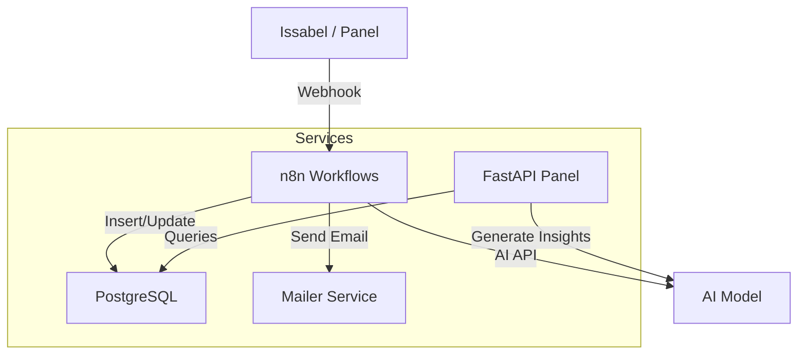
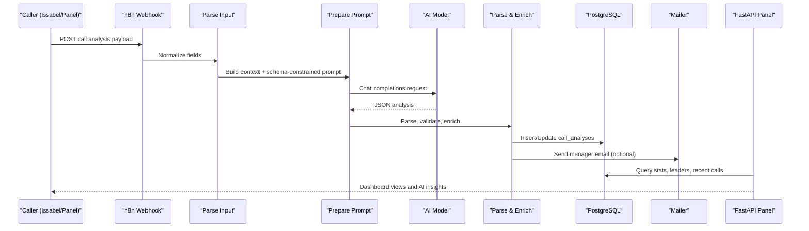
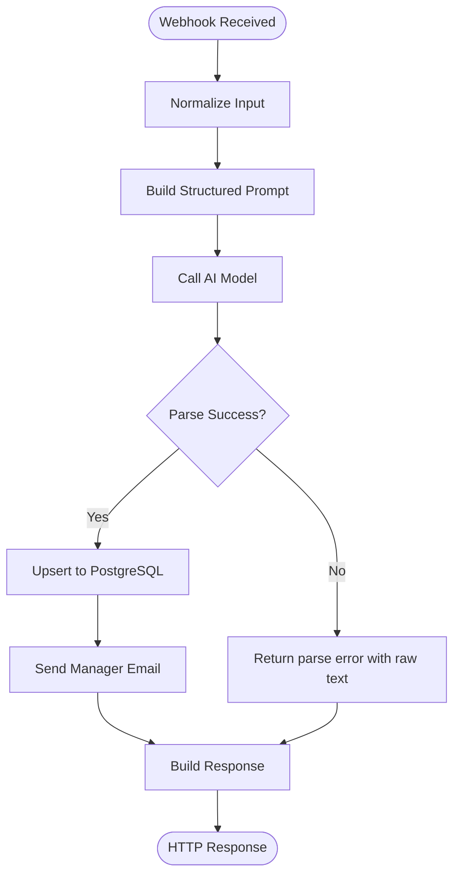
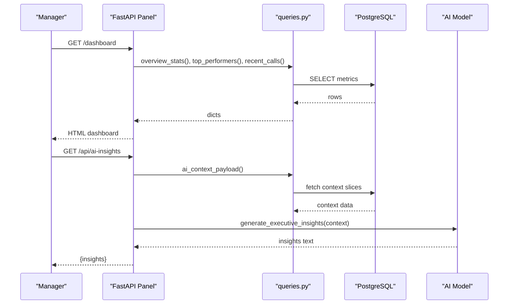
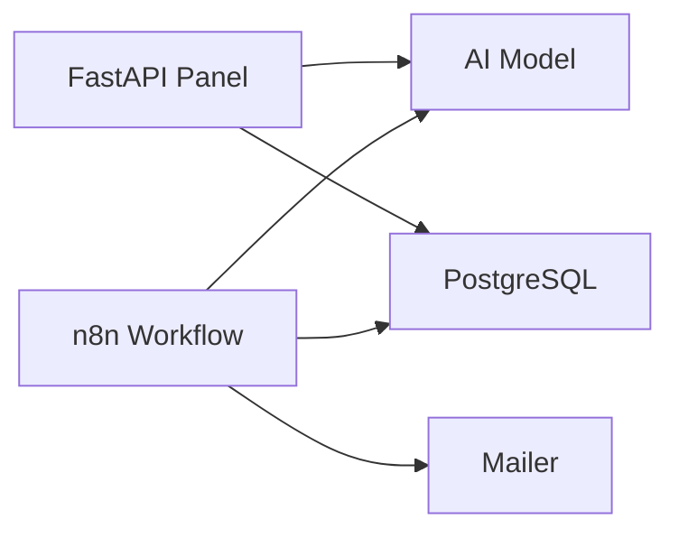

# Key Features and Capabilities

<cite>
**Referenced Files in This Document**
- [Atlas Call Intelligence README](file://03_Products/Atlas%20Call%20Intelligence/V1/README.md)
- [Call Intelligence Schema](file://03_Products/Atlas%20Call%20Intelligence/V1/schema.json)
- [n8n Call Intelligence Workflow](file://docker/n8n/workflows/atlas-call-intelligence-v1.json)
- [n8n Audio Analysis Workflow](file://docker/n8n/workflows/audio-analysis-workflow.json)
- [Panel FastAPI Main](file://docker/panel/app/main.py)
- [Panel Queries](file://docker/panel/app/queries.py)
- [PostgreSQL Init Schema](file://docker/postgres/init/001_call_intelligence.sql)
- [Docker Compose](file://docker/docker-compose.yml)
</cite>

## Table of Contents
1. Introduction
2. Project Structure
3. Core Components
4. Architecture Overview
5. Detailed Component Analysis
6. Dependency Analysis
7. Performance Considerations
8. Troubleshooting Guide
9. Conclusion

## Introduction
This document explains the core features and capabilities of Atlas, a microservices-based platform that transforms voice calls into actionable intelligence for accounting companies and software businesses. It covers AI-powered call analysis and transcription, automated workflow processing via n8n, a real-time analytics dashboard built with FastAPI, an email notification system, and performance reporting. The goal is to show how these components work together to deliver measurable value: faster sales cycles, improved customer satisfaction, better agent coaching, and data-driven management decisions.

## Project Structure
Atlas is composed of several services orchestrated by Docker Compose:
- PostgreSQL stores call analyses and monthly reports.
- n8n hosts workflows that receive webhooks, orchestrate AI analysis, persist results, and send notifications.
- A FastAPI panel serves dashboards and APIs for insights and metrics.
- A mailer service sends manager emails triggered by workflows.

**Diagram sources**
- [Docker Compose:1-98](file://docker/docker-compose.yml#L1-L98)
- [n8n Call Intelligence Workflow:1-160](file://docker/n8n/workflows/atlas-call-intelligence-v1.json#L1-L160)
- [Panel FastAPI Main:1-187](file://docker/panel/app/main.py#L1-L187)
- [PostgreSQL Init Schema:1-45](file://docker/postgres/init/001_call_intelligence.sql#L1-L45)

**Section sources**
- [Docker Compose:1-98](file://docker/docker-compose.yml#L1-L98)

## Core Components
- AI-powered call analysis and transcription: Accepts audio or transcript, infers department (sales/support/mixed), analyzes sentiment and satisfaction, scores agent performance, estimates purchase intent and close probability, and generates tickets.
- Automated workflow processing: n8n orchestrates parsing, prompt generation, AI calls, persistence, and notifications with robust error handling and retries.
- Real-time analytics dashboard: FastAPI serves KPIs, top performers, hot leads, unhappy customers, staff performance, satisfaction, successful sales, and monthly reports.
- Email notification system: Manager emails are generated from analysis results and sent via a dedicated mailer service.
- Performance reporting: Monthly aggregated reports and per-call metrics enable coaching, forecasting, and operational insights.

Value to accounting companies and software businesses:
- Sales acceleration: Identify high-intent leads, estimate discounts, and recommend next steps.
- Customer success: Detect dissatisfaction early, flag retention risks, and prioritize follow-ups.
- Agent coaching: Score communication, empathy, product knowledge, and process adherence.
- Management visibility: Dashboards and monthly reports provide clear KPIs and trends.

**Section sources**
- [Atlas Call Intelligence README:5-28](file://03_Products/Atlas%20Call%20Intelligence/V1/README.md#L5-L28)
- [Call Intelligence Schema:1-153](file://03_Products/Atlas%20Call%20Intelligence/V1/schema.json#L1-L153)
- [Panel FastAPI Main:68-187](file://docker/panel/app/main.py#L68-L187)
- [Panel Queries:6-260](file://docker/panel/app/queries.py#L6-L260)

## Architecture Overview
The end-to-end flow starts when a call recording or transcript is submitted to the n8n webhook. The workflow parses input, builds a structured prompt, calls the AI model, validates and enriches the response, persists it to PostgreSQL, and optionally notifies managers via email. The FastAPI panel reads from PostgreSQL to render dashboards and generate executive insights on demand.

**Diagram sources**
- [n8n Call Intelligence Workflow:1-160](file://docker/n8n/workflows/atlas-call-intelligence-v1.json#L1-L160)
- [Panel FastAPI Main:68-187](file://docker/panel/app/main.py#L68-L187)
- [PostgreSQL Init Schema:1-45](file://docker/postgres/init/001_call_intelligence.sql#L1-L45)

## Detailed Component Analysis

### AI-Powered Call Analysis and Transcription
- Inputs: audio URL or transcript plus metadata (call ID, department hint, agent/customer info, duration, date).
- Processing:
  - Normalize inputs and build a domain-specific prompt tailored for Iranian accounting contexts.
  - Call AI model to produce a structured JSON output aligned with the schema.
  - Validate and enrich: ensure required fields, set timestamps, fill missing transcript text, and compute derived scores.
- Outputs:
  - Department classification (sales/support/mixed/unknown).
  - Customer sentiment and satisfaction delta.
  - Agent performance scoring across multiple dimensions.
  - Sales analysis including purchase intent, objections, discount estimation, and next steps.
  - Support analysis including issue category, resolution status, first-call resolution, and retention risk.
  - Ticket generation with priority and follow-up flags.
  - Quality control flags and human review triggers.

Examples of intelligence:
- Sentiment analysis: overall sentiment label and score with voice indicators.
- Agent performance scoring: response quality, communication skills, empathy, process adherence.
- Automated ticket generation: title, priority, description, tags, and recommended assignee.

**Section sources**
- [n8n Call Intelligence Workflow:25-80](file://docker/n8n/workflows/atlas-call-intelligence-v1.json#L25-L80)
- [Call Intelligence Schema:1-153](file://03_Products/Atlas%20Call%20Intelligence/V1/schema.json#L1-L153)
- [Atlas Call Intelligence README:71-142](file://03_Products/Atlas%20Call%20Intelligence/V1/README.md#L71-L142)

### Automated Workflow Processing (n8n)
- Webhook endpoint receives payloads and routes through a deterministic pipeline.
- Parsing node normalizes varied field names and ensures required inputs exist.
- Prompt builder injects product context and department hints to improve accuracy.
- HTTP request to AI model uses environment-configured endpoints and models.
- Validation node handles parse errors gracefully and enriches outputs.
- Persistence node upserts records into PostgreSQL using a safe query with conflict handling.
- Notification node sends manager emails asynchronously; failures do not block the main flow.
- Response node constructs a consistent API response for callers.

**Diagram sources**
- [n8n Call Intelligence Workflow:1-160](file://docker/n8n/workflows/atlas-call-intelligence-v1.json#L1-L160)

**Section sources**
- [n8n Call Intelligence Workflow:1-160](file://docker/n8n/workflows/atlas-call-intelligence-v1.json#L1-L160)

### Real-Time Analytics Dashboard (FastAPI)
- Authentication: optional password-based login with cookie protection.
- Pages:
  - Dashboard: overview KPIs, top performers, department breakdown chart, recent calls.
  - Ready to Buy: high purchase intent leads with next steps and discount estimates.
  - Unhappy Customers: low satisfaction or flagged cases requiring attention.
  - Staff Performance: agent-level metrics and coaching signals.
  - Call Duration: total and average durations per agent.
  - Satisfaction: satisfaction rates and counts.
  - Successful Sales: high-probability deals with stage and probability.
  - Monthly Reports: list and detail views of aggregated reports.
  - AI Insights: dynamic executive summary generated from current data context.
- APIs:
  - Stats endpoint returns overview metrics for external consumers.
  - AI insights endpoint composes a context payload and calls AI to generate insights.

**Diagram sources**
- [Panel FastAPI Main:40-187](file://docker/panel/app/main.py#L40-L187)
- [Panel Queries:6-260](file://docker/panel/app/queries.py#L6-L260)
- [PostgreSQL Init Schema:1-45](file://docker/postgres/init/001_call_intelligence.sql#L1-L45)

**Section sources**
- [Panel FastAPI Main:40-187](file://docker/panel/app/main.py#L40-L187)
- [Panel Queries:6-260](file://docker/panel/app/queries.py#L6-L260)

### Email Notification System
- Triggered after successful analysis to notify managers about new tickets or urgent cases.
- Body includes call metadata, ticket details, scores, and full analysis JSON for traceability.
- Asynchronous sending via a dedicated mailer service; failures are logged but do not block workflow completion.

**Section sources**
- [n8n Call Intelligence Workflow:94-120](file://docker/n8n/workflows/atlas-call-intelligence-v1.json#L94-L120)
- [Docker Compose:62-79](file://docker/docker-compose.yml#L62-L79)

### Performance Reporting Capabilities
- Per-call metrics stored in PostgreSQL include scores for satisfaction, purchase intent, and agent quality, along with flags for human review.
- Aggregated monthly reports are persisted and viewable in the panel.
- Queries support cohort analysis by department, agent, and time windows to identify trends and coaching opportunities.

**Section sources**
- [PostgreSQL Init Schema:1-45](file://docker/postgres/init/001_call_intelligence.sql#L1-L45)
- [Panel Queries:195-211](file://docker/panel/app/queries.py#L195-L211)

## Dependency Analysis
- n8n depends on:
  - AI model endpoint configured via environment variables.
  - PostgreSQL for persistent storage.
  - Mailer service for email delivery.
- FastAPI panel depends on:
  - PostgreSQL for all dashboard data.
  - AI model endpoint for generating executive insights.
- Data contracts:
  - Call analysis JSON follows a strict schema ensuring consistency across services.
  - Database tables define indexes for efficient querying and reporting.

**Diagram sources**
- [n8n Call Intelligence Workflow:1-160](file://docker/n8n/workflows/atlas-call-intelligence-v1.json#L1-L160)
- [Panel FastAPI Main:166-170](file://docker/panel/app/main.py#L166-L170)
- [PostgreSQL Init Schema:1-45](file://docker/postgres/init/001_call_intelligence.sql#L1-L45)
- [Docker Compose:1-98](file://docker/docker-compose.yml#L1-L98)

**Section sources**
- [Docker Compose:1-98](file://docker/docker-compose.yml#L1-L98)

## Performance Considerations
- Use indexes on analyzed_at, agent_id, department, and call_date to optimize dashboard queries and monthly report generation.
- Batch or limit result sets in queries to reduce load on PostgreSQL and rendering time.
- Configure timeouts for AI and email calls to prevent long-running requests from blocking UI responsiveness.
- Cache frequently accessed aggregates if traffic increases beyond current expectations.

[No sources needed since this section provides general guidance]

## Troubleshooting Guide
- Missing transcript or audio URL:
  - Ensure at least one is provided; the workflow will raise an error otherwise.
- AI parse errors:
  - If the model returns non-JSON, the workflow captures raw text and marks parse_error; check logs and adjust prompts or model settings.
- Database write failures:
  - Upsert is used; verify credentials and connection strings in n8n and panel environments.
- Email delivery issues:
  - Confirm SMTP configuration in the mailer service and ATLAS_MANAGER_EMAIL in environment variables.
- Dashboard not loading:
  - Verify PostgreSQL health and that schemas are initialized; check panel environment variables for DB connectivity.

**Section sources**
- [n8n Call Intelligence Workflow:25-80](file://docker/n8n/workflows/atlas-call-intelligence-v1.json#L25-L80)
- [PostgreSQL Init Schema:1-45](file://docker/postgres/init/001_call_intelligence.sql#L1-L45)
- [Docker Compose:1-98](file://docker/docker-compose.yml#L1-L98)

## Conclusion
Atlas integrates AI-powered call analysis, automated workflows, a real-time analytics dashboard, email notifications, and performance reporting into a cohesive microservices architecture. For accounting companies and software businesses, this delivers actionable insights that accelerate sales, improve customer satisfaction, coach agents effectively, and provide leadership with clear, data-driven visibility into operations.

[No sources needed since this section summarizes without analyzing specific files]