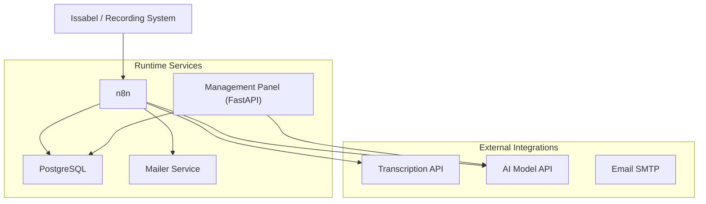
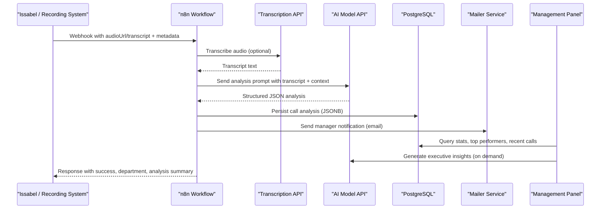
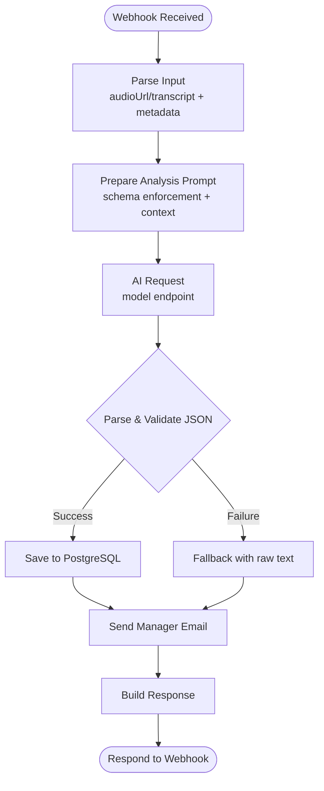
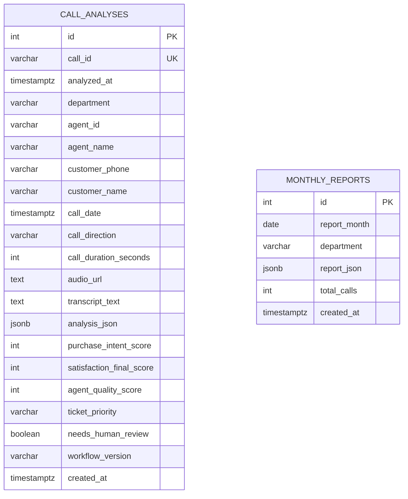
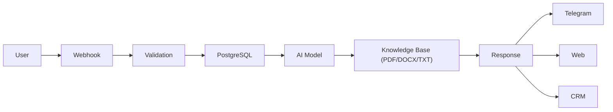
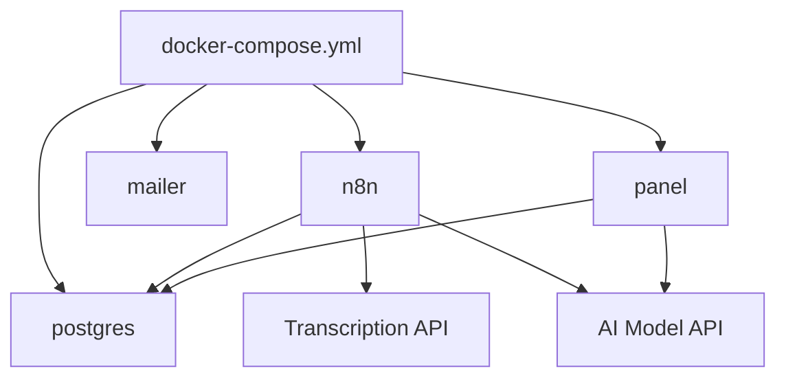

# Project Overview

<cite>
**Referenced Files in This Document**
- [README.md](file://README.md)
- [Mission.md](file://00_Company/Mission.md)
- [PainPoints.md](file://01_Strategy/PainPoints.md)
- [Atlas Call Intelligence README](file://03_Products/Atlas Call Intelligence/V1/README.md)
- [Atlas Call Intelligence Schema](file://03_Products/Atlas Call Intelligence/V1/schema.json)
- [Atlas Agent Architecture](file://03_Products/Atlas Agent/V1/Architecture.md)
- [Atlas Agent Features](file://03_Products/Atlas Agent/V1/Features.md)
- [Docker Compose](file://docker/docker-compose.yml)
- [Call Intelligence Workflow](file://docker/n8n/workflows/atlas-call-intelligence-v1.json)
- [Panel Main](file://docker/panel/app/main.py)
- [Panel Queries](file://docker/panel/app/queries.py)
- [Database Schema](file://docker/postgres/init/001_call_intelligence.sql)
</cite>

## Table of Contents
1. [Introduction](#introduction)
2. [Project Structure](#project-structure)
3. [Core Components](#core-components)
4. [Architecture Overview](#architecture-overview)
5. [Detailed Component Analysis](#detailed-component-analysis)
6. [Dependency Analysis](#dependency-analysis)
7. [Performance Considerations](#performance-considerations)
8. [Troubleshooting Guide](#troubleshooting-guide)
9. [Conclusion](#conclusion)
10. [Appendices](#appendices)

## Introduction
Atlas is an AI-powered call intelligence and automation platform designed for Iranian accounting companies and software businesses. It transforms recorded calls into structured insights to improve customer support, accelerate sales, and optimize business processes. The system provides:
- Call intelligence: automatic transcription, sentiment analysis, satisfaction measurement, and agent performance evaluation
- Workflow automation: orchestrated pipelines via n8n for ingestion, analysis, storage, notifications, and reporting
- Management dashboard: a secure panel to explore metrics, top performers, hot leads, unhappy customers, and monthly reports

The project’s mission centers on eliminating repetitive work with AI and automation to reduce costs and increase productivity. Atlas targets call centers, sales teams, and support desks within accounting firms and software vendors, enabling data-driven decisions through standardized outputs and actionable workflows.

**Section sources**
- [README.md:1-7](file://README.md#L1-L7)
- [Mission.md:1-23](file://00_Company/Mission.md#L1-L23)
- [Atlas Call Intelligence README:1-191](file://03_Products/Atlas Call Intelligence/V1/README.md#L1-L191)

## Project Structure
At a high level, Atlas comprises:
- Product documentation for Call Intelligence and Agent modules
- A Dockerized runtime with PostgreSQL, n8n (workflow automation), a mailer service, and a FastAPI management panel
- Workflows that implement the call intelligence pipeline and monthly reporting
- Database schema for storing per-call analyses and aggregated reports



**Diagram sources**
- [Docker Compose:1-98](file://docker/docker-compose.yml#L1-L98)
- [Call Intelligence Workflow:1-160](file://docker/n8n/workflows/atlas-call-intelligence-v1.json#L1-L160)
- [Panel Main:1-187](file://docker/panel/app/main.py#L1-L187)
- [Database Schema:1-45](file://docker/postgres/init/001_call_intelligence.sql#L1-L45)

**Section sources**
- [Docker Compose:1-98](file://docker/docker-compose.yml#L1-L98)
- [Atlas Call Intelligence README:16-28](file://03_Products/Atlas Call Intelligence/V1/README.md#L16-L28)

## Core Components
- Call Intelligence Pipeline: Ingests audio or transcripts, performs AI-driven analysis, stores results, and triggers notifications and reporting.
- Workflow Automation (n8n): Orchestrates parsing, prompt preparation, AI requests, validation, persistence, email notifications, and response building.
- Management Dashboard (FastAPI): Provides authenticated views for dashboards, staff performance, satisfaction, ready-to-buy leads, call details, and AI-generated executive insights.
- Data Layer (PostgreSQL): Stores call analyses and monthly reports with indexes for efficient querying.
- Mailer Service: Sends manager notifications based on workflow outcomes.

Key value propositions:
- AI-powered call analysis with standardized JSON output
- Automated ticket creation and manager notifications
- Performance reporting and staff ranking
- Business process optimization through workflow automation

Target audience:
- Iranian accounting companies seeking improved call handling and sales conversion
- Software businesses needing automated customer support and insight generation

**Section sources**
- [Atlas Call Intelligence README:5-15](file://03_Products/Atlas Call Intelligence/V1/README.md#L5-L15)
- [Call Intelligence Workflow:1-160](file://docker/n8n/workflows/atlas-call-intelligence-v1.json#L1-L160)
- [Panel Main:40-187](file://docker/panel/app/main.py#L40-L187)
- [Panel Queries:6-260](file://docker/panel/app/queries.py#L6-L260)
- [Database Schema:1-45](file://docker/postgres/init/001_call_intelligence.sql#L1-L45)

## Architecture Overview
Atlas implements a microservices-style architecture containerized with Docker:
- PostgreSQL persists call analyses and monthly reports
- n8n hosts workflows that coordinate transcription, AI analysis, validation, storage, and notifications
- FastAPI panel exposes UI endpoints and APIs for insights and statistics
- Mailer service handles outbound emails via SMTP



**Diagram sources**
- [Call Intelligence Workflow:1-160](file://docker/n8n/workflows/atlas-call-intelligence-v1.json#L1-L160)
- [Panel Main:68-187](file://docker/panel/app/main.py#L68-L187)
- [Docker Compose:1-98](file://docker/docker-compose.yml#L1-L98)
- [Database Schema:1-45](file://docker/postgres/init/001_call_intelligence.sql#L1-L45)

## Detailed Component Analysis

### Call Intelligence Pipeline
- Input normalization: Accepts audio URL or pre-transcribed text; extracts metadata such as call ID, department hint, agent info, customer info, direction, duration, date, and product context.
- Prompt preparation: Builds a domain-specific prompt for Iranian accounting company scenarios, enforcing a strict JSON schema for consistent outputs.
- AI request: Calls configured model endpoint with minimal temperature to ensure deterministic outputs.
- Validation and enrichment: Parses AI response, enforces schema, enriches meta fields, and prepares notifications.
- Persistence: Inserts or updates call_analyses with extracted scores and flags.
- Notification: Sends manager email summarizing key metrics and recommended actions.
- Response: Returns structured result including success flag, department, analysis, and notification details.



**Diagram sources**
- [Call Intelligence Workflow:1-160](file://docker/n8n/workflows/atlas-call-intelligence-v1.json#L1-L160)

**Section sources**
- [Atlas Call Intelligence README:71-142](file://03_Products/Atlas Call Intelligence/V1/README.md#L71-L142)
- [Call Intelligence Workflow:1-160](file://docker/n8n/workflows/atlas-call-intelligence-v1.json#L1-L160)
- [Atlas Call Intelligence Schema:1-153](file://03_Products/Atlas Call Intelligence/V1/schema.json#L1-L153)

### Management Dashboard
- Authentication: Optional password-based protection via cookie; middleware guards routes.
- Views: Dashboard overview, top performers, ready-to-buy leads, unhappy customers, staff performance, call duration, satisfaction, successful sales, monthly reports, and call detail pages.
- APIs: Stats endpoint and AI insights endpoint that aggregates context from queries and generates executive insights using the configured model.

```mermaid
classDiagram
class PanelApp {
+get("/login")
+post("/login")
+middleware()
+get("/")
+get("/top-performers")
+get("/ready-to-buy")
+get("/unhappy-customers")
+get("/staff-performance")
+get("/call-duration")
+get("/satisfaction")
+get("/successful-sales")
+get("/monthly-reports")
+get("/monthly-reports/{report_id}")
+get("/calls/{call_id}")
+get("/api/stats")
+get("/api/ai-insights")
}
class Queries {
+overview_stats()
+top_performers(limit)
+ready_to_buy(limit)
+unhappy_customers(limit)
+staff_performance()
+staff_call_duration()
+staff_satisfaction()
+successful_sales(limit)
+monthly_reports_list(limit)
+monthly_report_detail(report_id)
+recent_calls(limit)
+call_detail(call_id)
+department_breakdown()
+ai_context_payload()
}
PanelApp --> Queries : "uses"
```

**Diagram sources**
- [Panel Main:1-187](file://docker/panel/app/main.py#L1-L187)
- [Panel Queries:1-260](file://docker/panel/app/queries.py#L1-L260)

**Section sources**
- [Panel Main:40-187](file://docker/panel/app/main.py#L40-L187)
- [Panel Queries:6-260](file://docker/panel/app/queries.py#L6-L260)

### Data Model
- call_analyses: Stores per-call metadata, transcript, full JSON analysis, derived scores (purchase intent, satisfaction, agent quality), ticket priority, human review flags, and timestamps.
- monthly_reports: Aggregated monthly summaries by department with report JSON and total call counts.



**Diagram sources**
- [Database Schema:1-45](file://docker/postgres/init/001_call_intelligence.sql#L1-L45)

**Section sources**
- [Database Schema:1-45](file://docker/postgres/init/001_call_intelligence.sql#L1-L45)

### Atlas Agent Module
- Goal: Intelligent agent answering user questions from company documents and creating tickets when needed.
- Data flow: Webhook -> Validation -> Database -> AI Model -> Knowledge Base -> Response across channels (Telegram/Web/CRM).
- Services: n8n, PostgreSQL, Qdrant (Phase 2), Redis (Phase 2), OpenRouter (Phase 2).



**Diagram sources**
- [Atlas Agent Architecture:17-64](file://03_Products/Atlas Agent/V1/Architecture.md#L17-L64)

**Section sources**
- [Atlas Agent Architecture:1-97](file://03_Products/Atlas Agent/V1/Architecture.md#L1-L97)
- [Atlas Agent Features:1-67](file://03_Products/Atlas Agent/V1/Features.md#L1-L67)

## Dependency Analysis
- Runtime dependencies: PostgreSQL, n8n, mailer, panel services defined in docker-compose.
- External dependencies: Transcription API and AI Model API configured via environment variables.
- Workflow dependencies: n8n nodes depend on HTTP requests to external APIs and database credentials.
- Panel dependencies: FastAPI app depends on queries module and Jinja2 templates; optional AI insights generation uses configured model.



**Diagram sources**
- [Docker Compose:1-98](file://docker/docker-compose.yml#L1-L98)
- [Call Intelligence Workflow:1-160](file://docker/n8n/workflows/atlas-call-intelligence-v1.json#L1-L160)
- [Panel Main:1-187](file://docker/panel/app/main.py#L1-L187)

**Section sources**
- [Docker Compose:1-98](file://docker/docker-compose.yml#L1-L98)
- [Atlas Call Intelligence README:60-69](file://03_Products/Atlas Call Intelligence/V1/README.md#L60-L69)

## Performance Considerations
- Deterministic AI responses: Low temperature settings reduce variability and improve consistency for scoring and classification tasks.
- Indexing: Database indexes on analyzed_at, agent_id, department, and call_date support efficient reporting and filtering.
- Batch operations: Monthly reports aggregate large datasets; ensure cron scheduling aligns with peak usage windows.
- Timezone configuration: Set timezone to Asia/Tehran for accurate scheduling and reporting.
- Connection pooling and retries: Ensure robust error handling for external API calls to avoid blocking workflows.

[No sources needed since this section provides general guidance]

## Troubleshooting Guide
Common issues and resolutions:
- Missing transcript/audio: Validate webhook input; require either audioUrl or transcript before proceeding.
- AI parse errors: If JSON parsing fails, fallback preserves raw text and flags for manual review.
- Email delivery failures: Verify SMTP credentials and manager email configuration; mailer service logs can help diagnose.
- Database connectivity: Confirm PostgreSQL credentials and health checks in docker-compose; ensure schema initialization runs on startup.
- Panel authentication: If PANEL_PASSWORD is set, ensure correct cookie and access to protected routes.

Operational tips:
- Use confidence_overall and quality_control flags to identify low-quality analyses requiring human review.
- Monitor needs_human_review and analysis_flags to prioritize QA efforts.
- Leverage monthly reports to detect trends and anomalies over time.

**Section sources**
- [Atlas Call Intelligence README:170-183](file://03_Products/Atlas Call Intelligence/V1/README.md#L170-L183)
- [Call Intelligence Workflow:1-160](file://docker/n8n/workflows/atlas-call-intelligence-v1.json#L1-L160)
- [Docker Compose:1-98](file://docker/docker-compose.yml#L1-L98)

## Conclusion
Atlas delivers a comprehensive AI-powered call intelligence and automation platform tailored for Iranian accounting companies and software businesses. By standardizing call analysis, automating workflows, and providing actionable insights through a management dashboard, Atlas enables organizations to improve customer satisfaction, accelerate sales cycles, and optimize operational efficiency. The modular architecture supports future enhancements such as CRM integrations, real-time alerts, and domain-specific model fine-tuning.

[No sources needed since this section summarizes without analyzing specific files]

## Appendices

### Practical Use Cases
- Call transcription: Provide audioUrl or transcript to the webhook; the workflow transcribes if needed and proceeds to analysis.
- Sentiment analysis: The schema includes sentiment overall, score, and voice indicators to capture customer mood changes during calls.
- Performance reporting: The dashboard surfaces top performers, staff satisfaction rates, and call durations for coaching and recognition.
- Ready-to-buy leads: Filter calls with high purchase intent scores and estimated close probabilities to prioritize follow-ups.
- Unhappy customer detection: Identify low satisfaction scores and retention risks to trigger immediate interventions.

**Section sources**
- [Atlas Call Intelligence README:71-142](file://03_Products/Atlas Call Intelligence/V1/README.md#L71-L142)
- [Atlas Call Intelligence Schema:53-77](file://03_Products/Atlas Call Intelligence/V1/schema.json#L53-L77)
- [Panel Queries:52-106](file://docker/panel/app/queries.py#L52-L106)

### System Boundaries and Integration Patterns
- Boundaries:
  - Ingestion boundary: Webhook accepts structured payloads from recording systems or panels.
  - Processing boundary: n8n orchestrates transcription, AI analysis, validation, and persistence.
  - Presentation boundary: FastAPI panel renders dashboards and serves APIs for insights and statistics.
  - Notification boundary: Mailer service sends emails via SMTP.
- Integration patterns:
  - Event-driven: Webhooks trigger workflows upon new call data.
  - API-driven: Panel and workflows consume external AI and transcription APIs.
  - Data-driven: PostgreSQL stores normalized analyses and reports consumed by dashboards and analytics.

**Section sources**
- [Call Intelligence Workflow:1-160](file://docker/n8n/workflows/atlas-call-intelligence-v1.json#L1-L160)
- [Panel Main:68-187](file://docker/panel/app/main.py#L68-L187)
- [Docker Compose:1-98](file://docker/docker-compose.yml#L1-L98)