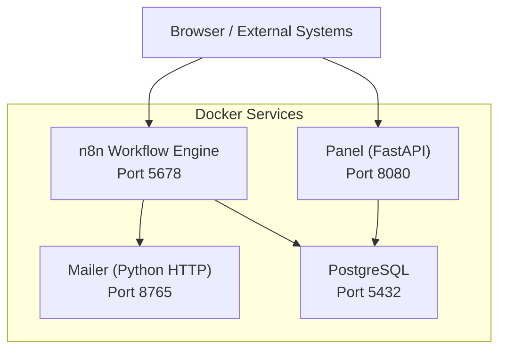
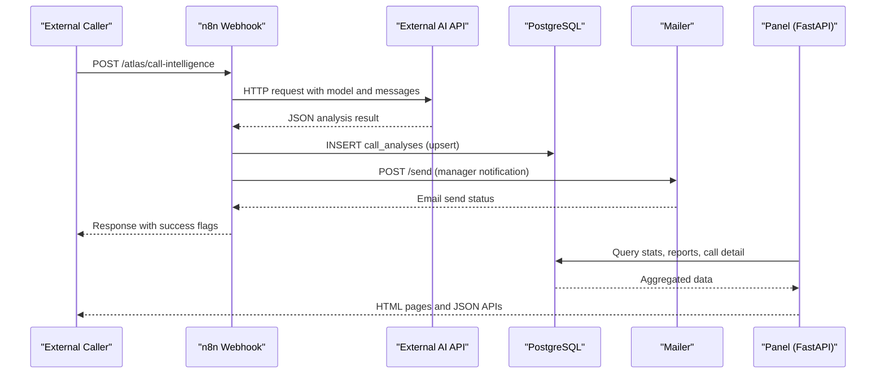
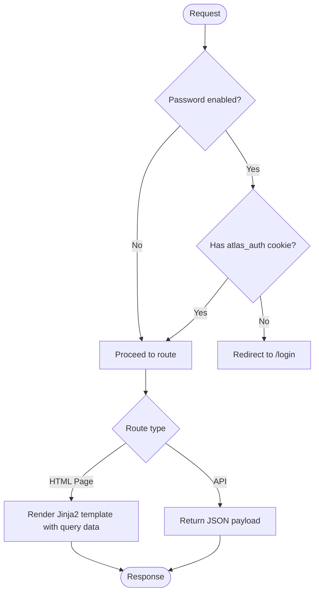
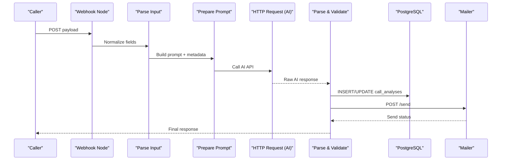
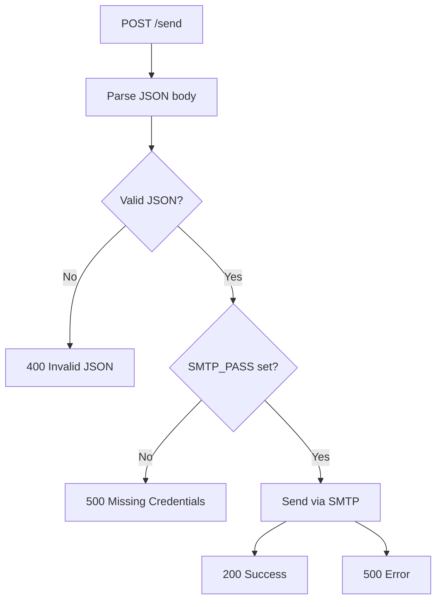
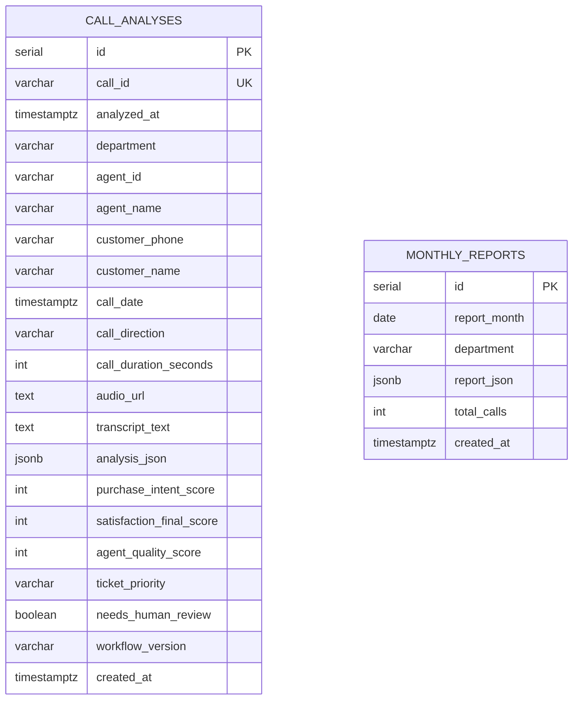
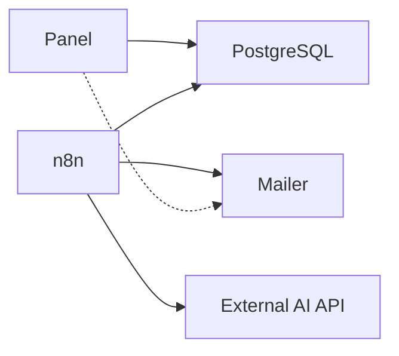

# System Architecture Overview

<cite>
**Referenced Files in This Document**
- [docker-compose.yml](file://docker/docker-compose.yml)
- [main.py](file://docker/panel/app/main.py)
- [config.py](file://docker/panel/app/config.py)
- [db.py](file://docker/panel/app/db.py)
- [queries.py](file://docker/panel/app/queries.py)
- [mailer.py](file://docker/mailer/mailer.py)
- [send_email.py](file://docker/mailer/send_email.py)
- [001_call_intelligence.sql](file://docker/postgres/init/001_call_intelligence.sql)
- [atlas-call-intelligence-v1.json](file://docker/n8n/workflows/atlas-call-intelligence-v1.json)
</cite>

## Table of Contents
1. Introduction
2. Project Structure
3. Core Components
4. Architecture Overview
5. Detailed Component Analysis
6. Dependency Analysis
7. Performance Considerations
8. Troubleshooting Guide
9. Conclusion

## Introduction
This document explains the high-level architecture and component interactions of the Atlas system, a call intelligence platform that ingests call data, performs AI-driven analysis, stores results, and exposes reporting via a web panel. The system is containerized with Docker Compose and uses an event-driven workflow engine to orchestrate processing steps such as transcription, AI analysis, database persistence, and email notifications.

Key architectural principles:
- Microservices separation: Panel (FastAPI), Mailer (HTTP SMTP relay), n8n (workflow engine), PostgreSQL (data store).
- Event-driven processing: Webhook-triggered workflows handle asynchronous call analysis and reporting.
- Template-based rendering: FastAPI serves Jinja2 templates for dashboards and reports.
- Modular service design: Each service has a single responsibility and communicates over HTTP or direct database access.

## Project Structure
The deployment is defined by a single Docker Compose file that orchestrates four services:
- PostgreSQL: persistent relational storage for call analyses and monthly reports.
- n8n: workflow automation engine that processes incoming call payloads, calls external AI APIs, persists results, and triggers emails.
- Panel: FastAPI application serving a secure admin UI and API endpoints backed by PostgreSQL.
- Mailer: lightweight Python HTTP server that sends emails via SMTP on behalf of other services.

**Diagram sources**
- [docker-compose.yml:3-98](file://docker/docker-compose.yml#L3-L98)

**Section sources**
- [docker-compose.yml:3-98](file://docker/docker-compose.yml#L3-L98)

## Core Components
- Panel (FastAPI): Provides authentication, dashboard pages, and REST endpoints. It renders Jinja2 templates and queries PostgreSQL for metrics, call details, and reports.
- n8n Workflows: Define webhook endpoints and processing pipelines. A primary workflow parses inputs, builds prompts, calls an external AI service, saves results to PostgreSQL, and notifies managers via email.
- Mailer Service: Exposes a simple HTTP POST endpoint to send emails using configured SMTP settings.
- PostgreSQL Database: Stores per-call AI analysis and monthly aggregated reports with indexes for efficient querying.

**Section sources**
- [main.py:43-190](file://docker/panel/app/main.py#L43-L190)
- [atlas-call-intelligence-v1.json:11-159](file://docker/n8n/workflows/atlas-call-intelligence-v1.json#L11-L159)
- [mailer.py:18-77](file://docker/mailer/mailer.py#L18-L77)
- [001_call_intelligence.sql:4-45](file://docker/postgres/init/001_call_intelligence.sql#L4-L45)

## Architecture Overview
Atlas follows a microservices pattern orchestrated by Docker Compose:
- Ingestion: External systems submit call data to the n8n webhook endpoint.
- Processing: n8n normalizes input, constructs an AI prompt, invokes an external AI API, validates and enriches the response, then persists results to PostgreSQL.
- Notification: n8n optionally calls the Mailer service to send manager notifications via SMTP.
- Consumption: The Panel reads from PostgreSQL to render dashboards and expose API endpoints for insights and statistics.

**Diagram sources**
- [atlas-call-intelligence-v1.json:11-159](file://docker/n8n/workflows/atlas-call-intelligence-v1.json#L11-L159)
- [main.py:71-190](file://docker/panel/app/main.py#L71-L190)
- [mailer.py:36-77](file://docker/mailer/mailer.py#L36-L77)
- [001_call_intelligence.sql:4-45](file://docker/postgres/init/001_call_intelligence.sql#L4-L45)

## Detailed Component Analysis

### Panel (FastAPI)
Responsibilities:
- Authentication middleware protecting routes when a password is configured.
- Dashboard and report pages rendered with Jinja2 templates.
- API endpoints for AI insights and statistics.
- Data retrieval via query functions against PostgreSQL.

Key flows:
- Login flow sets an httponly cookie for session management.
- Dashboard aggregates overview stats, top performers, recent calls, and department breakdowns.
- Monthly reports list and detail views fetch stored reports.
- AI insights endpoint composes a context payload and calls an AI generator function.

**Diagram sources**
- [main.py:43-68](file://docker/panel/app/main.py#L43-L68)
- [main.py:71-190](file://docker/panel/app/main.py#L71-L190)

**Section sources**
- [main.py:43-190](file://docker/panel/app/main.py#L43-L190)
- [config.py:1-14](file://docker/panel/app/config.py#L1-L14)
- [db.py:1-31](file://docker/panel/app/db.py#L1-L31)
- [queries.py:6-260](file://docker/panel/app/queries.py#L6-L260)

### n8n Workflow Engine
Responsibilities:
- Expose a webhook endpoint to receive call payloads.
- Parse and normalize input fields.
- Build structured prompts for AI models.
- Call external AI API and parse responses into a consistent schema.
- Persist analysis results to PostgreSQL with upsert semantics.
- Trigger email notifications via the Mailer service.
- Respond to the caller with processing outcomes.

Data flow highlights:
- Input normalization supports multiple field names for flexibility.
- Prompt construction includes product context and department hints.
- AI invocation uses environment variables for URL, model, and key.
- Database insertion maps analysis fields to columns and JSONB structures.
- Email notification body summarizes key metrics and actions.

**Diagram sources**
- [atlas-call-intelligence-v1.json:11-159](file://docker/n8n/workflows/atlas-call-intelligence-v1.json#L11-L159)

**Section sources**
- [atlas-call-intelligence-v1.json:11-159](file://docker/n8n/workflows/atlas-call-intelligence-v1.json#L11-L159)

### Mailer Service
Responsibilities:
- Provide a simple HTTP POST endpoint to send emails.
- Use SMTP configuration from environment variables.
- Handle invalid JSON and missing credentials gracefully.

Operational notes:
- Default recipient can be set via environment variable.
- Errors return appropriate HTTP status codes and JSON error messages.
- A standalone script exists for ad-hoc email testing.

**Diagram sources**
- [mailer.py:18-77](file://docker/mailer/mailer.py#L18-L77)

**Section sources**
- [mailer.py:18-77](file://docker/mailer/mailer.py#L18-L77)
- [send_email.py:9-39](file://docker/mailer/send_email.py#L9-L39)

### PostgreSQL Database
Responsibilities:
- Store per-call AI analysis records with rich metadata and scores.
- Store monthly aggregated reports for historical analysis.
- Provide indexed access for performance-critical queries.

Schema highlights:
- call_analyses: unique call_id, timestamps, agent/customer info, transcript text, JSONB analysis, scores, ticket priority, review flags.
- monthly_reports: month, department, JSONB report content, total calls.
- Indexes on analyzed_at, agent_id, department, call_date, and report_month optimize common queries.

**Diagram sources**
- [001_call_intelligence.sql:4-45](file://docker/postgres/init/001_call_intelligence.sql#L4-L45)

**Section sources**
- [001_call_intelligence.sql:4-45](file://docker/postgres/init/001_call_intelligence.sql#L4-L45)

## Dependency Analysis
Service dependencies and communication patterns:
- Panel depends on PostgreSQL for all data operations.
- n8n depends on PostgreSQL for persistence and on external AI API for analysis.
- n8n optionally depends on the Mailer service for email notifications.
- Docker Compose defines startup order and health checks to ensure PostgreSQL is ready before dependent services start.

**Diagram sources**
- [docker-compose.yml:3-98](file://docker/docker-compose.yml#L3-L98)
- [atlas-call-intelligence-v1.json:47-119](file://docker/n8n/workflows/atlas-call-intelligence-v1.json#L47-L119)

**Section sources**
- [docker-compose.yml:3-98](file://docker/docker-compose.yml#L3-L98)
- [atlas-call-intelligence-v1.json:47-119](file://docker/n8n/workflows/atlas-call-intelligence-v1.json#L47-L119)

## Performance Considerations
- Database indexing: Queries leverage indexes on analyzed_at, agent_id, department, call_date, and report_month to support fast aggregations and filtering.
- Connection management: Panel uses a context manager to open and close connections safely, reducing resource leaks.
- Asynchronous processing: n8n offloads heavy AI processing and email sending to background workflows, keeping the Panel responsive.
- Templating cache: Panel disables template caching for development compatibility; consider enabling in production for performance.
- External API timeouts: n8n HTTP nodes should configure appropriate timeouts to avoid long-running requests blocking workflows.

[No sources needed since this section provides general guidance]

## Troubleshooting Guide
Common issues and resolutions:
- SMTP configuration: Ensure SMTP_PASS is set; otherwise, the Mailer returns an error indicating missing credentials.
- Webhook parsing: If the n8n workflow receives malformed JSON or missing required fields, it will fail early; validate payloads before submission.
- Database connectivity: Verify environment variables for DB_HOST, DB_PORT, DB_NAME, DB_USER, and DB_PASSWORD in the Panel configuration.
- Health checks: Docker Compose health checks ensure PostgreSQL is ready before dependent services start; check logs if services fail to connect.

**Section sources**
- [mailer.py:18-33](file://docker/mailer/mailer.py#L18-L33)
- [atlas-call-intelligence-v1.json:25-35](file://docker/n8n/workflows/atlas-call-intelligence-v1.json#L25-L35)
- [config.py:1-14](file://docker/panel/app/config.py#L1-L14)
- [docker-compose.yml:20-25](file://docker/docker-compose.yml#L20-L25)

## Conclusion
Atlas employs a clean separation of concerns across microservices:
- Workflow automation (n8n) handles ingestion, AI processing, persistence, and notifications.
- API endpoints (Panel) provide user-facing dashboards and programmatic access to insights.
- Database operations are centralized in PostgreSQL with optimized schemas and indexes.
- User interface rendering uses Jinja2 templates within a FastAPI application.

Architectural decisions emphasize event-driven processing, template-based rendering, and modular service design. Scalability is supported through containerization, asynchronous workflows, and database indexing. Integration patterns include HTTP webhooks for ingestion, external AI API calls for analysis, and SMTP for reliable email delivery.

[No sources needed since this section summarizes without analyzing specific files]