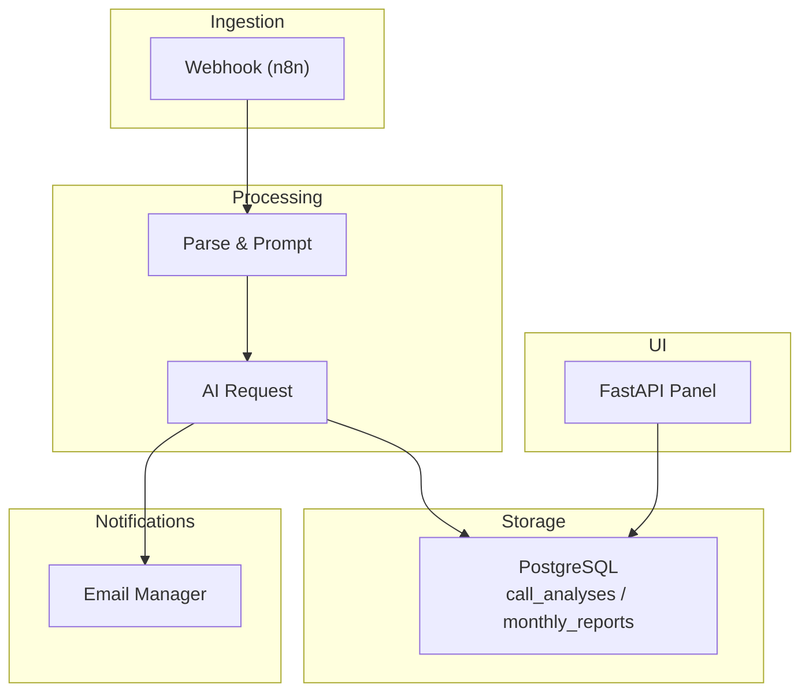
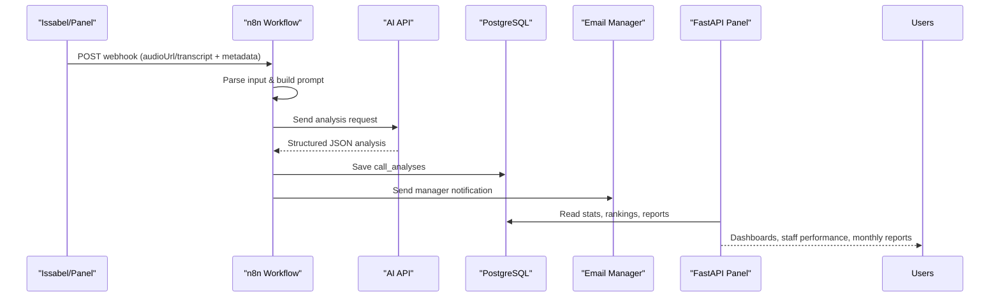
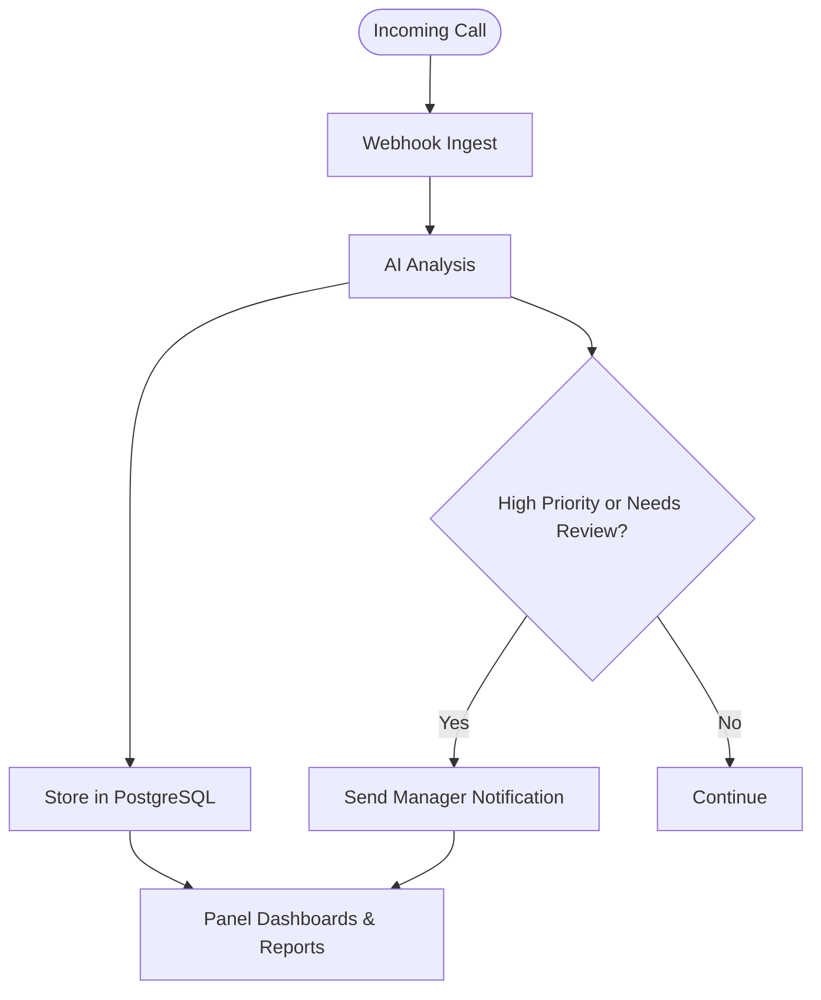
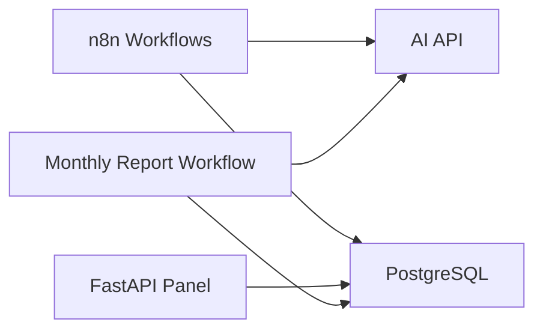

# Target Audience and Use Cases

<cite>
**Referenced Files in This Document**
- [Atlas Call Intelligence v1 README](file://03_Products/Atlas%20Call%20Intelligence/V1/README.md)
- [Call Intelligence Schema](file://03_Products/Atlas%20Call%20Intelligence/V1/schema.json)
- [Call Intelligence Workflow](file://docker/n8n/workflows/atlas-call-intelligence-v1.json)
- [Monthly Report Workflow](file://docker/n8n/workflows/atlas-call-intelligence-monthly-report.json)
- [Database Schema](file://docker/postgres/init/001_call_intelligence.sql)
- [Panel Main Routes](file://docker/panel/app/main.py)
- [Dashboard Template](file://docker/panel/templates/dashboard.html)
- [Staff Performance Template](file://docker/panel/templates/staff_performance.html)
- [Monthly Reports Template](file://docker/panel/templates/monthly_reports.html)
- [Test Result Sample](file://docker/scripts/test-result.json)
- [Real Call Result Sample](file://docker/scripts/real-call-result.json)
</cite>

## Table of Contents
1. Introduction
2. Project Structure
3. Core Components
4. Architecture Overview
5. Detailed Component Analysis
6. Dependency Analysis
7. Performance Considerations
8. Troubleshooting Guide
9. Conclusion

## Introduction
This document defines Atlas’s target audience and use cases with a focus on Iranian accounting companies, software businesses, and customer support teams. It explains how these organizations benefit from automated call analysis, satisfaction tracking, sales pipeline insights, and staff performance evaluation. It also outlines common workflows such as automated call analysis, alert generation, and monthly reporting, and provides concrete examples grounded in the repository’s test data and schema definitions.

## Project Structure
Atlas is composed of:
- A call intelligence workflow that ingests audio or transcripts, runs AI analysis, stores results, and notifies managers
- A monthly reporting workflow that aggregates call data into executive summaries
- A web panel for dashboards, staff performance, satisfaction, and monthly reports
- A PostgreSQL database storing per-call analyses and monthly reports
- JSON schemas defining structured outputs for consistent analytics

**Diagram sources**
- [Call Intelligence Workflow:12-159](file://docker/n8n/workflows/atlas-call-intelligence-v1.json#L12-L159)
- [Monthly Report Workflow:12-172](file://docker/n8n/workflows/atlas-call-intelligence-monthly-report.json#L12-L172)
- [Database Schema:4-44](file://docker/postgres/init/001_call_intelligence.sql#L4-L44)
- [Panel Main Routes:68-186](file://docker/panel/app/main.py#L68-L186)

**Section sources**
- [Atlas Call Intelligence v1 README:16-28](file://03_Products/Atlas%20Call%20Intelligence/V1/README.md#L16-L28)
- [Call Intelligence Workflow:12-159](file://docker/n8n/workflows/atlas-call-intelligence-v1.json#L12-L159)
- [Monthly Report Workflow:12-172](file://docker/n8n/workflows/atlas-call-intelligence-monthly-report.json#L12-L172)
- [Database Schema:4-44](file://docker/postgres/init/001_call_intelligence.sql#L4-L44)
- [Panel Main Routes:68-186](file://docker/panel/app/main.py#L68-L186)

## Core Components
- Automated call analysis: Accepts audio URL or transcript, detects department (sales/support/mixed), analyzes sentiment and satisfaction, scores agent performance, and generates CRM-ready tickets.
- Monthly reporting: Aggregates calls by department and agent, computes KPIs, ranks performers, identifies coaching needs, and produces an AI-generated executive summary.
- Web panel: Provides dashboards for top performers, ready-to-buy leads, unhappy customers, staff performance, satisfaction trends, successful sales, and monthly report details.
- Data model: Stores per-call metadata, full transcript, structured analysis JSON, and derived scores; monthly reports store aggregated JSON and totals.

**Section sources**
- [Atlas Call Intelligence v1 README:5-14](file://03_Products/Atlas%20Call%20Intelligence/V1/README.md#L5-L14)
- [Call Intelligence Schema:1-153](file://03_Products/Atlas%20Call%20Intelligence/V1/schema.json#L1-L153)
- [Database Schema:4-44](file://docker/postgres/init/001_call_intelligence.sql#L4-L44)
- [Panel Main Routes:68-186](file://docker/panel/app/main.py#L68-L186)

## Architecture Overview
The platform orchestrates call processing through n8n workflows, persists results in PostgreSQL, and exposes a FastAPI-based panel for visualization and reporting.

**Diagram sources**
- [Call Intelligence Workflow:12-159](file://docker/n8n/workflows/atlas-call-intelligence-v1.json#L12-L159)
- [Monthly Report Workflow:12-172](file://docker/n8n/workflows/atlas-call-intelligence-monthly-report.json#L12-L172)
- [Panel Main Routes:68-186](file://docker/panel/app/main.py#L68-L186)
- [Database Schema:4-44](file://docker/postgres/init/001_call_intelligence.sql#L4-L44)

## Detailed Component Analysis

### Primary Target Audience
- Iranian accounting companies: Benefit from automated call quality monitoring, compliance notes, and tailored sales/support insights for accounting software offerings.
- Software businesses: Leverage purchase intent scoring, objection handling, discount estimation, and follow-up recommendations to optimize sales pipelines.
- Customer support teams: Track first-call resolution, retention risk, and satisfaction deltas to improve service quality and reduce churn.

These audiences are supported by:
- Department detection and tailored analysis (sales vs support vs mixed)
- Satisfaction metrics (initial/final scores, delta)
- Agent performance scoring across communication, empathy, product knowledge, and process adherence
- Ticket generation with priority and actionable next steps

**Section sources**
- [Atlas Call Intelligence v1 README:5-14](file://03_Products/Atlas%20Call%20Intelligence/V1/README.md#L5-L14)
- [Call Intelligence Schema:53-118](file://03_Products/Atlas%20Call%20Intelligence/V1/schema.json#L53-L118)

### Use Case: Call Quality Monitoring
- Automated transcription and AI analysis produce structured quality signals: transcript quality flags, confidence scores, and human review triggers.
- Managers can monitor needs_human_review and analysis_flags to prioritize QA reviews.

Example patterns:
- Needs human review when transcript quality is poor or confidence is low
- Flags for compliance notes and risks surfaced in insights

**Section sources**
- [Call Intelligence Schema:142-150](file://03_Products/Atlas%20Call%20Intelligence/V1/schema.json#L142-L150)
- [Atlas Call Intelligence v1 README:170-174](file://03_Products/Atlas%20Call%20Intelligence/V1/README.md#L170-L174)

### Use Case: Customer Satisfaction Tracking
- Satisfaction tracked via initial and final scores with delta calculation and resolution status.
- Sentiment analysis includes overall tone and voice indicators.

Operational impact:
- Identify unhappy customers quickly
- Measure improvement after interventions
- Correlate satisfaction with agent performance

**Section sources**
- [Call Intelligence Schema:53-77](file://03_Products/Atlas%20Call%20Intelligence/V1/schema.json#L53-L77)

### Use Case: Sales Pipeline Analysis
- Purchase intent score, purchase stage, main objections, price sensitivity, estimated discount to close, and close probability guide pipeline management.
- Recommended next steps help agents prioritize follow-ups.

Real-world pattern:
- Objections about pricing lead to estimated discount suggestions and follow-up actions

**Section sources**
- [Call Intelligence Schema:93-106](file://03_Products/Atlas%20Call%20Intelligence/V1/schema.json#L93-L106)
- [Test Result Sample:13-16](file://docker/scripts/test-result.json#L13-L16)

### Use Case: Staff Performance Evaluation
- Agent performance includes response quality, communication skills, product knowledge, empathy, and process adherence.
- Strengths and improvements are captured per call; aggregated in monthly reports and panel views.

Manager workflows:
- Review staff performance page for average quality and satisfaction
- Identify top performers and those needing coaching
- Drill into specific calls for detailed feedback

**Section sources**
- [Call Intelligence Schema:79-92](file://03_Products/Atlas%20Call%20Intelligence/V1/schema.json#L79-L92)
- [Staff Performance Template:8-31](file://docker/panel/templates/staff_performance.html#L8-L31)
- [Monthly Report Workflow:71-79](file://docker/n8n/workflows/atlas-call-intelligence-monthly-report.json#L71-L79)

### Role-Based Scenarios
- Executives: View monthly reports and AI-generated executive summaries to assess department performance, identify critical issues, and set training priorities.
- Sales managers: Monitor ready-to-buy leads, purchase intent trends, and recommended next steps to accelerate conversions.
- Support managers: Track unhappy customers, first-call resolution rates, and retention risk to improve service outcomes.
- Agents: Access call detail pages to review transcripts, satisfaction changes, and feedback for continuous improvement.

**Section sources**
- [Panel Main Routes:83-155](file://docker/panel/app/main.py#L83-L155)
- [Dashboard Template:4-11](file://docker/panel/templates/dashboard.html#L4-L11)
- [Monthly Reports Template:4-20](file://docker/panel/templates/monthly_reports.html#L4-L20)

### Common Workflows
- Automated call analysis:
  - Ingest audio or transcript via webhook
  - Generate structured analysis using AI
  - Persist results to PostgreSQL
  - Notify managers via email
- Alert generation:
  - High-priority tickets and needs_human_review trigger notifications
  - Unhappy customers flagged for immediate attention
- Performance reporting:
  - Monthly aggregation of calls by department and agent
  - Rankings, coaching needs, and executive summaries generated automatically

**Diagram sources**
- [Call Intelligence Workflow:12-159](file://docker/n8n/workflows/atlas-call-intelligence-v1.json#L12-L159)
- [Monthly Report Workflow:12-172](file://docker/n8n/workflows/atlas-call-intelligence-monthly-report.json#L12-L172)
- [Panel Main Routes:68-186](file://docker/panel/app/main.py#L68-L186)

**Section sources**
- [Atlas Call Intelligence v1 README:71-140](file://03_Products/Atlas%20Call%20Intelligence/V1/README.md#L71-L140)
- [Call Intelligence Workflow:12-159](file://docker/n8n/workflows/atlas-call-intelligence-v1.json#L12-L159)
- [Monthly Report Workflow:12-172](file://docker/n8n/workflows/atlas-call-intelligence-monthly-report.json#L12-L172)

### Concrete Examples from Test Data and Schema
- Test call example shows a sales conversation where the customer requests information about accounting software, raises price objections, and receives a discount offer. The analysis captures purchase intent, estimated discount, and recommended next steps.
- Real call example demonstrates a detailed sales interaction covering features, modules, support hours, and future upsell opportunities, illustrating how rich transcripts feed into structured insights.

These examples validate:
- Accurate capture of customer needs, pain points, and products mentioned
- Actionable ticket creation with priority and follow-up requirements
- Agent performance insights including key actions taken

**Section sources**
- [Test Result Sample:13-16](file://docker/scripts/test-result.json#L13-L16)
- [Real Call Result Sample:7-15](file://docker/scripts/real-call-result.json#L7-L15)
- [Call Intelligence Schema:53-118](file://03_Products/Atlas%20Call%20Intelligence/V1/schema.json#L53-L118)

## Dependency Analysis
Atlas components depend on each other as follows:
- n8n workflows depend on AI APIs for analysis and on PostgreSQL for persistence
- The panel depends on PostgreSQL for data retrieval and templates for rendering
- Monthly reports depend on aggregated call data and AI for executive summaries

**Diagram sources**
- [Call Intelligence Workflow:12-159](file://docker/n8n/workflows/atlas-call-intelligence-v1.json#L12-L159)
- [Monthly Report Workflow:12-172](file://docker/n8n/workflows/atlas-call-intelligence-monthly-report.json#L12-L172)
- [Panel Main Routes:68-186](file://docker/panel/app/main.py#L68-L186)
- [Database Schema:4-44](file://docker/postgres/init/001_call_intelligence.sql#L4-L44)

**Section sources**
- [Call Intelligence Workflow:12-159](file://docker/n8n/workflows/atlas-call-intelligence-v1.json#L12-L159)
- [Monthly Report Workflow:12-172](file://docker/n8n/workflows/atlas-call-intelligence-monthly-report.json#L12-L172)
- [Panel Main Routes:68-186](file://docker/panel/app/main.py#L68-L186)
- [Database Schema:4-44](file://docker/postgres/init/001_call_intelligence.sql#L4-L44)

## Performance Considerations
- Indexes on analyzed_at, agent_id, department, and call_date optimize query performance for dashboards and monthly reports.
- Structured JSONB storage enables flexible analytics while maintaining query efficiency.
- Cron-triggered monthly reports run at a scheduled time to avoid peak load during business hours.

[No sources needed since this section provides general guidance]

## Troubleshooting Guide
Common issues and resolutions:
- Email sending failures: Ensure SMTP configuration is correct; check error messages for SMTP_PASS or HTTP errors.
- AI parsing errors: If the AI returns non-JSON or malformed content, the workflow captures parse_error and raw_text for debugging.
- Missing data: Verify that call metadata (agent_name, customer_phone, call_date) is provided to enrich analysis and reporting.

Operational checks:
- Validate webhook endpoints and credentials in n8n
- Confirm PostgreSQL connectivity and schema initialization
- Review panel authentication and cookie settings if access is denied

**Section sources**
- [Test Result Sample:2-12](file://docker/scripts/test-result.json#L2-L12)
- [Call Intelligence Workflow:74-93](file://docker/n8n/workflows/atlas-call-intelligence-v1.json#L74-L93)
- [Panel Main Routes:40-65](file://docker/panel/app/main.py#L40-L65)

## Conclusion
Atlas delivers measurable value to Iranian accounting companies, software businesses, and customer support teams by automating call analysis, tracking satisfaction, analyzing sales pipelines, and evaluating staff performance. Executives gain actionable monthly insights, managers monitor KPIs and coaching needs, and agents receive targeted feedback to improve outcomes. The platform’s robust workflows, structured schema, and intuitive panel enable scalable operations and continuous improvement.

[No sources needed since this section summarizes without analyzing specific files]