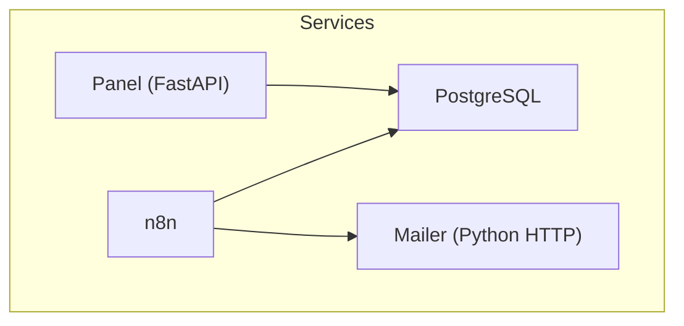
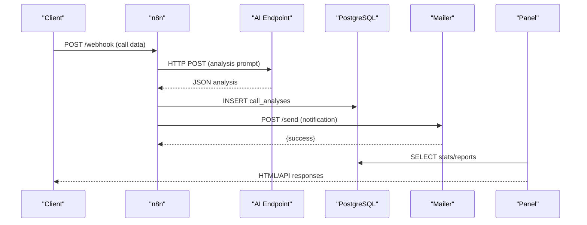
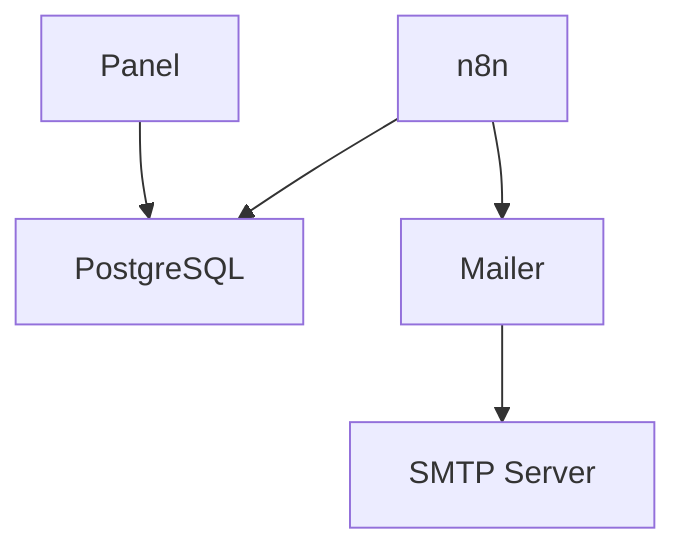

# Common Issues & Solutions

<cite>
**Referenced Files in This Document**
- [docker-compose.yml](file://docker/docker-compose.yml)
- [config.py](file://docker/panel/app/config.py)
- [main.py](file://docker/panel/app/main.py)
- [db.py](file://docker/panel/app/db.py)
- [queries.py](file://docker/panel/app/queries.py)
- [mailer.py](file://docker/mailer/mailer.py)
- [001_call_intelligence.sql](file://docker/postgres/init/001_call_intelligence.sql)
- [002_panel_seed.sql](file://docker/postgres/init/002_panel_seed.sql)
- [Dockerfile](file://docker/panel/Dockerfile)
- [atlas-call-intelligence-v1.json](file://docker/n8n/workflows/atlas-call-intelligence-v1.json)
</cite>

## Table of Contents
1. Introduction
2. Project Structure
3. Core Components
4. Architecture Overview
5. Detailed Component Analysis
6. Dependency Analysis
7. Performance Considerations
8. Troubleshooting Guide
9. Conclusion

## Introduction
This document provides a comprehensive guide to common issues and their solutions for the Atlas platform. It focuses on setup problems (Docker startup, database connectivity, service dependencies), authentication failures, webhook endpoint errors, workflow execution problems, configuration issues (environment variables, SMTP, API keys), and performance-related concerns (degradation, memory leaks, resource exhaustion). Each section includes step-by-step resolution guides, error message interpretations, log analysis techniques, and recovery procedures.

## Project Structure
Atlas is composed of:
- PostgreSQL database with initialization scripts
- n8n workflow engine orchestrating call intelligence workflows
- A Python FastAPI panel for dashboards and analytics
- A lightweight mailer service for sending notifications via SMTP
- Docker Compose to orchestrate all services

**Diagram sources**
- [docker-compose.yml:3-98](file://docker/docker-compose.yml#L3-L98)

**Section sources**
- [docker-compose.yml:3-98](file://docker/docker-compose.yml#L3-L98)

## Core Components
- Database layer: PostgreSQL schema and seed data define the core entities used by both n8n and the panel.
- Panel: FastAPI application serving dashboards and APIs; reads from PostgreSQL and optionally calls AI insights.
- Mailer: Simple HTTP server that sends emails via SMTP; exposed to other services.
- n8n: Workflow engine that processes incoming webhooks, calls external AI endpoints, persists results to PostgreSQL, and triggers email notifications.

Key responsibilities and integration points are defined across the following files:
- docker-compose.yml: Service definitions, environment variables, ports, health checks, and dependencies
- config.py: Panel configuration loaded from environment variables
- main.py: Panel routes, authentication middleware, and template rendering
- db.py: PostgreSQL connection management and query helpers
- queries.py: Report queries used by the panel
- mailer.py: SMTP-based email sender and HTTP handler
- SQL init scripts: Schema and sample data
- Dockerfile: Panel container build and runtime
- n8n workflow JSON: Webhook processing, AI request, DB persistence, and email notification

**Section sources**
- [docker-compose.yml:3-98](file://docker/docker-compose.yml#L3-L98)
- [config.py:1-14](file://docker/panel/app/config.py#L1-L14)
- [main.py:1-187](file://docker/panel/app/main.py#L1-L187)
- [db.py:1-31](file://docker/panel/app/db.py#L1-L31)
- [queries.py:1-260](file://docker/panel/app/queries.py#L1-L260)
- [mailer.py:1-77](file://docker/mailer/mailer.py#L1-L77)
- [001_call_intelligence.sql:1-45](file://docker/postgres/init/001_call_intelligence.sql#L1-L45)
- [002_panel_seed.sql:1-46](file://docker/postgres/init/002_panel_seed.sql#L1-L46)
- [Dockerfile:1-11](file://docker/panel/Dockerfile#L1-L11)
- [atlas-call-intelligence-v1.json:1-160](file://docker/n8n/workflows/atlas-call-intelligence-v1.json#L1-L160)

## Architecture Overview
The system integrates multiple services orchestrated by Docker Compose. The n8n workflow receives webhook payloads, performs AI-driven analysis, stores results in PostgreSQL, and optionally notifies managers via the mailer. The panel consumes the same database to render dashboards and provide APIs.

**Diagram sources**
- [atlas-call-intelligence-v1.json:12-159](file://docker/n8n/workflows/atlas-call-intelligence-v1.json#L12-L159)
- [docker-compose.yml:26-61](file://docker/docker-compose.yml#L26-L61)
- [docker-compose.yml:62-79](file://docker/docker-compose.yml#L62-L79)
- [docker-compose.yml:80-98](file://docker/docker-compose.yml#L80-L98)
- [queries.py:6-23](file://docker/panel/app/queries.py#L6-L23)

## Detailed Component Analysis

### Docker Compose Services and Dependencies
- PostgreSQL: Exposed on port 5432 with health check using pg_isready. Data persisted via volume.
- n8n: Depends on healthy Postgres; uses environment variables for DB credentials and AI endpoints; exposes port 5678.
- Mailer: Python HTTP server exposing port 8765; requires SMTP settings.
- Panel: Built from Dockerfile; depends on healthy Postgres; exposes port 8080; reads DB and optional AI settings.

Common pitfalls:
- Port conflicts on 5432, 5678, 8765, or 8080
- Missing or incorrect environment variables for DB, AI, SMTP
- Health check failures preventing dependent services from starting

Resolution steps:
- Verify ports are free and not bound by other processes
- Ensure environment variables are set correctly in .env or compose overrides
- Check service logs for health check failures and adjust timeouts if needed

**Section sources**
- [docker-compose.yml:3-98](file://docker/docker-compose.yml#L3-L98)

### Panel Authentication and Access Control
- Optional password protection via PANEL_PASSWORD cookie-based auth
- Middleware redirects unauthenticated requests to /login when PANEL_PASSWORD is set
- Static assets are exempted from auth checks

Common issues:
- Login loop or redirect to /login even when PANEL_PASSWORD is empty
- Cookie not set due to browser restrictions or missing secure flags
- Misconfigured PANEL_TITLE affecting templates

Resolution steps:
- Confirm PANEL_PASSWORD is set appropriately in environment
- Clear cookies and retry login
- Validate static file path mounting and template availability

**Section sources**
- [main.py:40-65](file://docker/panel/app/main.py#L40-L65)
- [config.py:12-13](file://docker/panel/app/config.py#L12-L13)

### Database Connectivity and Schema
- Panel connects to PostgreSQL using DSN built from config variables
- Queries rely on call_analyses and monthly_reports tables
- Seed script inserts demo data into call_analyses

Common issues:
- Connection errors due to wrong host, port, user, or password
- Missing tables or schema mismatch causing query failures
- Seed data not applied leading to empty dashboards

Resolution steps:
- Validate DB_HOST, DB_PORT, DB_NAME, DB_USER, DB_PASSWORD
- Ensure initialization scripts run at container start
- Re-run seed script if dashboard appears empty

**Section sources**
- [db.py:8-18](file://docker/panel/app/db.py#L8-L18)
- [queries.py:6-23](file://docker/panel/app/queries.py#L6-L23)
- [001_call_intelligence.sql:4-45](file://docker/postgres/init/001_call_intelligence.sql#L4-L45)
- [002_panel_seed.sql:4-46](file://docker/postgres/init/002_panel_seed.sql#L4-L46)

### Mailer Service and SMTP Configuration
- Mailer listens on port 8765 and accepts POST /send with JSON payload
- Requires SMTP_HOST, SMTP_PORT, SMTP_USER, SMTP_PASS
- Returns success or error JSON; logs exceptions

Common issues:
- SMTP_PASS not configured resulting in send failure
- Invalid JSON payload returning 400
- Network or TLS issues with SMTP server

Resolution steps:
- Set SMTP_PASS and ensure correct SMTP credentials
- Send valid JSON with fields: to, subject, body
- Inspect mailer logs for connection errors and adjust timeout or TLS settings

**Section sources**
- [mailer.py:10-33](file://docker/mailer/mailer.py#L10-L33)
- [mailer.py:36-68](file://docker/mailer/mailer.py#L36-L68)
- [mailer.py:74-77](file://docker/mailer/mailer.py#L74-L77)

### n8n Workflow Execution and Webhook Handling
- Webhook node defines endpoint path and response mode
- Input parsing extracts audio URL, transcript, and metadata
- AI request uses environment variables for model and endpoint
- Save-to-db node persists analysis results
- Email notification calls mailer service

Common issues:
- Webhook path mismatch or disabled workflow
- Missing or invalid input fields causing parse errors
- AI endpoint unreachable or returning non-JSON
- Database save failures due to credential or schema issues
- Email notification failures due to mailer downtime or SMTP misconfiguration

Resolution steps:
- Enable workflow and verify webhook path matches client expectations
- Validate input payload structure before sending
- Check AI endpoint connectivity and response format
- Confirm Postgres credentials and table schema exist
- Ensure mailer is reachable and SMTP settings are correct

**Section sources**
- [atlas-call-intelligence-v1.json:12-159](file://docker/n8n/workflows/atlas-call-intelligence-v1.json#L12-L159)

## Dependency Analysis
Service dependencies and data flows:
- n8n depends on PostgreSQL and optionally calls AI endpoints and mailer
- Panel depends on PostgreSQL and optionally calls AI insights
- Mailer depends on SMTP server
- All services are orchestrated via Docker Compose with health checks and restart policies

**Diagram sources**
- [docker-compose.yml:26-61](file://docker/docker-compose.yml#L26-L61)
- [docker-compose.yml:62-79](file://docker/docker-compose.yml#L62-L79)
- [docker-compose.yml:80-98](file://docker/docker-compose.yml#L80-L98)

**Section sources**
- [docker-compose.yml:3-98](file://docker/docker-compose.yml#L3-L98)

## Performance Considerations
- Database queries: Aggregations and filters can be heavy; ensure indexes exist on frequently queried columns
- Memory usage: Python services should run with appropriate limits; monitor container memory usage
- Concurrency: n8n workflow executions may queue; tune execution order and concurrency settings
- Network latency: AI endpoint calls and SMTP connections can introduce delays; consider timeouts and retries

Recommendations:
- Monitor query performance and add indexes where necessary
- Use connection pooling if scaling up panel instances
- Configure n8n execution limits and worker nodes for high throughput
- Cache frequent dashboard stats if needed

[No sources needed since this section provides general guidance]

## Troubleshooting Guide

### Docker Container Startup Failures
Symptoms:
- Containers exit immediately or fail to start
- Ports already in use
- Health checks failing

Steps:
- Check container logs for errors
- Verify environment variables and secrets
- Free conflicting ports or change mappings
- Review health check commands and timeouts

**Section sources**
- [docker-compose.yml:20-24](file://docker/docker-compose.yml#L20-L24)
- [docker-compose.yml:26-61](file://docker/docker-compose.yml#L26-L61)
- [docker-compose.yml:62-79](file://docker/docker-compose.yml#L62-L79)
- [docker-compose.yml:80-98](file://docker/docker-compose.yml#L80-L98)

### Database Connection Errors
Symptoms:
- Panel cannot load dashboards
- n8n fails to save analysis results
- Error messages indicating authentication or network issues

Steps:
- Validate DB_HOST, DB_PORT, DB_NAME, DB_USER, DB_PASSWORD
- Ensure PostgreSQL is healthy and accepting connections
- Confirm initialization scripts ran successfully
- Test connection manually from containers

**Section sources**
- [db.py:8-18](file://docker/panel/app/db.py#L8-L18)
- [config.py:3-7](file://docker/panel/app/config.py#L3-L7)
- [001_call_intelligence.sql:4-45](file://docker/postgres/init/001_call_intelligence.sql#L4-L45)

### Service Dependency Issues
Symptoms:
- n8n cannot reach mailer or AI endpoints
- Panel pages load but lack data
- Workflows stall at specific nodes

Steps:
- Verify service names and ports in compose
- Check depends_on conditions and health checks
- Inspect inter-service network connectivity
- Restart services in dependency order

**Section sources**
- [docker-compose.yml:26-61](file://docker/docker-compose.yml#L26-L61)
- [docker-compose.yml:62-79](file://docker/docker-compose.yml#L62-L79)
- [docker-compose.yml:80-98](file://docker/docker-compose.yml#L80-L98)

### Authentication Failures (Panel)
Symptoms:
- Redirects to login page repeatedly
- Cookie not set or rejected
- Access denied to protected routes

Steps:
- Confirm PANEL_PASSWORD is set
- Clear browser cookies and retry
- Ensure static paths are allowed without auth
- Check middleware logic for path exemptions

**Section sources**
- [main.py:40-65](file://docker/panel/app/main.py#L40-L65)
- [config.py:12-13](file://docker/panel/app/config.py#L12-L13)

### Webhook Endpoint Errors (n8n)
Symptoms:
- 404 or 400 responses from webhook
- Workflow does not execute
- Parse errors due to missing fields

Steps:
- Ensure workflow is active and webhook path matches
- Validate payload contains required fields (audioUrl/transcript and metadata)
- Check n8n logs for parse and validation errors
- Confirm response mode and output structure

**Section sources**
- [atlas-call-intelligence-v1.json:12-35](file://docker/n8n/workflows/atlas-call-intelligence-v1.json#L12-L35)
- [atlas-call-intelligence-v1.json:36-72](file://docker/n8n/workflows/atlas-call-intelligence-v1.json#L36-L72)

### Workflow Execution Problems
Symptoms:
- AI request fails or returns unexpected format
- Database insert fails
- Email notification not sent

Steps:
- Verify AI endpoint URL and API key environment variables
- Inspect AI response parsing and JSON normalization
- Confirm Postgres credentials and schema match expected fields
- Check mailer availability and SMTP configuration

**Section sources**
- [atlas-call-intelligence-v1.json:47-93](file://docker/n8n/workflows/atlas-call-intelligence-v1.json#L47-L93)
- [atlas-call-intelligence-v1.json:94-120](file://docker/n8n/workflows/atlas-call-intelligence-v1.json#L94-L120)
- [mailer.py:10-33](file://docker/mailer/mailer.py#L10-L33)

### Environment Variable Misconfigurations
Symptoms:
- Panel shows default values instead of configured ones
- n8n cannot connect to AI or DB
- Mailer defaults to incorrect SMTP settings

Steps:
- List all required variables per service
- Validate .env file syntax and precedence
- Rebuild/restart containers after changes
- Log variable values during startup for verification

**Section sources**
- [docker-compose.yml:34-53](file://docker/docker-compose.yml#L34-L53)
- [docker-compose.yml:70-76](file://docker/docker-compose.yml#L70-L76)
- [docker-compose.yml:86-95](file://docker/docker-compose.yml#L86-L95)
- [config.py:3-13](file://docker/panel/app/config.py#L3-L13)

### SMTP Server Connectivity Problems
Symptoms:
- Email send failures with authentication or TLS errors
- Timeouts connecting to SMTP host

Steps:
- Confirm SMTP_HOST, SMTP_PORT, SMTP_USER, SMTP_PASS
- Test SMTP connectivity from mailer container
- Adjust timeout and TLS settings if needed
- Review mailer logs for detailed error messages

**Section sources**
- [mailer.py:10-33](file://docker/mailer/mailer.py#L10-L33)
- [mailer.py:36-68](file://docker/mailer/mailer.py#L36-L68)

### API Key Validation Errors
Symptoms:
- AI requests return 401/403 or malformed responses
- n8n workflow fails at AI node

Steps:
- Verify AI_API_KEY and related environment variables
- Check AI endpoint authentication requirements
- Log request/response headers for debugging
- Rotate keys if compromised or expired

**Section sources**
- [docker-compose.yml:45-48](file://docker/docker-compose.yml#L45-L48)
- [atlas-call-intelligence-v1.json:47-61](file://docker/n8n/workflows/atlas-call-intelligence-v1.json#L47-L61)

### Performance Degradation, Memory Leaks, Resource Exhaustion
Symptoms:
- Slow dashboard loads
- High CPU/memory usage in containers
- Queued or delayed workflow executions

Steps:
- Monitor container metrics and logs
- Optimize database queries and add indexes
- Scale n8n workers and tune execution limits
- Limit concurrent requests and implement caching where appropriate
- Investigate memory leaks in custom code or third-party integrations

[No sources needed since this section provides general guidance]

### Error Message Interpretations and Log Analysis Techniques
- Docker logs: Use docker logs to inspect service startup and runtime errors
- n8n logs: Check workflow execution logs for node-level failures
- Panel logs: Review FastAPI logs for route errors and middleware issues
- Mailer logs: Print statements reveal SMTP connection states and errors
- Database logs: Inspect PostgreSQL logs for connection and query errors

Recovery procedures:
- Restart failed services in dependency order
- Roll back recent configuration changes
- Restore database from backups if corruption detected
- Reinitialize schema and seed data if necessary

**Section sources**
- [mailer.py:70-77](file://docker/mailer/mailer.py#L70-L77)
- [docker-compose.yml:20-24](file://docker/docker-compose.yml#L20-L24)

## Conclusion
This guide covered the most common issues encountered in the Atlas platform, including Docker startup failures, database connectivity problems, service dependency misconfigurations, authentication and webhook errors, workflow execution issues, environment variable mistakes, SMTP connectivity problems, API key validation errors, and performance concerns. By following the step-by-step resolutions, interpreting error messages, analyzing logs, and applying recovery procedures, operators can maintain a stable and efficient Atlas environment.