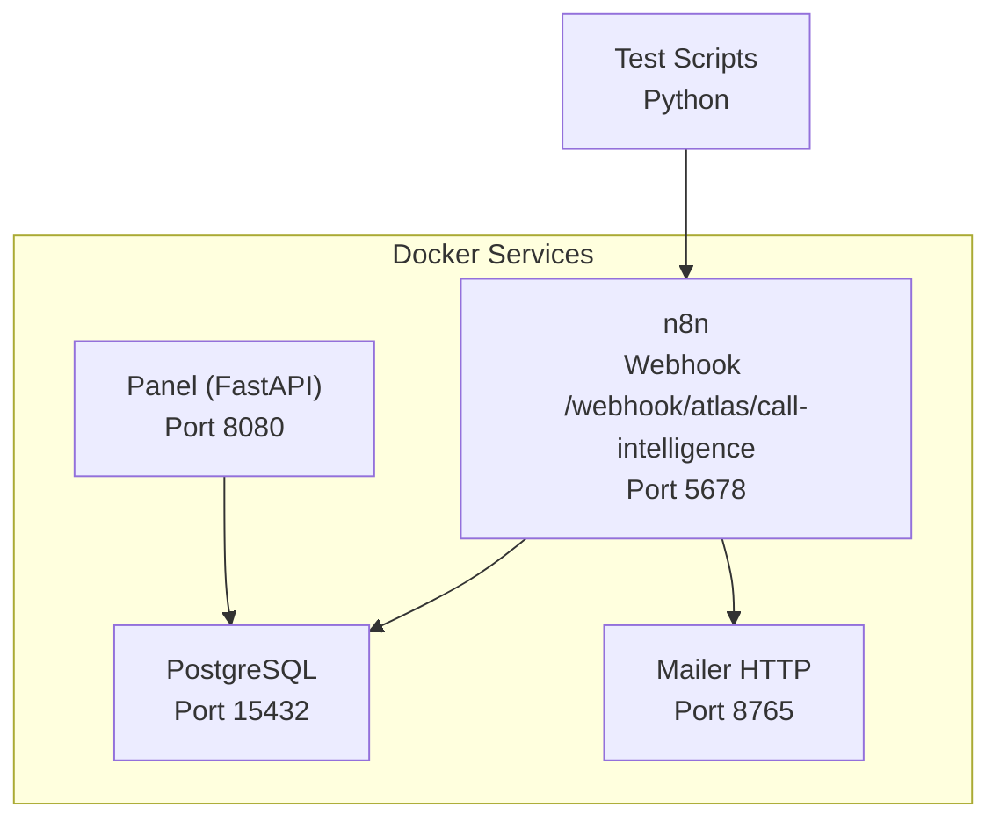
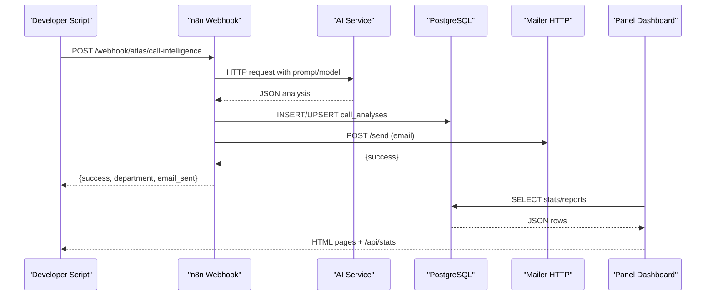
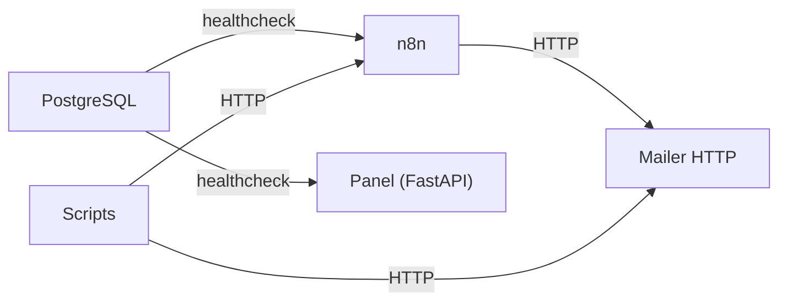

# Diagnostic Tools & Debugging

<cite>
**Referenced Files in This Document**
- [docker-compose.yml](file://docker/docker-compose.yml)
- [main.py](file://docker/panel/app/main.py)
- [config.py](file://docker/panel/app/config.py)
- [db.py](file://docker/panel/app/db.py)
- [queries.py](file://docker/panel/app/queries.py)
- [001_call_intelligence.sql](file://docker/postgres/init/001_call_intelligence.sql)
- [atlas-call-intelligence-v1.json](file://docker/n8n/workflows/atlas-call-intelligence-v1.json)
- [run-real-voice-test.py](file://docker/scripts/run-real-voice-test.py)
- [send-real-call-analysis.py](file://docker/scripts/send-real-call-analysis.py)
- [mailer.py](file://docker/mailer/mailer.py)
</cite>

## Table of Contents
1. [Introduction](#introduction)
2. [Project Structure](#project-structure)
3. [Core Components](#core-components)
4. [Architecture Overview](#architecture-overview)
5. [Detailed Component Analysis](#detailed-component-analysis)
6. [Dependency Analysis](#dependency-analysis)
7. [Performance Considerations](#performance-considerations)
8. [Troubleshooting Guide](#troubleshooting-guide)
9. [Conclusion](#conclusion)
10. [Appendices](#appendices)

## Introduction
This document explains how to diagnose and debug the Atlas platform using its built-in logging, health checks, dashboards, and development scripts. It covers Docker logs, PostgreSQL query logs, n8n workflow execution logs, and Python services (FastAPI panel, mailer, and test scripts). You will find guidance for proactive monitoring, effective log queries, performance profiling, memory analysis, custom debug configurations, and capturing diagnostics for support requests.

## Project Structure
The platform runs as a set of Docker services:
- PostgreSQL database with initialization scripts
- n8n workflow engine exposing webhooks for call analysis
- FastAPI-based Panel dashboard for reporting and insights
- Mailer service for email notifications
- Development scripts to run end-to-end voice tests

**Diagram sources**
- [docker-compose.yml:3-25](file://docker/docker-compose.yml#L3-L25)
- [docker-compose.yml:26-61](file://docker/docker-compose.yml#L26-L61)
- [docker-compose.yml:62-79](file://docker/docker-compose.yml#L62-L79)
- [docker-compose.yml:80-98](file://docker/docker-compose.yml#L80-L98)

**Section sources**
- [docker-compose.yml:3-98](file://docker/docker-compose.yml#L3-L98)

## Core Components
- PostgreSQL: Health-checked via pg_isready; stores call analyses and monthly reports.
- n8n: Receives webhook payloads, calls AI, persists results to PostgreSQL, and sends emails via the mailer.
- Panel (FastAPI): Provides HTML dashboards and API endpoints to read analytics from PostgreSQL.
- Mailer: Simple HTTP server that sends emails via SMTP.
- Test scripts: End-to-end tools to transcribe audio, analyze via n8n or directly via AI, and send emails.

Key configuration is environment-driven (database credentials, AI model keys, panel password, SMTP settings).

**Section sources**
- [docker-compose.yml:3-98](file://docker/docker-compose.yml#L3-L98)
- [config.py:1-14](file://docker/panel/app/config.py#L1-L14)
- [001_call_intelligence.sql:1-45](file://docker/postgres/init/001_call_intelligence.sql#L1-L45)

## Architecture Overview
End-to-end flow for call analysis and reporting:

**Diagram sources**
- [atlas-call-intelligence-v1.json:12-16](file://docker/n8n/workflows/atlas-call-intelligence-v1.json#L12-L16)
- [atlas-call-intelligence-v1.json:47-61](file://docker/n8n/workflows/atlas-call-intelligence-v1.json#L47-L61)
- [atlas-call-intelligence-v1.json:73-93](file://docker/n8n/workflows/atlas-call-intelligence-v1.json#L73-L93)
- [atlas-call-intelligence-v1.json:105-120](file://docker/n8n/workflows/atlas-call-intelligence-v1.json#L105-L120)
- [main.py:166-186](file://docker/panel/app/main.py#L166-L186)
- [queries.py:6-23](file://docker/panel/app/queries.py#L6-L23)

## Detailed Component Analysis

### PostgreSQL Health and Logs
- Health check: The compose file defines a healthcheck using pg_isready. Use it to verify readiness before other services start.
- Query logs: Enable detailed logging at the container level to capture slow queries and errors. Typical flags include log_min_duration_statement and log_connections/log_disconnections.
- Useful queries:
  - Recent calls and counts: see overview_stats logic.
  - Top performers, unhappy customers, staff performance, satisfaction rates, monthly reports.

Operational tips:
- Inspect container logs for startup and connection issues.
- Use psql inside the container to run ad-hoc queries against call_analyses and monthly_reports.

**Section sources**
- [docker-compose.yml:20-25](file://docker/docker-compose.yml#L20-L25)
- [001_call_intelligence.sql:4-45](file://docker/postgres/init/001_call_intelligence.sql#L4-L45)
- [queries.py:6-260](file://docker/panel/app/queries.py#L6-L260)

### n8n Workflow Execution Logs
- Webhook endpoint: /webhook/atlas/call-intelligence receives payloads and orchestrates analysis.
- Execution logs: In the n8n UI, open Executions to inspect inputs, outputs, and errors per run.
- Key nodes to inspect:
  - Parse Input: validates and normalizes payload fields.
  - Prepare Analysis Prompt: builds the AI prompt with metadata.
  - AI Request: calls external AI; failures here often indicate network/auth issues.
  - Save to DB: writes analysis to PostgreSQL; failures indicate DB connectivity or schema mismatch.
  - Send Manager Email: calls mailer; failures indicate mailer unavailability or SMTP misconfiguration.

Common issues:
- Invalid payload structure (missing transcript/audioUrl).
- AI provider timeouts or invalid responses.
- Database write failures due to constraints or permissions.
- Email delivery failures when SMTP_PASS is not configured.

**Section sources**
- [atlas-call-intelligence-v1.json:12-16](file://docker/n8n/workflows/atlas-call-intelligence-v1.json#L12-L16)
- [atlas-call-intelligence-v1.json:25-35](file://docker/n8n/workflows/atlas-call-intelligence-v1.json#L25-L35)
- [atlas-call-intelligence-v1.json:47-61](file://docker/n8n/workflows/atlas-call-intelligence-v1.json#L47-L61)
- [atlas-call-intelligence-v1.json:73-93](file://docker/n8n/workflows/atlas-call-intelligence-v1.json#L73-L93)
- [atlas-call-intelligence-v1.json:105-120](file://docker/n8n/workflows/atlas-call-intelligence-v1.json#L105-L120)

### Panel (FastAPI) Logging and Monitoring
- Authentication middleware: Protects routes unless PANEL_PASSWORD is unset.
- Dashboard endpoints: Render HTML templates with data from PostgreSQL.
- API endpoints:
  - GET /api/stats returns overview statistics.
  - GET /api/ai-insights generates executive insights by calling an AI helper.
- Logging approach:
  - The Panel uses minimal print statements; rely on container logs for request traces.
  - Add structured logging around key endpoints if needed.

Monitoring:
- Use /api/stats to quickly validate data pipeline health.
- Check login behavior when PANEL_PASSWORD is set.

**Section sources**
- [main.py:16-186](file://docker/panel/app/main.py#L16-L186)
- [config.py:1-14](file://docker/panel/app/config.py#L1-L14)

### Mailer Service Diagnostics
- HTTP endpoints: POST /send and / accept JSON with to, subject, body.
- SMTP configuration: Requires SMTP_HOST, SMTP_PORT, SMTP_USER, SMTP_PASS. Missing SMTP_PASS results in failure.
- Logging: Uses BaseHTTPRequestHandler.log_message to print request lines; also prints startup info.

Troubleshooting:
- Verify port mapping (8765) and reachability from host or containers.
- Confirm SMTP credentials and TLS settings.
- Validate JSON payload shape.

**Section sources**
- [mailer.py:1-77](file://docker/mailer/mailer.py#L1-L77)

### Development Scripts for Testing Integrations
- run-real-voice-test.py:
  - Transcribes audio using Gemini, then posts to n8n webhook for analysis and email.
  - Writes transcript and result files locally for inspection.
  - Environment variables: AI_API_KEY, GEMINI_MODEL, N8N_WEBHOOK_URL.
- send-real-call-analysis.py:
  - Reads a transcript file, analyzes via Gemini, builds email content, and sends via mailer.
  - Environment variables: AI_API_KEY, MAILER_URL, TO_EMAIL.

Usage notes:
- Ensure n8n and mailer are running and reachable.
- Adjust paths for input/output files as needed.
- Capture stdout/stderr for troubleshooting.

**Section sources**
- [run-real-voice-test.py:1-90](file://docker/scripts/run-real-voice-test.py#L1-L90)
- [send-real-call-analysis.py:1-219](file://docker/scripts/send-real-call-analysis.py#L1-L219)

## Dependency Analysis
Service dependencies defined in compose:
- n8n depends on postgres being healthy.
- Panel depends on postgres being healthy.
- Mailer is independent but used by n8n and scripts.

**Diagram sources**
- [docker-compose.yml:20-25](file://docker/docker-compose.yml#L20-L25)
- [docker-compose.yml:58-61](file://docker/docker-compose.yml#L58-L61)
- [docker-compose.yml:96-98](file://docker/docker-compose.yml#L96-L98)

**Section sources**
- [docker-compose.yml:20-98](file://docker/docker-compose.yml#L20-L98)

## Performance Considerations
- PostgreSQL:
  - Monitor slow queries with log_min_duration_statement.
  - Use indexes already defined on call_analyses and monthly_reports for common filters.
  - Periodically vacuum/analyze tables to maintain planner accuracy.
- n8n:
  - Increase worker concurrency if processing many calls concurrently.
  - Tune HTTP timeout for AI calls to avoid premature failures.
- Panel:
  - Cache expensive queries if dashboards become slow under load.
  - Consider adding rate limiting for public endpoints if exposed.
- Mailer:
  - SMTP connections can be slow; ensure timeouts are adequate and retries are handled upstream.

[No sources needed since this section provides general guidance]

## Troubleshooting Guide

### Docker Logs
- View all service logs: docker compose logs -f
- Filter by service: docker compose logs -f <service_name>
- Common symptoms:
  - n8n cannot connect to PostgreSQL: check credentials and ports.
  - Panel shows empty dashboards: verify data exists in call_analyses and monthly_reports.
  - Emails not sent: confirm SMTP_PASS and mailer availability.

**Section sources**
- [docker-compose.yml:3-98](file://docker/docker-compose.yml#L3-L98)

### PostgreSQL Query Logs
- Enable logging in the PostgreSQL container environment:
  - log_min_duration_statement to capture slow queries.
  - log_connections and log_disconnections for connection issues.
- Inspect recent entries:
  - Look for failed queries, lock waits, or high duration statements.
- Validate schema:
  - Ensure call_analyses columns match what n8n inserts.

**Section sources**
- [001_call_intelligence.sql:4-45](file://docker/postgres/init/001_call_intelligence.sql#L4-L45)

### n8n Workflow Execution Logs
- Open Executions in the n8n UI to inspect each run’s input, output, and error stack.
- Focus on:
  - Parse Input node for malformed payloads.
  - AI Request node for network or auth errors.
  - Save to DB node for constraint violations or permission errors.
  - Send Manager Email node for mailer connectivity or SMTP issues.

**Section sources**
- [atlas-call-intelligence-v1.json:12-16](file://docker/n8n/workflows/atlas-call-intelligence-v1.json#L12-L16)
- [atlas-call-intelligence-v1.json:47-61](file://docker/n8n/workflows/atlas-call-intelligence-v1.json#L47-L61)
- [atlas-call-intelligence-v1.json:73-93](file://docker/n8n/workflows/atlas-call-intelligence-v1.json#L73-L93)
- [atlas-call-intelligence-v1.json:105-120](file://docker/n8n/workflows/atlas-call-intelligence-v1.json#L105-L120)

### FastAPI Application Debugging
- Health check: GET /api/stats should return overview statistics if data exists.
- Authentication: If PANEL_PASSWORD is set, ensure you can log in and access protected routes.
- Add logging:
  - Log request paths and parameters at key endpoints.
  - Wrap database calls with try/except and log exceptions.

**Section sources**
- [main.py:166-186](file://docker/panel/app/main.py#L166-L186)
- [config.py:1-14](file://docker/panel/app/config.py#L1-L14)

### Python Services Debugging
- Scripts:
  - run-real-voice-test.py: Validate AI_API_KEY, GEMINI_MODEL, and N8N_WEBHOOK_URL. Check local file paths for audio and output files.
  - send-real-call-analysis.py: Ensure transcript file exists and MAILER_URL is reachable.
- Mailer:
  - Confirm SMTP_PASS is set; otherwise, send_email returns failure.
  - Validate JSON payload shape for POST /send.

**Section sources**
- [run-real-voice-test.py:1-90](file://docker/scripts/run-real-voice-test.py#L1-L90)
- [send-real-call-analysis.py:1-219](file://docker/scripts/send-real-call-analysis.py#L1-L219)
- [mailer.py:18-33](file://docker/mailer/mailer.py#L18-L33)

### Effective Log Queries
- PostgreSQL:
  - Find slow queries: filter by log_min_duration_statement threshold.
  - Identify frequent failures: search for ERROR or FATAL messages.
- n8n:
  - Search executions by tag or date range; inspect last 10 runs for errors.
- Panel:
  - Use /api/stats to quickly validate data pipeline health.

[No sources needed since this section provides general guidance]

### Performance Profiling and Memory Usage
- PostgreSQL:
  - Use EXPLAIN ANALYZE on slow queries identified in logs.
  - Monitor shared_buffers, work_mem, and maintenance_work_mem for optimal performance.
- n8n:
  - Monitor CPU/memory usage of the n8n container; scale workers if needed.
- Panel:
  - Profile endpoint latency with browser dev tools or curl timing.
  - Consider caching frequently accessed aggregates.
- Scripts:
  - Use Python cProfile to profile transcription and analysis steps if needed.

[No sources needed since this section provides general guidance]

### Custom Debug Configurations
- PostgreSQL:
  - Set log_min_duration_statement, log_connections, log_disconnections via environment variables in compose.
- n8n:
  - Increase execution retention and enable verbose execution logs in UI.
- Panel:
  - Add structured logging around endpoints; consider enabling request ID headers.
- Mailer:
  - Log SMTP handshake details and retry attempts.

[No sources needed since this section provides general guidance]

### Capturing Diagnostics for Support Requests
Collect:
- Docker logs for all services around the time of the issue.
- n8n execution IDs and screenshots of the failing run.
- PostgreSQL logs and any EXPLAIN ANALYZE output for problematic queries.
- Panel /api/stats response and any relevant HTML page states.
- Script outputs and any generated files (transcripts, results).
- Environment variable summary (redact secrets), including AI_API_KEY presence, SMTP settings, and model names.

[No sources needed since this section provides general guidance]

## Conclusion
The Atlas platform provides multiple layers for diagnosis: Docker health checks, PostgreSQL logs, n8n execution traces, Panel dashboards and APIs, and development scripts for end-to-end testing. By combining these tools, you can proactively detect issues, trace failures across services, and collect comprehensive diagnostics for support.

[No sources needed since this section summarizes without analyzing specific files]

## Appendices

### Quick Commands and Endpoints
- Start services: docker compose up -d
- Follow logs: docker compose logs -f
- Health check: curl http://localhost:8080/api/stats
- n8n webhook: POST to http://localhost:5678/webhook/atlas/call-intelligence
- Mailer: POST to http://localhost:8765/send with JSON {to, subject, body}

[No sources needed since this section provides general guidance]