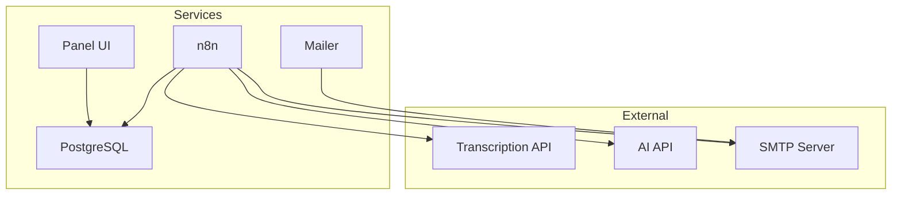
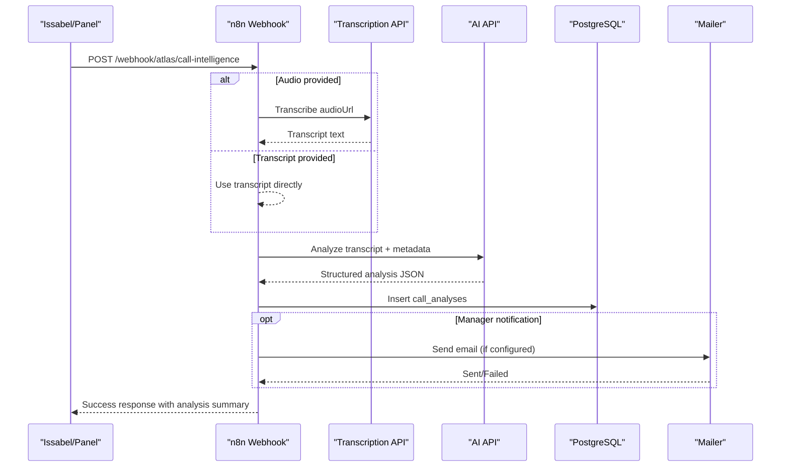
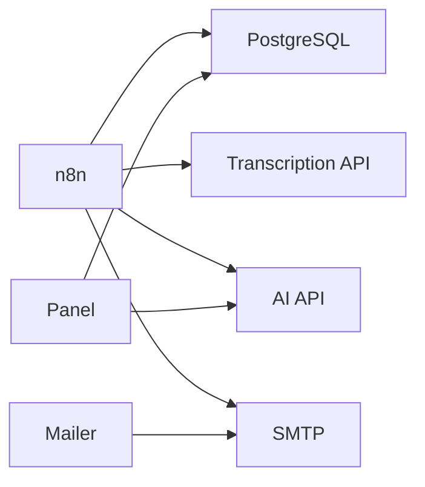

# Frequently Asked Questions

<cite>
**Referenced Files in This Document**
- [README.md](file://README.md)
- [Atlas Call Intelligence README](file://03_Products/Atlas Call Intelligence/V1/README.md)
- [Atlas Agent README](file://03_Products/Atlas Agent/V1/README.md)
- [docker-compose.yml](file://docker/docker-compose.yml)
- [Panel main.py](file://docker/panel/app/main.py)
- [Panel config.py](file://docker/panel/app/config.py)
- [Panel db.py](file://docker/panel/app/db.py)
- [Postgres init schema](file://docker/postgres/init/001_call_intelligence.sql)
- [Test result sample](file://docker/scripts/test-result.json)
</cite>

## Table of Contents
1. [Introduction](#introduction)
2. [Project Structure](#project-structure)
3. [Core Components](#core-components)
4. [Architecture Overview](#architecture-overview)
5. [Detailed Component Analysis](#detailed-component-analysis)
6. [Dependency Analysis](#dependency-analysis)
7. [Performance Considerations](#performance-considerations)
8. [Troubleshooting Guide](#troubleshooting-guide)
9. [Conclusion](#conclusion)
10. [Appendices](#appendices)

## Introduction
This FAQ provides quick, actionable answers to common questions about the Atlas platform, including setup, configuration, feature usage, limitations, maintenance, and deployment. It focuses on the Call Intelligence product and supporting services (n8n workflows, PostgreSQL, Panel UI, and optional mailer). For high-level context, see the project overview.

**Section sources**
- [README.md:1-7](file://README.md#L1-L7)

## Project Structure
Atlas is composed of containerized services orchestrated by Docker Compose:
- PostgreSQL for persistent storage
- n8n for workflow automation and webhooks
- A Python-based Panel UI for dashboards and analytics
- Optional mailer service for email notifications
- Postgres initialization scripts that define the data model

**Diagram sources**
- [docker-compose.yml:3-98](file://docker/docker-compose.yml#L3-L98)
- [Postgres init schema:1-45](file://docker/postgres/init/001_call_intelligence.sql#L1-L45)

**Section sources**
- [docker-compose.yml:3-98](file://docker/docker-compose.yml#L3-L98)
- [Postgres init schema:1-45](file://docker/postgres/init/001_call_intelligence.sql#L1-L45)

## Core Components
- Call Intelligence v1: Ingests audio or transcripts, classifies department, analyzes satisfaction and sales intent, stores results, and supports monthly reporting.
- n8n Workflows: Orchestrate transcription, AI analysis, database writes, and notifications via webhooks.
- Panel UI: FastAPI-based dashboard with authentication, metrics, call details, and AI insights.
- PostgreSQL: Stores per-call analyses and monthly reports with indexes for performance.
- Mailer: Sends manager notifications via SMTP when configured.

**Section sources**
- [Atlas Call Intelligence README:5-15](file://03_Products/Atlas Call Intelligence/V1/README.md#L5-L15)
- [Atlas Call Intelligence README:30-69](file://03_Products/Atlas Call Intelligence/V1/README.md#L30-L69)
- [Panel main.py:18-204](file://docker/panel/app/main.py#L18-L204)
- [Postgres init schema:4-45](file://docker/postgres/init/001_call_intelligence.sql#L4-L45)
- [docker-compose.yml:62-79](file://docker/docker-compose.yml#L62-L79)

## Architecture Overview
The Call Intelligence flow integrates telephony recordings, transcription, AI analysis, and reporting.

**Diagram sources**
- [Atlas Call Intelligence README:16-28](file://03_Products/Atlas Call Intelligence/V1/README.md#L16-L28)
- [Atlas Call Intelligence README:71-142](file://03_Products/Atlas Call Intelligence/V1/README.md#L71-L142)
- [docker-compose.yml:26-61](file://docker/docker-compose.yml#L26-L61)
- [docker-compose.yml:62-79](file://docker/docker-compose.yml#L62-L79)

## Detailed Component Analysis

### Setup and Installation
- How do I start Atlas locally?
  - Run Docker Compose from the docker directory. The compose file defines PostgreSQL, n8n, mailer, and panel services with health checks and volumes.
  - If PostgreSQL already contains data, run the initialization script to create tables.
  - Import the provided n8n workflows into the n8n UI and configure credentials.

- What environment variables are required?
  - For n8n: AI API URL, transcription API URL, API key, model name, manager email, and SMTP sender.
  - For panel: Database connection settings, AI key/model, optional title/password.
  - For mailer: SMTP host/port/user/password and manager email.

- Where can I find the default ports?
  - PostgreSQL: 15432 (host) -> 5432 (container)
  - n8n: 5678
  - Panel: 8080
  - Mailer: 8765

- How do I verify services are healthy?
  - PostgreSQL exposes a healthcheck; n8n depends on it. Check container logs and access the UI endpoints.

**Section sources**
- [Atlas Call Intelligence README:30-69](file://03_Products/Atlas Call Intelligence/V1/README.md#L30-L69)
- [docker-compose.yml:3-98](file://docker/docker-compose.yml#L3-L98)
- [Panel config.py:1-14](file://docker/panel/app/config.py#L1-L14)

### Configuration and Customization
- How do I connect the Panel to the database?
  - Configure DB_HOST, DB_PORT, DB_NAME, DB_USER, DB_PASSWORD via environment variables. The Panel reads these at startup.

- How do I enable simple authentication for the Panel?
  - Set PANEL_PASSWORD. When set, the Panel enforces login and cookie-based auth for protected routes.

- How do I customize the Panel title?
  - Set PANEL_TITLE. It is injected into templates.

- How do I change the AI model used by the Panel?
  - Set AI_MODEL. The Panel uses this for generating executive insights.

- How do I configure email notifications?
  - Provide ATLAS_MANAGER_EMAIL and SMTP credentials to the mailer service. Ensure SMTP_HOST, SMTP_PORT, SMTP_USER, SMTP_PASS are set.

**Section sources**
- [Panel config.py:1-14](file://docker/panel/app/config.py#L1-L14)
- [Panel main.py:57-82](file://docker/panel/app/main.py#L57-L82)
- [docker-compose.yml:34-50](file://docker/docker-compose.yml#L34-L50)
- [docker-compose.yml:70-76](file://docker/docker-compose.yml#L70-L76)

### Feature Usage and Limitations
- What inputs does the Call Intelligence webhook accept?
  - Either audioUrl or transcript, plus optional metadata such as call_id, department, agent info, customer info, direction, duration, date, and product context.

- What outputs can I expect?
  - A structured JSON containing success flags, call metadata, analysis (meta, transcript segments, customer satisfaction deltas), sales indicators, ticket suggestions, and optional manager notification details.

- How do I generate monthly reports?
  - Call the monthly report endpoint with year/month or without body to use the previous month. A cron runs monthly at 8 AM Asia/Tehran.

- What integrations are supported out of the box?
  - PostgreSQL storage, n8n workflows, optional SMTP email, and external transcription/AI APIs.

- Known limitations and edge cases
  - Email sending may fail if SMTP credentials are missing or misconfigured.
  - Analysis quality depends on transcription accuracy and AI model capabilities.
  - Some features (e.g., CRM ticket creation) are planned but not yet implemented.

**Section sources**
- [Atlas Call Intelligence README:71-154](file://03_Products/Atlas Call Intelligence/V1/README.md#L71-L154)
- [Atlas Call Intelligence README:170-190](file://03_Products/Atlas Call Intelligence/V1/README.md#L170-L190)
- [Test result sample:1-14](file://docker/scripts/test-result.json#L1-L14)

### Maintenance and Deployment
- How do I back up data?
  - Persist PostgreSQL data via the mounted volume. Back up the volume directory regularly.

- How do I update services?
  - Pull updated images and restart containers. For n8n, re-import workflows after major updates if needed.

- How do I monitor health?
  - Use container logs and healthchecks. PostgreSQL healthcheck is defined; n8n depends on it.

- How do I scale or harden the deployment?
  - Add reverse proxy, TLS termination, and secrets management for credentials. Consider separate networks and resource limits.

**Section sources**
- [docker-compose.yml:16-18](file://docker/docker-compose.yml#L16-L18)
- [docker-compose.yml:20-25](file://docker/docker-compose.yml#L20-L25)
- [docker-compose.yml:55-61](file://docker/docker-compose.yml#L55-L61)

## Dependency Analysis
Service dependencies and runtime coupling:
- n8n depends on PostgreSQL and external APIs (transcription, AI, SMTP).
- Panel depends on PostgreSQL and optionally an AI API for insights.
- Mailer depends on SMTP.

**Diagram sources**
- [docker-compose.yml:26-98](file://docker/docker-compose.yml#L26-L98)

**Section sources**
- [docker-compose.yml:26-98](file://docker/docker-compose.yml#L26-L98)

## Performance Considerations
- Database indexing: The schema includes indexes on analyzed_at, agent_id, department, and call_date to optimize queries for dashboards and reports.
- Connection handling: Panel uses a context-managed connection pattern to ensure connections are closed properly.
- Caching: Template cache is disabled for development compatibility; consider enabling caching in production for performance.
- Resource sizing: Ensure adequate CPU/memory for AI and transcription calls; consider rate limiting and retries in workflows.

**Section sources**
- [Postgres init schema:29-45](file://docker/postgres/init/001_call_intelligence.sql#L29-L45)
- [Panel db.py:12-31](file://docker/panel/app/db.py#L12-L31)
- [Panel main.py:21-22](file://docker/panel/app/main.py#L21-L22)

## Troubleshooting Guide
- Webhook returns failure with SMTP errors
  - Cause: Missing or invalid SMTP credentials.
  - Action: Configure SMTP_HOST, SMTP_PORT, SMTP_USER, SMTP_PASS and ATLAS_MANAGER_EMAIL in the mailer service. Verify network access to SMTP server.

- Panel cannot connect to the database
  - Cause: Incorrect DB_* environment variables or unreachable host.
  - Action: Confirm DB_HOST, DB_PORT, DB_NAME, DB_USER, DB_PASSWORD match the PostgreSQL service. Ensure the Panel container can resolve the host.

- n8n workflows not running
  - Cause: Missing credentials or unhealthy dependency.
  - Action: Import workflows, set credentials for PostgreSQL and external APIs, and ensure PostgreSQL is healthy before activating workflows.

- Monthly report not generated
  - Cause: Cron not configured or wrong timezone.
  - Action: Ensure n8n timezone is set to Asia/Tehran and the scheduled trigger is active.

- Authentication bypassed in Panel
  - Cause: PANEL_PASSWORD not set.
  - Action: Set PANEL_PASSWORD to enforce login. Clear cookies if testing redirects.

- Data not persisting across restarts
  - Cause: Volume not mounted or permissions issue.
  - Action: Verify PostgreSQL volume mount path and permissions. Re-run initialization script if schema is missing.

**Section sources**
- [Test result sample:1-14](file://docker/scripts/test-result.json#L1-L14)
- [Panel config.py:1-14](file://docker/panel/app/config.py#L1-L14)
- [Panel main.py:57-82](file://docker/panel/app/main.py#L57-L82)
- [docker-compose.yml:34-50](file://docker/docker-compose.yml#L34-L50)
- [docker-compose.yml:70-76](file://docker/docker-compose.yml#L70-L76)

## Conclusion
Atlas provides a modular, containerized platform for call intelligence with clear integration points for transcription, AI analysis, and reporting. Use this FAQ to quickly set up, configure, and operate the system, and refer to the linked sections for deeper technical details.

## Appendices

### Quick Start Checklist
- Start services with Docker Compose.
- Initialize PostgreSQL schema if needed.
- Import n8n workflows and configure credentials.
- Set environment variables for AI, SMTP, and Panel.
- Access Panel at port 8080 and n8n at port 5678.

**Section sources**
- [Atlas Call Intelligence README:30-69](file://03_Products/Atlas Call Intelligence/V1/README.md#L30-L69)
- [docker-compose.yml:3-98](file://docker/docker-compose.yml#L3-L98)

### Version Compatibility and Upgrades
- Base images: PostgreSQL 16, n8n latest, Python 3.12-slim for mailer.
- Upgrade steps: Update images, restart services, validate workflows, and re-run migrations if schema changes occur.
- Model compatibility: Ensure AI_MODEL values match your provider’s supported models.

**Section sources**
- [docker-compose.yml:3-98](file://docker/docker-compose.yml#L3-L98)
- [Panel config.py:9-10](file://docker/panel/app/config.py#L9-L10)

### Migration Considerations
- Schema changes: Review new tables/columns and run migration scripts in order.
- Data retention: Back up volumes before upgrades.
- Workflow changes: Re-import or adjust n8n workflows to match new payloads or endpoints.

**Section sources**
- [Postgres init schema:1-45](file://docker/postgres/init/001_call_intelligence.sql#L1-L45)

### Community and Support
- Refer to the product READMEs for feature overviews and roadmap items.
- Use the test artifacts and examples to validate configurations locally.

**Section sources**
- [Atlas Call Intelligence README:176-190](file://03_Products/Atlas Call Intelligence/V1/README.md#L176-L190)
- [Atlas Agent README:49-69](file://03_Products/Atlas Agent/V1/README.md#L49-L69)