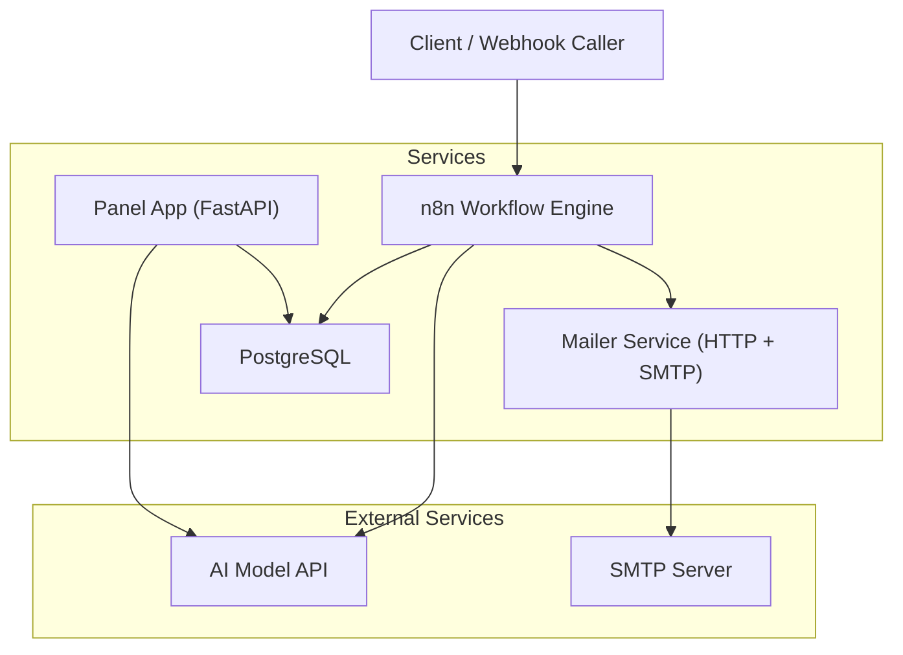
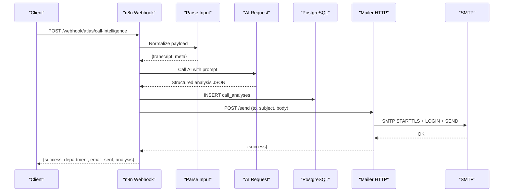
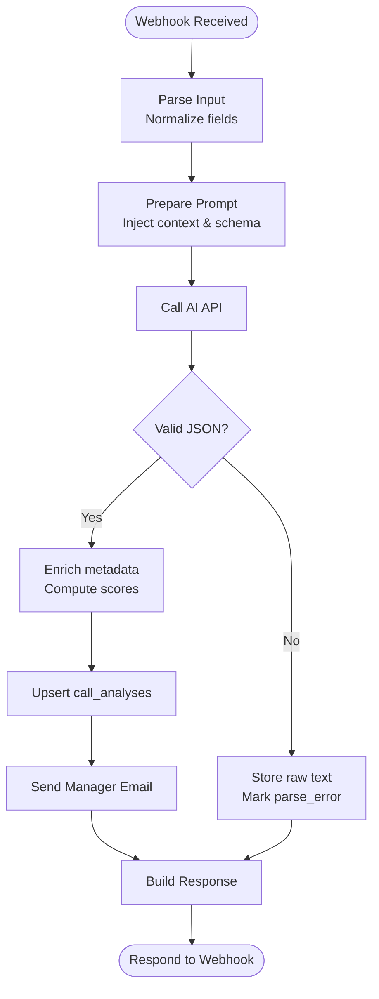
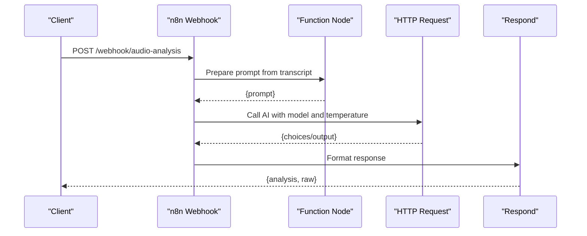
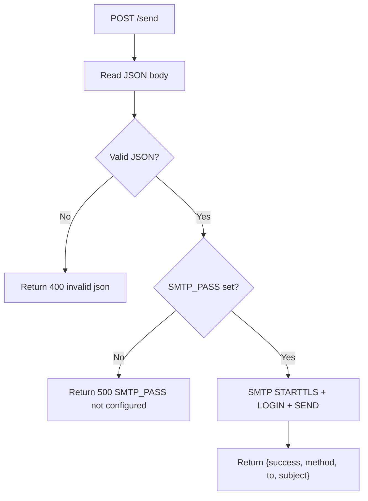
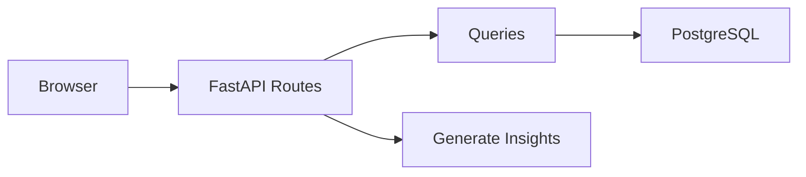
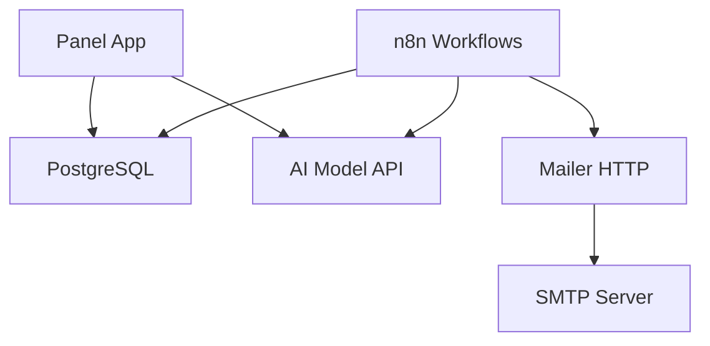

# Integration Challenges & Troubleshooting

<cite>
**Referenced Files in This Document**
- [docker-compose.yml](file://docker/docker-compose.yml)
- [mailer.py](file://docker/mailer/mailer.py)
- [send_email.py](file://docker/mailer/send_email.py)
- [atlas-call-intelligence-v1.json](file://docker/n8n/workflows/atlas-call-intelligence-v1.json)
- [audio-analysis-workflow.json](file://docker/n8n/workflows/audio-analysis-workflow.json)
- [main.py](file://docker/panel/app/main.py)
- [config.py](file://docker/panel/app/config.py)
- [db.py](file://docker/panel/app/db.py)
- [queries.py](file://docker/panel/app/queries.py)
- [send-real-call-analysis.py](file://docker/scripts/send-real-call-analysis.py)
- [run-test.ps1](file://docker/scripts/run-test.ps1)
</cite>

## Table of Contents
1. Introduction
2. Project Structure
3. Core Components
4. Architecture Overview
5. Detailed Component Analysis
6. Dependency Analysis
7. Performance Considerations
8. Troubleshooting Guide
9. Conclusion
10. Appendices

## Introduction
This document provides a comprehensive troubleshooting guide for integration challenges in the Atlas platform. It focuses on external service integrations including AI model APIs, email services (SMTP), and webhook endpoints. It also covers n8n workflow integration issues, node configuration errors, data transformation problems, email delivery failures, SMTP configuration issues, template rendering errors, real-time integration debugging, event processing delays, and data synchronization problems. The guide includes step-by-step diagnostics, error handling patterns, retry mechanisms, and fallback strategies to help you quickly identify and resolve issues.

## Project Structure
Atlas is composed of several integrated services orchestrated via Docker Compose:
- PostgreSQL database for storing call analyses and reports
- n8n workflows that receive webhooks, call AI APIs, persist results, and send emails
- A Python-based mailer service exposing an HTTP endpoint to send emails via SMTP
- A FastAPI panel application that serves dashboards and exposes API endpoints to read analytics and generate insights

**Diagram sources**
- [docker-compose.yml:26-61](file://docker/docker-compose.yml#L26-L61)
- [docker-compose.yml:62-79](file://docker/docker-compose.yml#L62-L79)
- [docker-compose.yml:80-98](file://docker/docker-compose.yml#L80-L98)

**Section sources**
- [docker-compose.yml:1-98](file://docker/docker-compose.yml#L1-L98)

## Core Components
- n8n Call Intelligence Workflow: Receives webhook payloads, normalizes input, builds prompts, calls AI models, persists analysis to PostgreSQL, sends manager notifications via the mailer, and returns structured responses.
- Audio Analysis Workflow: A simpler flow that prepares a prompt from transcript data, calls an AI endpoint, formats the response, and responds to the webhook.
- Mailer Service: An HTTP server that accepts JSON payloads and sends emails using SMTP with TLS.
- Panel Application: FastAPI app serving dashboards and APIs; reads from PostgreSQL and optionally calls AI for insights.

Key responsibilities and integration points are defined across these components and their configuration files.

**Section sources**
- [atlas-call-intelligence-v1.json:1-160](file://docker/n8n/workflows/atlas-call-intelligence-v1.json#L1-L160)
- [audio-analysis-workflow.json:1-139](file://docker/n8n/workflows/audio-analysis-workflow.json#L1-L139)
- [mailer.py:1-77](file://docker/mailer/mailer.py#L1-L77)
- [main.py:1-204](file://docker/panel/app/main.py#L1-L204)
- [config.py:1-14](file://docker/panel/app/config.py#L1-L14)
- [db.py:1-31](file://docker/panel/app/db.py#L1-L31)
- [queries.py:1-260](file://docker/panel/app/queries.py#L1-L260)

## Architecture Overview
The end-to-end flow for call intelligence involves:
- External systems trigger n8n via webhook endpoints
- n8n parses and validates inputs, constructs prompts, and calls AI APIs
- Results are persisted to PostgreSQL and emailed to managers via the mailer
- The Panel reads analytics from PostgreSQL and can request AI-generated insights

**Diagram sources**
- [atlas-call-intelligence-v1.json:1-160](file://docker/n8n/workflows/atlas-call-intelligence-v1.json#L1-L160)
- [mailer.py:18-33](file://docker/mailer/mailer.py#L18-L33)
- [docker-compose.yml:26-79](file://docker/docker-compose.yml#L26-L79)

## Detailed Component Analysis

### n8n Call Intelligence Workflow
- Webhook triggers parsing and validation of incoming payloads, supporting multiple field names for flexibility.
- Prompt preparation injects context, metadata, and schema constraints to guide AI output.
- AI request uses environment variables for URL and model selection; supports multiple response shapes.
- Parsing and validation handle markdown-wrapped JSON and enriches metadata before persistence.
- Database insertion uses upsert semantics to avoid duplicates by call_id.
- Email notification is sent to a manager address configured via environment variables.
- Response building aggregates success flags and error details for callers.

**Diagram sources**
- [atlas-call-intelligence-v1.json:1-160](file://docker/n8n/workflows/atlas-call-intelligence-v1.json#L1-L160)

**Section sources**
- [atlas-call-intelligence-v1.json:1-160](file://docker/n8n/workflows/atlas-call-intelligence-v1.json#L1-L160)

### Audio Analysis Workflow
- Simpler pipeline focused on summarizing or categorizing call transcripts.
- Uses environment or static configuration for API URL and model parameters.
- Formats varied AI responses into a consistent structure before responding.

**Diagram sources**
- [audio-analysis-workflow.json:1-139](file://docker/n8n/workflows/audio-analysis-workflow.json#L1-L139)

**Section sources**
- [audio-analysis-workflow.json:1-139](file://docker/n8n/workflows/audio-analysis-workflow.json#L1-L139)

### Mailer Service
- Exposes HTTP endpoints to accept JSON payloads with recipient, subject, and body.
- Validates required SMTP credentials and sends emails via SMTP with TLS.
- Returns standardized JSON responses indicating success or failure.

**Diagram sources**
- [mailer.py:18-68](file://docker/mailer/mailer.py#L18-L68)

**Section sources**
- [mailer.py:1-77](file://docker/mailer/mailer.py#L1-L77)
- [send_email.py:1-39](file://docker/mailer/send_email.py#L1-L39)

### Panel Application
- FastAPI app serving dashboard pages and APIs.
- Reads analytics from PostgreSQL and generates executive insights via AI.
- Uses environment variables for database and AI configuration.

**Diagram sources**
- [main.py:85-204](file://docker/panel/app/main.py#L85-L204)
- [queries.py:1-260](file://docker/panel/app/queries.py#L1-L260)
- [config.py:1-14](file://docker/panel/app/config.py#L1-L14)
- [db.py:1-31](file://docker/panel/app/db.py#L1-L31)

**Section sources**
- [main.py:1-204](file://docker/panel/app/main.py#L1-L204)
- [config.py:1-14](file://docker/panel/app/config.py#L1-L14)
- [db.py:1-31](file://docker/panel/app/db.py#L1-L31)
- [queries.py:1-260](file://docker/panel/app/queries.py#L1-L260)

## Dependency Analysis
- n8n depends on:
  - PostgreSQL for persistence
  - AI model API via environment variables
  - Mailer HTTP service for email delivery
- Mailer depends on:
  - SMTP server credentials and network access
- Panel depends on:
  - PostgreSQL for data retrieval
  - Optional AI API for insights generation

**Diagram sources**
- [docker-compose.yml:26-98](file://docker/docker-compose.yml#L26-L98)
- [atlas-call-intelligence-v1.json:48-119](file://docker/n8n/workflows/atlas-call-intelligence-v1.json#L48-L119)
- [mailer.py:10-33](file://docker/mailer/mailer.py#L10-L33)
- [main.py:183-187](file://docker/panel/app/main.py#L183-L187)

**Section sources**
- [docker-compose.yml:1-98](file://docker/docker-compose.yml#L1-L98)

## Performance Considerations
- Use connection pooling for PostgreSQL in high-throughput scenarios to reduce latency.
- Cache frequent queries in the Panel if read-heavy workloads are expected.
- Configure timeouts appropriately for AI API calls and SMTP operations to prevent hanging requests.
- Batch insertions where possible to reduce database round-trips.
- Monitor n8n execution queues and scale horizontally if needed.

[No sources needed since this section provides general guidance]

## Troubleshooting Guide

### Authentication Failures
- AI Model API:
  - Verify environment variables for API URL and key are correctly set in n8n and Panel.
  - Confirm the model name matches the provider’s expectations.
  - Test connectivity with a minimal request outside n8n to isolate environment issues.
- SMTP:
  - Ensure SMTP_HOST, SMTP_PORT, SMTP_USER, and SMTP_PASS are configured in the mailer service.
  - Validate that the SMTP server requires authentication and that credentials are correct.
  - Check TLS settings and port compatibility (e.g., 587 for STARTTLS).

**Section sources**
- [docker-compose.yml:34-51](file://docker/docker-compose.yml#L34-L51)
- [docker-compose.yml:70-76](file://docker/docker-compose.yml#L70-L76)
- [mailer.py:10-15](file://docker/mailer/mailer.py#L10-L15)
- [config.py:9-10](file://docker/panel/app/config.py#L9-L10)

### Rate Limiting Issues
- Symptoms:
  - Intermittent 429 responses from AI providers or SMTP servers.
  - Increased latency or dropped connections during peak usage.
- Mitigations:
  - Implement exponential backoff and jitter in n8n HTTP nodes.
  - Queue requests and process them at a controlled rate.
  - Use retries with maximum attempts and circuit breaker patterns to avoid cascading failures.
  - Monitor provider quotas and adjust model choices or batch sizes accordingly.

[No sources needed since this section provides general guidance]

### Data Format Mismatches in API Communications
- Common causes:
  - Inconsistent field names in webhook payloads.
  - AI responses wrapped in markdown code blocks or varying structures.
- Fixes:
  - Normalize input fields early in the workflow to a canonical shape.
  - Strip markdown fences and parse JSON robustly; store raw text when parsing fails.
  - Add validation nodes to enforce schema constraints and log mismatches.

**Section sources**
- [atlas-call-intelligence-v1.json:25-39](file://docker/n8n/workflows/atlas-call-intelligence-v1.json#L25-L39)
- [atlas-call-intelligence-v1.json:63-71](file://docker/n8n/workflows/atlas-call-intelligence-v1.json#L63-L71)
- [audio-analysis-workflow.json:20-22](file://docker/n8n/workflows/audio-analysis-workflow.json#L20-L22)
- [audio-analysis-workflow.json:51-54](file://docker/n8n/workflows/audio-analysis-workflow.json#L51-L54)

### n8n Workflow Integration Problems
- Webhook not receiving events:
  - Confirm the webhook path and method match the caller’s expectations.
  - Check n8n logs for incoming requests and ensure the workflow is active.
- Node configuration errors:
  - Validate environment variable references for URLs and keys.
  - Ensure credentials for PostgreSQL and HTTP endpoints are set.
- Execution order and timing:
  - Review execution order settings and dependencies between nodes.
  - Increase timeouts for long-running AI calls.

**Section sources**
- [atlas-call-intelligence-v1.json:11-24](file://docker/n8n/workflows/atlas-call-intelligence-v1.json#L11-L24)
- [atlas-call-intelligence-v1.json:48-59](file://docker/n8n/workflows/atlas-call-intelligence-v1.json#L48-L59)
- [atlas-call-intelligence-v1.json:74-93](file://docker/n8n/workflows/atlas-call-intelligence-v1.json#L74-L93)
- [atlas-call-intelligence-v1.json:106-119](file://docker/n8n/workflows/atlas-call-intelligence-v1.json#L106-L119)

### Data Transformation Issues
- Symptoms:
  - Missing or incorrect fields in saved records.
  - Incorrect types (e.g., strings instead of numbers).
- Diagnosis:
  - Inspect intermediate outputs in n8n nodes.
  - Log transformed payloads before database insertion.
- Resolution:
  - Add explicit type coercion and default values in code nodes.
  - Use conditional logic to handle optional fields gracefully.

**Section sources**
- [atlas-call-intelligence-v1.json:25-39](file://docker/n8n/workflows/atlas-call-intelligence-v1.json#L25-L39)
- [atlas-call-intelligence-v1.json:63-79](file://docker/n8n/workflows/atlas-call-intelligence-v1.json#L63-L79)

### Email Delivery Failures
- SMTP configuration problems:
  - Verify SMTP_HOST, SMTP_PORT, SMTP_USER, and SMTP_PASS are set.
  - Ensure the mailer container can reach the SMTP server.
- Template rendering errors:
  - Confirm that email bodies are valid UTF-8 and do not contain malformed characters.
  - Validate subject lines and recipient addresses.
- Fallback strategy:
  - If email sending fails, log errors and continue workflow execution without blocking.
  - Provide a manual retry mechanism via test scripts.

**Section sources**
- [mailer.py:18-33](file://docker/mailer/mailer.py#L18-L33)
- [mailer.py:36-68](file://docker/mailer/mailer.py#L36-L68)
- [send_email.py:9-34](file://docker/mailer/send_email.py#L9-L34)
- [atlas-call-intelligence-v1.json:106-119](file://docker/n8n/workflows/atlas-call-intelligence-v1.json#L106-L119)

### Real-Time Integrations Debugging
- Event processing delays:
  - Check n8n queue length and worker capacity.
  - Monitor AI API latency and consider caching or batching.
- Data synchronization issues:
  - Validate idempotency of inserts using call_id.
  - Ensure timestamps and timezones are consistent across services.
- Observability:
  - Enable detailed logging in n8n and mailer.
  - Capture request/response payloads for post-mortem analysis.

**Section sources**
- [atlas-call-intelligence-v1.json:74-93](file://docker/n8n/workflows/atlas-call-intelligence-v1.json#L74-L93)
- [docker-compose.yml:34-51](file://docker/docker-compose.yml#L34-L51)

### Error Handling Patterns, Retry Mechanisms, and Fallback Strategies
- Patterns:
  - Wrap external calls in try/catch blocks; return structured error responses.
  - Mark non-critical steps as “continue on fail” to keep workflows running.
- Retries:
  - Implement exponential backoff with jitter for transient failures.
  - Set maximum retry counts and circuit breakers to protect downstream services.
- Fallbacks:
  - Store raw AI responses when parsing fails to preserve information.
  - Queue failed emails for later retry and notify operators.

**Section sources**
- [atlas-call-intelligence-v1.json:74-93](file://docker/n8n/workflows/atlas-call-intelligence-v1.json#L74-L93)
- [mailer.py:57-68](file://docker/mailer/mailer.py#L57-L68)
- [send-real-call-analysis.py:186-196](file://docker/scripts/send-real-call-analysis.py#L186-L196)

### Testing and Validation Procedures
- End-to-end test:
  - Use the provided PowerShell script to send a test payload to the n8n webhook and inspect the result.
  - Validate success flags, department classification, and email delivery status.
- Manual email test:
  - Run the standalone email sender to verify SMTP connectivity and credential correctness.
- Local development:
  - Ensure Docker services are running and ports are accessible.
  - Check container logs for errors in n8n, mailer, and panel.

**Section sources**
- [run-test.ps1:1-38](file://docker/scripts/run-test.ps1#L1-L38)
- [send_email.py:1-39](file://docker/mailer/send_email.py#L1-L39)
- [docker-compose.yml:26-98](file://docker/docker-compose.yml#L26-L98)

## Conclusion
This guide outlined the architecture and common integration challenges in the Atlas platform, focusing on AI model APIs, email services, and webhook endpoints. By following the diagnostic steps, applying robust error handling, and leveraging retry and fallback strategies, you can maintain reliable integrations and quickly resolve issues. Use the provided testing procedures to validate configurations and ensure end-to-end functionality.

[No sources needed since this section summarizes without analyzing specific files]

## Appendices

### Environment Variables Reference
- n8n:
  - API_URL, TRANSCRIPTION_API_URL, API_KEY, AI_MODEL, ATLAS_MANAGER_EMAIL, ATLAS_SMTP_FROM
- Mailer:
  - SMTP_HOST, SMTP_PORT, SMTP_USER, SMTP_PASS, ATLAS_MANAGER_EMAIL, MAILER_PORT
- Panel:
  - DB_HOST, DB_PORT, DB_NAME, DB_USER, DB_PASSWORD, AI_API_KEY, AI_MODEL, PANEL_TITLE, PANEL_PASSWORD

**Section sources**
- [docker-compose.yml:34-51](file://docker/docker-compose.yml#L34-L51)
- [docker-compose.yml:70-76](file://docker/docker-compose.yml#L70-L76)
- [docker-compose.yml:86-95](file://docker/docker-compose.yml#L86-L95)
- [config.py:1-14](file://docker/panel/app/config.py#L1-L14)