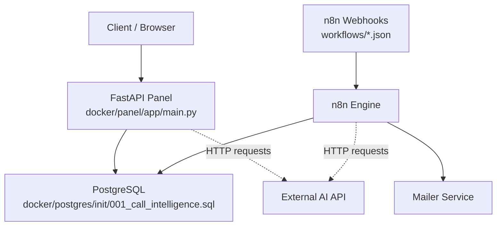
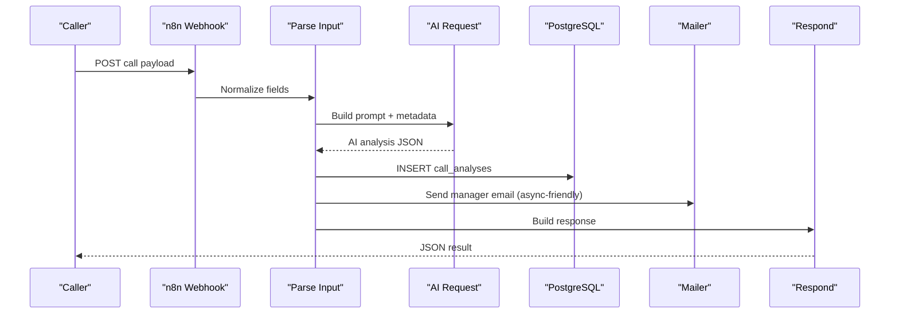
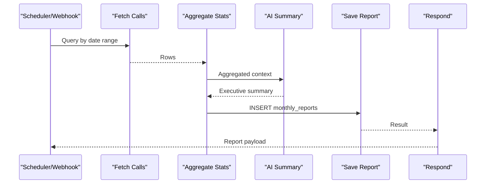
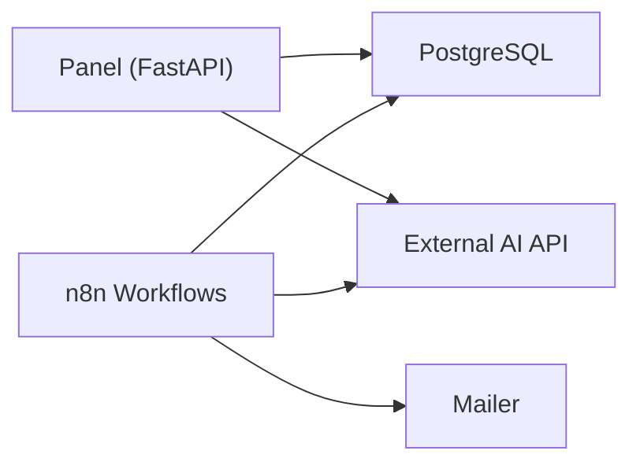
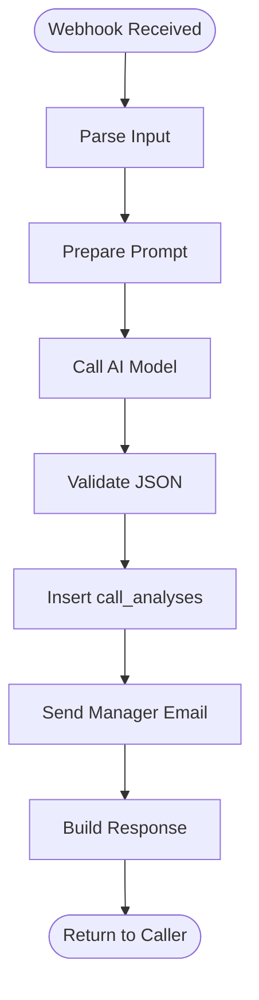
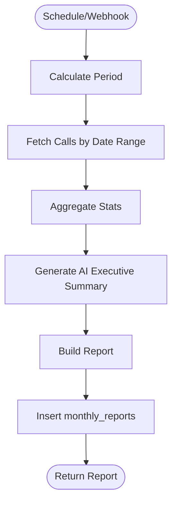

# Performance Problems & Optimization

<cite>
**Referenced Files in This Document**
- [docker-compose.yml](file://docker/docker-compose.yml)
- [main.py](file://docker/panel/app/main.py)
- [config.py](file://docker/panel/app/config.py)
- [db.py](file://docker/panel/app/db.py)
- [queries.py](file://docker/panel/app/queries.py)
- [001_call_intelligence.sql](file://docker/postgres/init/001_call_intelligence.sql)
- [atlas-call-intelligence-v1.json](file://docker/n8n/workflows/atlas-call-intelligence-v1.json)
- [audio-analysis-workflow.json](file://docker/n8n/workflows/audio-analysis-workflow.json)
- [atlas-call-intelligence-monthly-report.json](file://docker/n8n/workflows/atlas-call-intelligence-monthly-report.json)
- [Dockerfile](file://docker/panel/Dockerfile)
- [requirements.txt](file://docker/panel/requirements.txt)
</cite>

## Table of Contents
1. Introduction
2. Project Structure
3. Core Components
4. Architecture Overview
5. Detailed Component Analysis
6. Dependency Analysis
7. Performance Considerations
8. Troubleshooting Guide
9. Conclusion
10. Appendices

## Introduction
This document provides a comprehensive guide to identifying and resolving performance problems in the Atlas platform. It focuses on slow database queries, memory consumption issues, and API response time bottlenecks across the FastAPI panel, n8n workflows, and PostgreSQL data layer. It also includes optimization strategies for PostgreSQL tuning, query improvements, connection pooling, caching, load balancing, capacity planning, benchmarking techniques, and ongoing monitoring practices tailored to call analysis throughput and n8n workflow efficiency.

## Project Structure
Atlas is composed of:
- A FastAPI-based Panel that serves dashboards and APIs over HTTP and reads from PostgreSQL.
- n8n workflows that ingest call data, perform AI-driven analysis via external APIs, persist results to PostgreSQL, and optionally send notifications.
- PostgreSQL as the primary datastore with schema and indexes defined at initialization.
- Docker Compose orchestrating services (PostgreSQL, n8n, mailer, panel).

**Diagram sources**
- [docker-compose.yml:1-98](file://docker/docker-compose.yml#L1-L98)
- [main.py:71-189](file://docker/panel/app/main.py#L71-L189)
- [atlas-call-intelligence-v1.json:1-160](file://docker/n8n/workflows/atlas-call-intelligence-v1.json#L1-L160)
- [audio-analysis-workflow.json:1-139](file://docker/n8n/workflows/audio-analysis-workflow.json#L1-L139)
- [001_call_intelligence.sql:1-45](file://docker/postgres/init/001_call_intelligence.sql#L1-L45)

**Section sources**
- [docker-compose.yml:1-98](file://docker/docker-compose.yml#L1-L98)
- [main.py:1-190](file://docker/panel/app/main.py#L1-L190)
- [001_call_intelligence.sql:1-45](file://docker/postgres/init/001_call_intelligence.sql#L1-L45)

## Core Components
- Panel (FastAPI): Serves UI pages and lightweight APIs; performs dashboard queries and triggers AI insights generation.
- Database Layer: Uses psycopg2 with per-request connections; defines fetch helpers and DSN configuration.
- Queries: Report-oriented SQL against call_analyses and monthly_reports tables.
- n8n Workflows: Ingest calls via webhooks, call external AI models, parse and validate JSON, persist results, and send emails.
- Infrastructure: Docker Compose defines service dependencies, environment variables, ports, volumes, and health checks.

Key performance-relevant observations:
- No application-level connection pool is used; each request opens a new psycopg2 connection.
- Heavy JSONB operations and multiple aggregations run on every page load.
- n8n workflows invoke external AI endpoints synchronously within the request path.
- Monthly report workflow aggregates large datasets in-memory before calling AI.

**Section sources**
- [db.py:1-31](file://docker/panel/app/db.py#L1-L31)
- [queries.py:1-260](file://docker/panel/app/queries.py#L1-L260)
- [main.py:71-189](file://docker/panel/app/main.py#L71-L189)
- [atlas-call-intelligence-v1.json:1-160](file://docker/n8n/workflows/atlas-call-intelligence-v1.json#L1-L160)
- [atlas-call-intelligence-monthly-report.json:1-172](file://docker/n8n/workflows/atlas-call-intelligence-monthly-report.json#L1-L172)

## Architecture Overview
The system processes call data through two main paths:
- Real-time call analysis: Webhook -> Parse -> Prompt -> AI Request -> Validate -> Save to DB -> Email -> Response.
- Reporting: Scheduled or manual trigger -> Fetch calls -> Aggregate stats -> AI summary -> Persist report -> Response.

**Diagram sources**
- [atlas-call-intelligence-v1.json:1-160](file://docker/n8n/workflows/atlas-call-intelligence-v1.json#L1-L160)

**Diagram sources**
- [atlas-call-intelligence-monthly-report.json:1-172](file://docker/n8n/workflows/atlas-call-intelligence-monthly-report.json#L1-L172)

## Detailed Component Analysis

### Panel (FastAPI) Performance
- Request handling: Each endpoint composes template responses using multiple query functions. The dashboard aggregates overview stats, top performers, recent calls, and department breakdowns in a single request.
- Connection management: db.get_conn creates a new psycopg2 connection per request and closes it after use. This can become a bottleneck under concurrent load due to connection overhead and lack of pooling.
- Template cache disabled: Jinja2 template cache is explicitly disabled for compatibility, which may increase CPU usage during high traffic.

Optimization opportunities:
- Introduce a connection pool (e.g., SQLAlchemy with psycopg2 pool or asyncpg) to reduce connection churn.
- Cache expensive read-only queries (overview stats, department breakdown) using an in-process cache or Redis with short TTLs.
- Paginate or limit heavy lists to reduce payload size and query cost.
- Enable template caching in production to reduce rendering overhead.

**Section sources**
- [main.py:71-189](file://docker/panel/app/main.py#L71-L189)
- [db.py:8-31](file://docker/panel/app/db.py#L8-L31)
- [requirements.txt:1-7](file://docker/panel/requirements.txt#L1-L7)
- [Dockerfile:1-11](file://docker/panel/Dockerfile#L1-L11)

### Database Layer and Queries
- Schema and indexing: call_analyses has indexes on analyzed_at, agent_id, department, call_date; monthly_reports indexed on report_month. These support common filters and sorting but do not cover all query patterns.
- Query complexity: Several queries compute multiple aggregates, filter on JSONB fields, and sort by derived metrics. Some queries scan large portions of call_analyses without selective WHERE clauses.

Optimization opportunities:
- Add composite indexes for frequent filter/sort combinations (e.g., department + call_date, satisfaction_final_score + call_date).
- Materialize frequently accessed aggregates into summary tables refreshed periodically.
- Use partial indexes for hot subsets (e.g., needs_human_review = TRUE).
- Avoid SELECT * in detail views; select only needed columns to reduce network and parsing overhead.
- Ensure parameters are bound correctly and avoid unnecessary conversions in Python.

**Section sources**
- [001_call_intelligence.sql:1-45](file://docker/postgres/init/001_call_intelligence.sql#L1-L45)
- [queries.py:6-260](file://docker/panel/app/queries.py#L6-L260)

### n8n Workflows Performance
- Real-time call analysis: The workflow parses input, constructs prompts, calls external AI, validates JSON, persists to DB, and sends email. All steps execute synchronously in the webhook flow, making end-to-end latency dependent on AI provider and DB write speed.
- Monthly reporting: Loads entire month’s calls into memory, computes per-agent and per-department statistics, then calls AI to generate executive summary. Large payloads and in-memory aggregation can cause memory spikes and slow processing.

Optimization opportunities:
- Offload long-running tasks to background jobs (e.g., n8n queues or external workers) to decouple ingestion from response.
- Stream or chunk large datasets when aggregating monthly reports to reduce memory pressure.
- Cache AI responses for identical prompts or near-duplicate transcripts to reduce redundant calls.
- Tune n8n execution settings (workers, concurrency) and consider horizontal scaling of n8n instances behind a load balancer.
- Use idempotent writes and upserts to prevent duplicate processing.

**Section sources**
- [atlas-call-intelligence-v1.json:1-160](file://docker/n8n/workflows/atlas-call-intelligence-v1.json#L1-L160)
- [atlas-call-intelligence-monthly-report.json:1-172](file://docker/n8n/workflows/atlas-call-intelligence-monthly-report.json#L1-L172)
- [audio-analysis-workflow.json:1-139](file://docker/n8n/workflows/audio-analysis-workflow.json#L1-L139)

### Infrastructure and Deployment
- Docker Compose defines service dependencies and environment variables. Health checks ensure Postgres readiness before starting dependent services.
- Ports exposed: Panel on 8080, n8n on 5678, mailer on 8765, Postgres on 15432.

Optimization opportunities:
- Scale horizontally by running multiple panel and n8n replicas behind a reverse proxy/load balancer.
- Separate environments for dev/staging/prod with tuned resource limits and secrets management.
- Monitor container resource usage and set appropriate CPU/memory limits to avoid throttling.

**Section sources**
- [docker-compose.yml:1-98](file://docker/docker-compose.yml#L1-L98)

## Dependency Analysis
The Panel depends on PostgreSQL via psycopg2 and optional external AI APIs. n8n workflows depend on PostgreSQL and external AI APIs, plus a mailer service.

**Diagram sources**
- [main.py:169-173](file://docker/panel/app/main.py#L169-L173)
- [atlas-call-intelligence-v1.json:47-61](file://docker/n8n/workflows/atlas-call-intelligence-v1.json#L47-L61)
- [atlas-call-intelligence-monthly-report.json:80-88](file://docker/n8n/workflows/atlas-call-intelligence-monthly-report.json#L80-L88)
- [docker-compose.yml:26-61](file://docker/docker-compose.yml#L26-L61)

**Section sources**
- [main.py:169-173](file://docker/panel/app/main.py#L169-L173)
- [atlas-call-intelligence-v1.json:47-61](file://docker/n8n/workflows/atlas-call-intelligence-v1.json#L47-L61)
- [atlas-call-intelligence-monthly-report.json:80-88](file://docker/n8n/workflows/atlas-call-intelligence-monthly-report.json#L80-L88)
- [docker-compose.yml:26-61](file://docker/docker-compose.yml#L26-L61)

## Performance Considerations

### Slow Database Queries
Symptoms:
- Dashboard loads take several seconds.
- Reports show high CPU usage on Postgres.
- Frequent timeouts under load.

Root causes:
- Full table scans due to missing or suboptimal indexes for complex filters.
- Repeated computation of aggregates on every request.
- JSONB extraction and nested field access without supporting indexes.

Actions:
- Add composite indexes for common predicates (department + call_date, satisfaction_final_score + call_date).
- Create partial indexes for hot subsets (needs_human_review = TRUE).
- Precompute and cache summary metrics (totals, averages) in a dedicated summary table updated via scheduled jobs.
- Refactor queries to minimize JSONB traversal where possible; extract frequently accessed fields into normalized columns if beneficial.

**Section sources**
- [001_call_intelligence.sql:29-45](file://docker/postgres/init/001_call_intelligence.sql#L29-L45)
- [queries.py:6-260](file://docker/panel/app/queries.py#L6-L260)

### Memory Consumption Issues
Symptoms:
- High memory usage in n8n during monthly report generation.
- Panel memory grows with large template contexts.

Root causes:
- Loading entire month’s dataset into memory for aggregation.
- Building large JSON payloads for AI prompts.
- Disabling template cache increases memory churn.

Actions:
- Chunk processing in n8n workflows to stream data instead of loading all rows at once.
- Reduce payload sizes by selecting only necessary fields and compressing outputs where feasible.
- Enable template caching in production and consider server-side caching for rendered fragments.

**Section sources**
- [atlas-call-intelligence-monthly-report.json:50-93](file://docker/n8n/workflows/atlas-call-intelligence-monthly-report.json#L50-L93)
- [main.py:19-20](file://docker/panel/app/main.py#L19-L20)

### API Response Time Problems
Symptoms:
- Long latencies for call analysis webhooks.
- Spikes in response times during peak hours.

Root causes:
- Synchronous AI model calls blocking the request pipeline.
- Database writes and email sends occurring in the critical path.
- Lack of connection pooling causing connection setup overhead.

Actions:
- Decouple long-running tasks: accept the request, enqueue processing, and return a job ID; poll for completion or use webhooks for callbacks.
- Implement retry policies and circuit breakers for external AI calls.
- Use connection pooling in the Panel to reduce connection overhead.
- Add rate limiting and backpressure mechanisms to protect downstream services.

**Section sources**
- [atlas-call-intelligence-v1.json:47-119](file://docker/n8n/workflows/atlas-call-intelligence-v1.json#L47-L119)
- [db.py:8-31](file://docker/panel/app/db.py#L8-L31)

### PostgreSQL Tuning
Recommendations:
- Adjust shared_buffers, work_mem, maintenance_work_mem based on available RAM and workload characteristics.
- Tune effective_cache_size to reflect OS cache expectations.
- Configure autovacuum aggressively for high-write tables like call_analyses.
- Use EXPLAIN ANALYZE to identify slow plans and optimize queries accordingly.
- Partition call_analyses by time (e.g., monthly) to improve query performance and manageability.

**Section sources**
- [001_call_intelligence.sql:4-45](file://docker/postgres/init/001_call_intelligence.sql#L4-L45)

### Connection Pooling Configuration
Current state:
- Each request opens a new psycopg2 connection and closes it afterward.

Recommended changes:
- Introduce a connection pool (e.g., SQLAlchemy with psycopg2 pool or asyncpg) to reuse connections and reduce overhead.
- Set pool size appropriately for expected concurrency and Postgres max_connections.
- Use connection timeouts and idle timeouts to prevent resource leaks.

**Section sources**
- [db.py:8-31](file://docker/panel/app/db.py#L8-L31)
- [requirements.txt:1-7](file://docker/panel/requirements.txt#L1-L7)

### Caching Strategies
Options:
- In-process cache (e.g., functools.lru_cache or simple dict) for small, frequently accessed data with short TTLs.
- Redis-backed cache for distributed caching across multiple Panel instances.
- Cache AI insights and monthly reports with appropriate invalidation policies.

Implementation guidance:
- Cache overview stats and department breakdowns with TTLs aligned to update frequency.
- Cache AI-generated insights keyed by input context hash to avoid redundant calls.
- Invalidate caches on data mutations or schedule periodic refreshes.

**Section sources**
- [main.py:169-173](file://docker/panel/app/main.py#L169-L173)
- [queries.py:6-260](file://docker/panel/app/queries.py#L6-L260)

### Load Balancing and Scaling
- Horizontal scaling: Run multiple Panel and n8n containers behind a reverse proxy (e.g., Nginx/Traefik) for load distribution.
- Statelessness: Ensure Panel and n8n are stateless; store session/state externally (Redis) if needed.
- Resource limits: Set CPU/memory limits per container to prevent noisy neighbor issues.
- Auto-scaling: Use orchestration features to scale based on CPU, memory, or request queue depth.

**Section sources**
- [docker-compose.yml:1-98](file://docker/docker-compose.yml#L1-L98)

### Capacity Planning
- Estimate peak QPS for call ingestion and dashboard requests.
- Size Postgres based on data growth rates and query complexity.
- Plan storage for JSONB payloads and logs; implement retention policies.
- Monitor AI provider rate limits and plan fallbacks or queuing strategies.

[No sources needed since this section provides general guidance]

### Benchmarking Techniques and Tools
- Database: Use EXPLAIN ANALYZE to profile query plans; pg_stat_statements to track slow queries.
- Application: Instrument endpoints with timing middleware; log request durations and error rates.
- n8n: Measure node execution times; monitor queue lengths and worker utilization.
- Load testing: Use tools like k6 or Locust to simulate realistic traffic patterns and measure latency percentiles.

[No sources needed since this section provides general guidance]

## Troubleshooting Guide
Common issues and resolutions:
- Slow dashboard loads: Check query execution plans; add or adjust indexes; enable caching for read-heavy endpoints.
- High memory usage in n8n: Reduce payload sizes; process data in chunks; monitor worker memory and restart if necessary.
- API timeouts: Inspect external AI provider status; implement retries and timeouts; offload long-running tasks to background jobs.
- Database connection errors: Verify connection pooling configuration; ensure max_connections is sufficient; tune pool sizes.

**Section sources**
- [queries.py:6-260](file://docker/panel/app/queries.py#L6-L260)
- [atlas-call-intelligence-monthly-report.json:50-93](file://docker/n8n/workflows/atlas-call-intelligence-monthly-report.json#L50-L93)
- [atlas-call-intelligence-v1.json:47-119](file://docker/n8n/workflows/atlas-call-intelligence-v1.json#L47-L119)
- [db.py:8-31](file://docker/panel/app/db.py#L8-L31)

## Conclusion
Performance in Atlas hinges on efficient database queries, scalable connection management, and optimized n8n workflows. By introducing connection pooling, caching, query optimizations, and asynchronous processing, you can significantly reduce latency and improve throughput. Continuous monitoring, benchmarking, and capacity planning will help maintain reliability and performance as data volume and user load grow.

[No sources needed since this section summarizes without analyzing specific files]

## Appendices

### Key Workflow Flowcharts

#### Call Analysis Pipeline

**Diagram sources**
- [atlas-call-intelligence-v1.json:1-160](file://docker/n8n/workflows/atlas-call-intelligence-v1.json#L1-L160)

#### Monthly Report Generation

**Diagram sources**
- [atlas-call-intelligence-monthly-report.json:1-172](file://docker/n8n/workflows/atlas-call-intelligence-monthly-report.json#L1-L172)