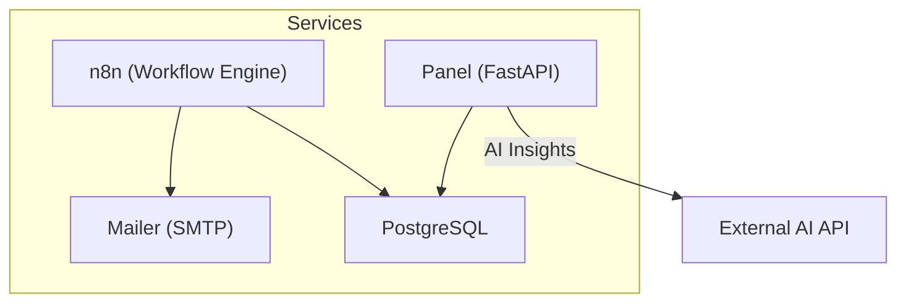
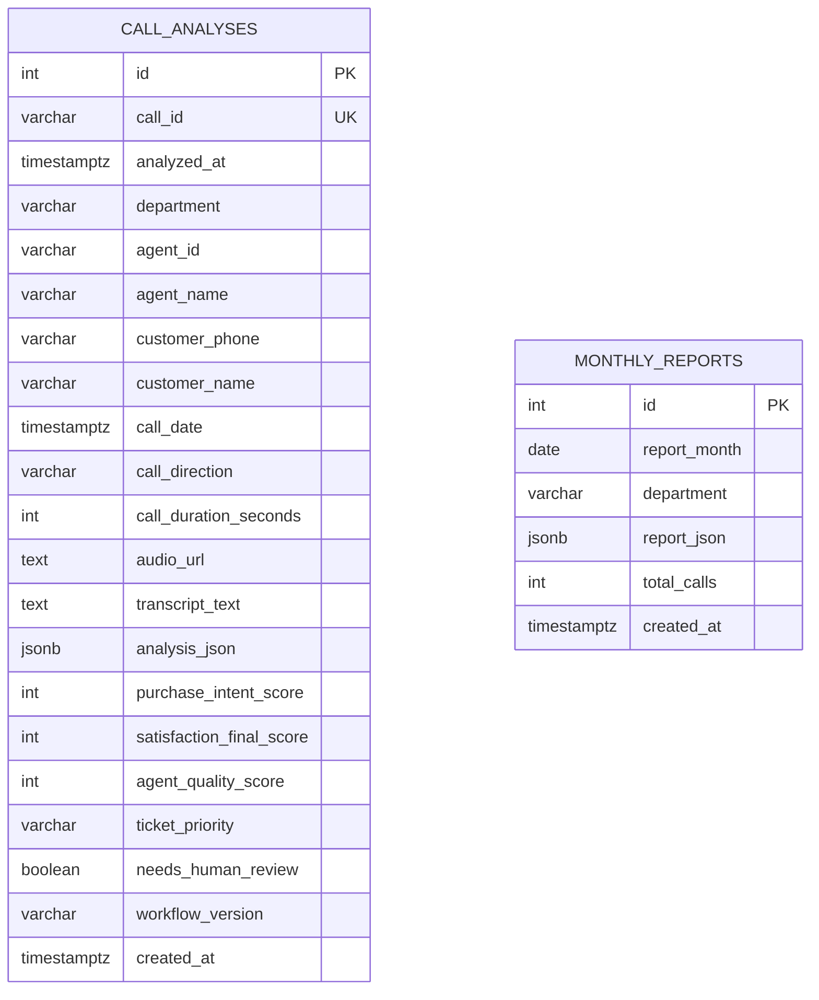
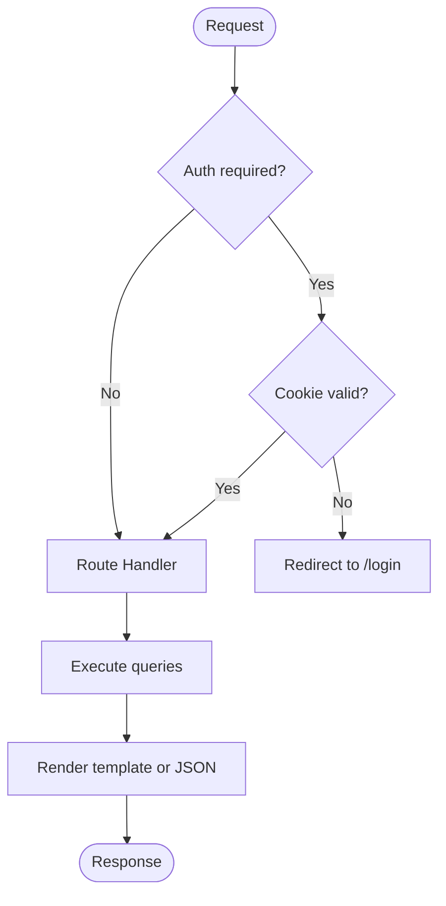
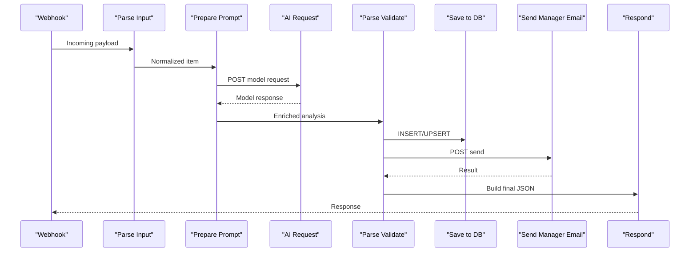
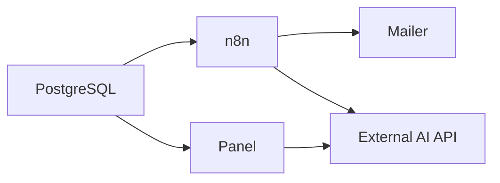

# Troubleshooting & FAQ

<cite>
**Referenced Files in This Document**
- [docker-compose.yml](file://docker/docker-compose.yml)
- [main.py](file://docker/panel/app/main.py)
- [config.py](file://docker/panel/app/config.py)
- [db.py](file://docker/panel/app/db.py)
- [queries.py](file://docker/panel/app/queries.py)
- [001_call_intelligence.sql](file://docker/postgres/init/001_call_intelligence.sql)
- [mailer.py](file://docker/mailer/mailer.py)
- [atlas-call-intelligence-v1.json](file://docker/n8n/workflows/atlas-call-intelligence-v1.json)
- [ai.py](file://docker/panel/app/ai.py)
- [send-real-call-analysis.py](file://docker/scripts/send-real-call-analysis.py)
</cite>

## Table of Contents
1. Introduction
2. Project Structure
3. Core Components
4. Architecture Overview
5. Detailed Component Analysis
6. Dependency Analysis
7. Performance Considerations
8. Troubleshooting Guide
9. Conclusion
10. Appendices

## Introduction
This document provides comprehensive troubleshooting guidance and frequently asked questions for the Atlas platform. It focuses on common setup problems, service connectivity issues, workflow execution errors, performance bottlenecks, database connection problems, API integration failures, log analysis techniques, debugging approaches, monitoring tools, escalation procedures, migration and upgrade considerations, and compatibility across versions.

## Project Structure
Atlas is a containerized system composed of:
- PostgreSQL database with initialization scripts
- n8n workflow engine orchestrating call intelligence processing
- A FastAPI-based management panel for dashboards and analytics
- A Python mailer service for sending notifications via SMTP
- Scripts to run end-to-end tests and sample workflows



**Diagram sources**
- [docker-compose.yml:1-98](file://docker/docker-compose.yml#L1-L98)
- [main.py:16-187](file://docker/panel/app/main.py#L16-L187)
- [mailer.py:1-77](file://docker/mailer/mailer.py#L1-L77)
- [atlas-call-intelligence-v1.json:1-160](file://docker/n8n/workflows/atlas-call-intelligence-v1.json#L1-L160)

**Section sources**
- [docker-compose.yml:1-98](file://docker/docker-compose.yml#L1-L98)

## Core Components
- Database layer: PostgreSQL schema and indexes for call analyses and monthly reports
- Panel (FastAPI): Web UI endpoints, authentication middleware, templates, and data queries
- Queries module: SQL aggregation and reporting functions used by the panel
- n8n workflow: Ingests call data, calls AI, parses results, persists to DB, and sends emails
- Mailer: HTTP endpoint that sends emails via SMTP
- AI integration: External model calls for executive insights and call analysis

**Section sources**
- [001_call_intelligence.sql:1-45](file://docker/postgres/init/001_call_intelligence.sql#L1-L45)
- [main.py:16-187](file://docker/panel/app/main.py#L16-L187)
- [queries.py:1-260](file://docker/panel/app/queries.py#L1-L260)
- [atlas-call-intelligence-v1.json:1-160](file://docker/n8n/workflows/atlas-call-intelligence-v1.json#L1-L160)
- [mailer.py:1-77](file://docker/mailer/mailer.py#L1-L77)
- [ai.py:1-37](file://docker/panel/app/ai.py#L1-L37)

## Architecture Overview
The end-to-end flow starts with an incoming call payload processed by n8n, which invokes an external AI model, parses structured output, stores it in PostgreSQL, and optionally notifies managers via email. The Panel reads from PostgreSQL to render dashboards and can generate executive insights using the same AI provider.

```mermaid
sequenceDiagram
participant Client as "Caller / System"
participant N8N as "n8n Workflow"
participant AI as "External AI API"
participant DB as "PostgreSQL"
participant Mailer as "Mailer Service"
participant Panel as "Panel (FastAPI)"
Client->>N8N : POST webhook with call data
N8N->>AI : Generate analysis (prompt + model)
AI-->>N8N : Structured JSON analysis
N8N->>DB : INSERT/UPSERT call_analyses
N8N->>Mailer : Send manager notification
Note over N8N,Mailer : Email may fail independently; workflow continues
Panel->>DB : Query stats, reports, details
Panel->>AI : Generate executive insights (optional)
AI-->>Panel : Insights text
Panel-->>Client : HTML pages / JSON responses
```

**Diagram sources**
- [atlas-call-intelligence-v1.json:1-160](file://docker/n8n/workflows/atlas-call-intelligence-v1.json#L1-L160)
- [main.py:68-187](file://docker/panel/app/main.py#L68-L187)
- [ai.py:7-37](file://docker/panel/app/ai.py#L7-L37)
- [mailer.py:18-33](file://docker/mailer/mailer.py#L18-L33)

## Detailed Component Analysis

### Database Layer
- Schema includes call_analyses and monthly_reports with appropriate indexes for query performance
- Common issues: missing init scripts, incorrect credentials, index bloat, slow aggregations



**Diagram sources**
- [001_call_intelligence.sql:1-45](file://docker/postgres/init/001_call_intelligence.sql#L1-L45)

**Section sources**
- [001_call_intelligence.sql:1-45](file://docker/postgres/init/001_call_intelligence.sql#L1-L45)

### Panel (FastAPI)
- Authentication via optional password cookie
- Endpoints for dashboard, top performers, ready-to-buy, unhappy customers, staff performance, call duration, satisfaction, successful sales, monthly reports, call detail, AI insights
- Uses psycopg2 for DB access and Jinja2 templates for rendering



**Diagram sources**
- [main.py:40-66](file://docker/panel/app/main.py#L40-L66)
- [main.py:68-187](file://docker/panel/app/main.py#L68-L187)
- [db.py:8-31](file://docker/panel/app/db.py#L8-L31)

**Section sources**
- [main.py:40-187](file://docker/panel/app/main.py#L40-L187)
- [db.py:8-31](file://docker/panel/app/db.py#L8-L31)
- [config.py:1-14](file://docker/panel/app/config.py#L1-L14)

### Queries Module
- Aggregates metrics for overview, top performers, hot leads, unhappy customers, staff performance, call durations, satisfaction rates, successful sales, monthly reports, recent calls, call details, department breakdown
- Potential pitfalls: NULL handling, missing fields in analysis_json, performance on large datasets

**Section sources**
- [queries.py:6-260](file://docker/panel/app/queries.py#L6-L260)

### n8n Workflow
- Webhook receives call payloads, parses input, prepares prompt, calls AI, validates and enriches response, saves to DB, sends email, builds response
- Environment variables control AI model and URLs; credentials stored in n8n for Postgres



**Diagram sources**
- [atlas-call-intelligence-v1.json:1-160](file://docker/n8n/workflows/atlas-call-intelligence-v1.json#L1-L160)

**Section sources**
- [atlas-call-intelligence-v1.json:1-160](file://docker/n8n/workflows/atlas-call-intelligence-v1.json#L1-L160)

### Mailer Service
- HTTP server exposing /send and / endpoints
- Sends emails via SMTP with TLS; returns success/failure JSON
- Common issues: missing SMTP_PASS, wrong host/port/user, network timeouts

**Section sources**
- [mailer.py:1-77](file://docker/mailer/mailer.py#L1-L77)

### AI Integration
- Panel generates executive insights by calling external AI API with context from queries
- Scripted test uses Gemini directly and sends email via mailer

**Section sources**
- [ai.py:1-37](file://docker/panel/app/ai.py#L1-L37)
- [send-real-call-analysis.py:1-219](file://docker/scripts/send-real-call-analysis.py#L1-L219)

## Dependency Analysis
- docker-compose defines service dependencies and environment variables
- Panel depends on PostgreSQL and optional AI API key
- n8n depends on PostgreSQL and external AI API; also calls mailer
- Mailer depends on SMTP configuration



**Diagram sources**
- [docker-compose.yml:1-98](file://docker/docker-compose.yml#L1-L98)

**Section sources**
- [docker-compose.yml:1-98](file://docker/docker-compose.yml#L1-L98)

## Performance Considerations
- Ensure proper indexing on call_analyses and monthly_reports for frequent filters and aggregations
- Use LIMIT clauses in queries to avoid heavy loads on large tables
- Monitor PostgreSQL connection pool usage; consider connection reuse if scaling up
- Cache expensive computations in the panel if needed (e.g., periodic pre-aggregation)
- Tune n8n execution concurrency and timeouts for AI requests
- Optimize email sending with retries and backoff to avoid blocking workflows

[No sources needed since this section provides general guidance]

## Troubleshooting Guide

### Setup Problems
- Services not starting
  - Verify Docker Compose services are healthy; check logs for each service
  - Confirm ports are available and not conflicting
  - Ensure volumes are mounted correctly for persistent data
- PostgreSQL not initializing
  - Check that init scripts exist under postgres/init and are readable
  - Validate credentials match environment variables
- n8n cannot connect to database
  - Confirm DB_TYPE and Postgres credentials in n8n environment
  - Ensure n8n depends_on postgres health condition is satisfied

**Section sources**
- [docker-compose.yml:1-98](file://docker/docker-compose.yml#L1-L98)
- [001_call_intelligence.sql:1-45](file://docker/postgres/init/001_call_intelligence.sql#L1-L45)

### Service Connectivity Issues
- Panel login redirects unexpectedly
  - If PANEL_PASSWORD is empty, authentication is bypassed and redirects to root
  - Ensure cookie atlas_auth is set after successful login
- Panel shows 404 on call detail
  - Call ID must exist in call_analyses; verify insertion by n8n workflow
- Mailer returns 400 or 500
  - Validate JSON payload format
  - Check SMTP_PASS configuration and network reachability

**Section sources**
- [main.py:40-66](file://docker/panel/app/main.py#L40-L66)
- [main.py:147-155](file://docker/panel/app/main.py#L147-L155)
- [mailer.py:36-68](file://docker/mailer/mailer.py#L36-L68)

### Workflow Execution Errors
- Webhook returns error or no data saved
  - Inspect n8n execution logs for parse/input validation errors
  - Ensure required fields (transcript or audioUrl) are provided
- AI request fails or returns invalid JSON
  - Check AI_URL and API_KEY environment variables
  - Validate model name and timeout settings
- Email not sent
  - Verify ATLAS_MANAGER_EMAIL and SMTP settings
  - Review mailer logs for exceptions and SMTP errors

**Section sources**
- [atlas-call-intelligence-v1.json:1-160](file://docker/n8n/workflows/atlas-call-intelligence-v1.json#L1-L160)
- [mailer.py:18-33](file://docker/mailer/mailer.py#L18-L33)

### Performance Bottlenecks
- Slow dashboard queries
  - Analyze query plans for heavy aggregations
  - Ensure indexes on analyzed_at, agent_id, department, call_date
- High memory usage in Panel
  - Reduce LIMIT values for list endpoints
  - Avoid loading full transcripts into memory when unnecessary
- n8n execution timeouts
  - Increase timeouts for AI requests
  - Split large batches into smaller chunks

**Section sources**
- [001_call_intelligence.sql:29-45](file://docker/postgres/init/001_call_intelligence.sql#L29-L45)
- [queries.py:6-260](file://docker/panel/app/queries.py#L6-L260)

### Database Connection Problems
- Panel cannot connect to PostgreSQL
  - Validate DB_HOST, DB_PORT, DB_NAME, DB_USER, DB_PASSWORD
  - Check network connectivity and firewall rules
- Duplicate entries or conflicts
  - Ensure call_id uniqueness; use UPSERT logic in workflow
- Data inconsistencies in analysis_json
  - Normalize fields during ingestion; add validation in n8n code nodes

**Section sources**
- [config.py:1-14](file://docker/panel/app/config.py#L1-L14)
- [db.py:8-31](file://docker/panel/app/db.py#L8-L31)
- [atlas-call-intelligence-v1.json:73-93](file://docker/n8n/workflows/atlas-call-intelligence-v1.json#L73-L93)

### API Integration Failures
- Executive insights endpoint returns placeholder text
  - AI_API_KEY must be configured; otherwise returns a message indicating missing key
- External AI API rate limits or downtime
  - Implement retries with exponential backoff
  - Add circuit breaker patterns to avoid cascading failures

**Section sources**
- [ai.py:7-37](file://docker/panel/app/ai.py#L7-L37)

### Log Analysis Techniques
- Docker logs
  - Use docker logs to inspect service outputs and errors
  - Filter by service name to isolate issues
- n8n execution logs
  - Review failed executions and node outputs for detailed diagnostics
- Panel logs
  - Check FastAPI logs for request traces and exceptions
- Mailer logs
  - Observe SMTP handshake and send results

[No sources needed since this section provides general guidance]

### Debugging Approaches
- Reproduce with minimal inputs
  - Use send-real-call-analysis.py to simulate end-to-end flow
- Validate environment variables
  - Ensure all required keys and URLs are set
- Step through n8n workflow
  - Execute nodes individually to pinpoint failure points
- Test mailer locally
  - Send test emails to verify SMTP configuration

**Section sources**
- [send-real-call-analysis.py:1-219](file://docker/scripts/send-real-call-analysis.py#L1-L219)

### Monitoring Tools
- Health checks
  - Use docker-compose healthcheck for PostgreSQL readiness
- Metrics
  - Expose application metrics where possible (e.g., request latency, error rates)
- Alerts
  - Set up alerts for failed emails, AI API errors, and database connection failures

[No sources needed since this section provides general guidance]

### Escalation Procedures
- Complex problems
  - Gather logs from all services, environment variables (redacted), and reproduction steps
  - Engage support with detailed context and timeline
- Recurring issues
  - Document workarounds and propose permanent fixes
  - Track incidents and measure resolution time

[No sources needed since this section provides general guidance]

### Community Resources
- Official documentation for PostgreSQL, n8n, FastAPI, and SMTP providers
- GitHub repositories and issue trackers for related components
- Forums and community channels for troubleshooting tips

[No sources needed since this section provides general guidance]

### Migration Issues
- Schema changes
  - Apply new init scripts carefully; ensure backward compatibility
  - Use migrations to alter existing tables without downtime
- Data migration
  - Validate data integrity before and after migration
  - Back up databases prior to any schema updates

[No sources needed since this section provides general guidance]

### Upgrade Procedures
- Docker images
  - Pin versions for stability; upgrade incrementally
  - Test upgrades in staging before production
- Dependencies
  - Update Python packages and Node modules as needed
  - Rebuild containers to reflect changes

[No sources needed since this section provides general guidance]

### Compatibility Concerns
- Version mismatches
  - Ensure AI model names and API versions are compatible
  - Validate n8n node versions against workflow definitions
- Environment differences
  - Keep environment variables consistent across environments

[No sources needed since this section provides general guidance]

## Conclusion
This guide covers common setup, connectivity, workflow, performance, and integration issues for the Atlas platform. By following the diagnostic steps, analyzing logs, and applying the recommended fixes, most problems can be resolved efficiently. For complex cases, escalate with comprehensive logs and context. Regular monitoring and proactive maintenance will help detect issues early and maintain system reliability.

## Appendices

### Frequently Asked Questions (FAQ)

- How do I enable authentication for the Panel?
  - Set PANEL_PASSWORD in environment; the Panel will require login and set a session cookie.

- Why does the AI insights endpoint return a message about missing key?
  - Configure AI_API_KEY; without it, the endpoint returns a message indicating the key is not set.

- What happens if the mailer fails to send an email?
  - The workflow continues; review mailer logs and SMTP configuration to resolve delivery issues.

- How can I verify that call data is being saved?
  - Query call_analyses table or check the Panel’s recent calls and call detail endpoints.

- How do I troubleshoot slow dashboard queries?
  - Check indexes, reduce result sets with LIMIT, and analyze query performance.

- What should I do if n8n cannot reach the AI API?
  - Verify API_URL and API_KEY; adjust timeouts and retry policies; monitor external API status.

- How do I handle duplicate call entries?
  - Ensure unique call_id and use UPSERT logic to update existing records.

- Can I customize the Panel title and password?
  - Yes, configure PANEL_TITLE and PANEL_PASSWORD via environment variables.

- How do I run a test end-to-end call analysis?
  - Use the provided script to analyze a transcript and send an email via the mailer.

**Section sources**
- [config.py:1-14](file://docker/panel/app/config.py#L1-L14)
- [ai.py:7-37](file://docker/panel/app/ai.py#L7-L37)
- [mailer.py:18-33](file://docker/mailer/mailer.py#L18-L33)
- [queries.py:214-232](file://docker/panel/app/queries.py#L214-L232)
- [send-real-call-analysis.py:1-219](file://docker/scripts/send-real-call-analysis.py#L1-L219)