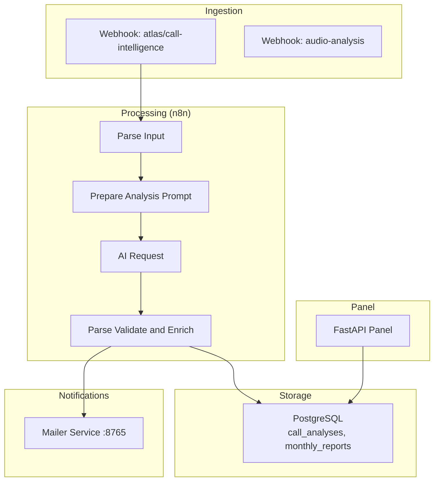
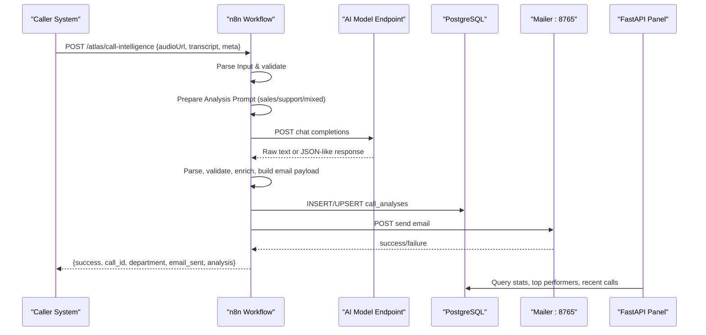
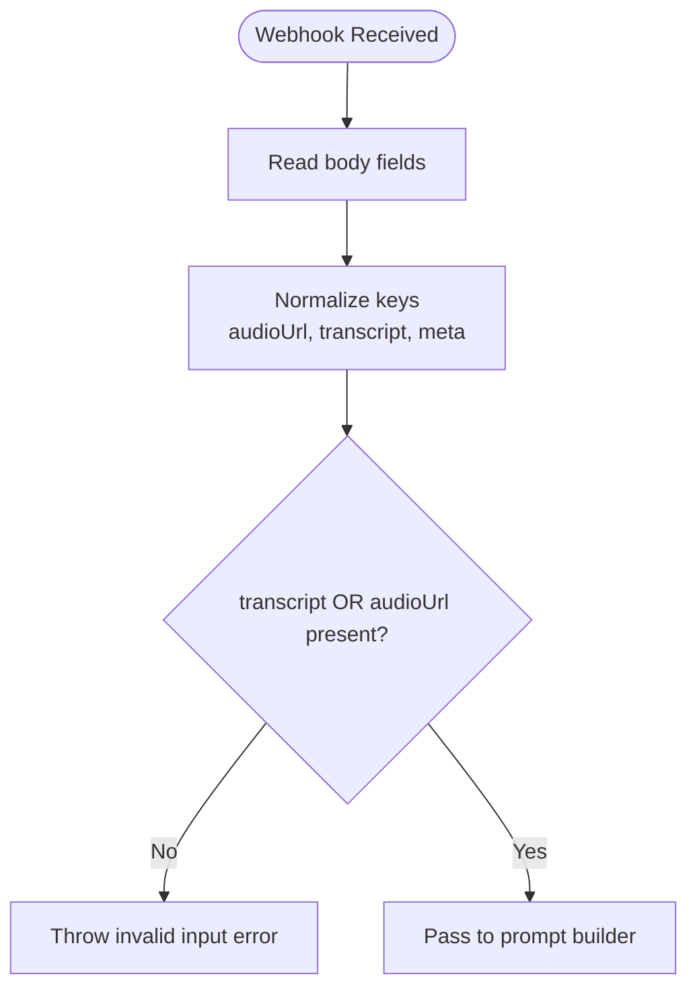
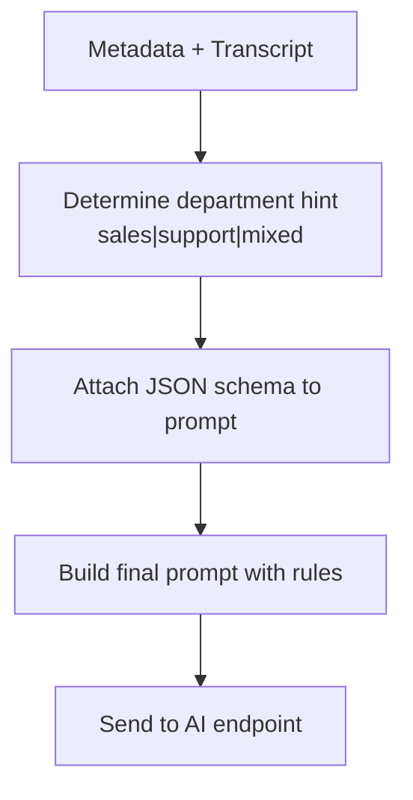
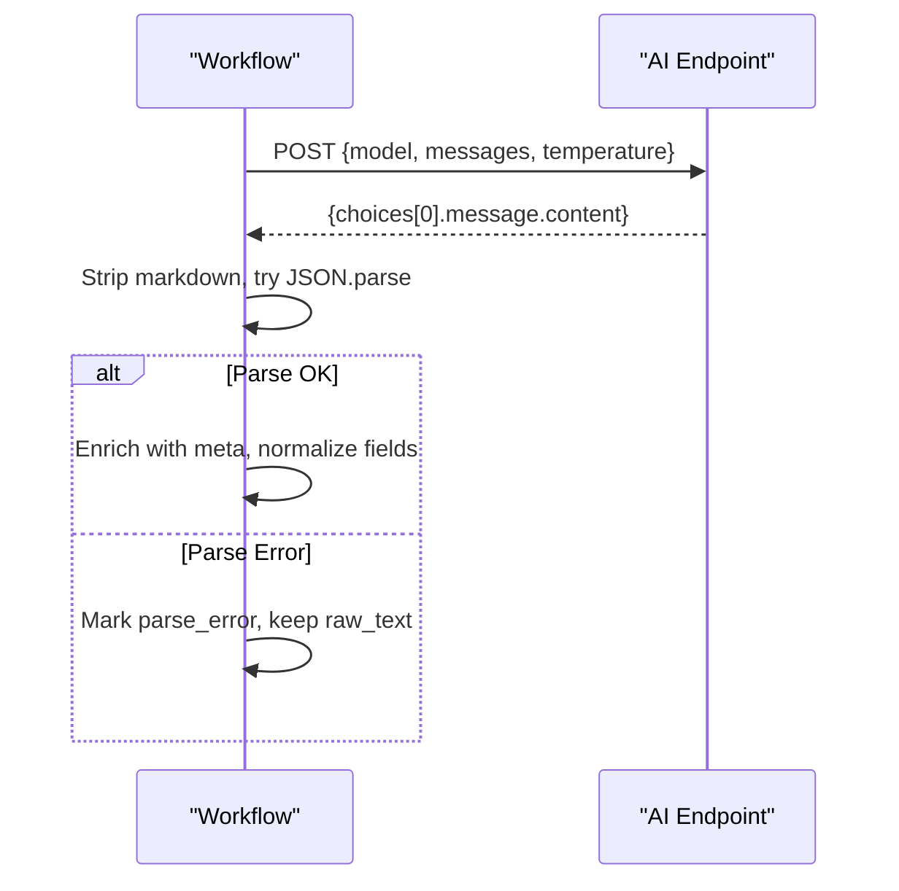
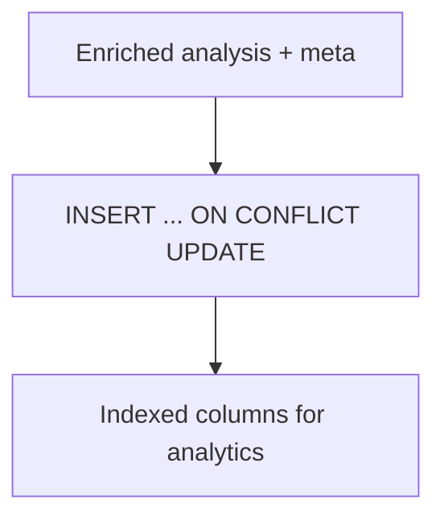
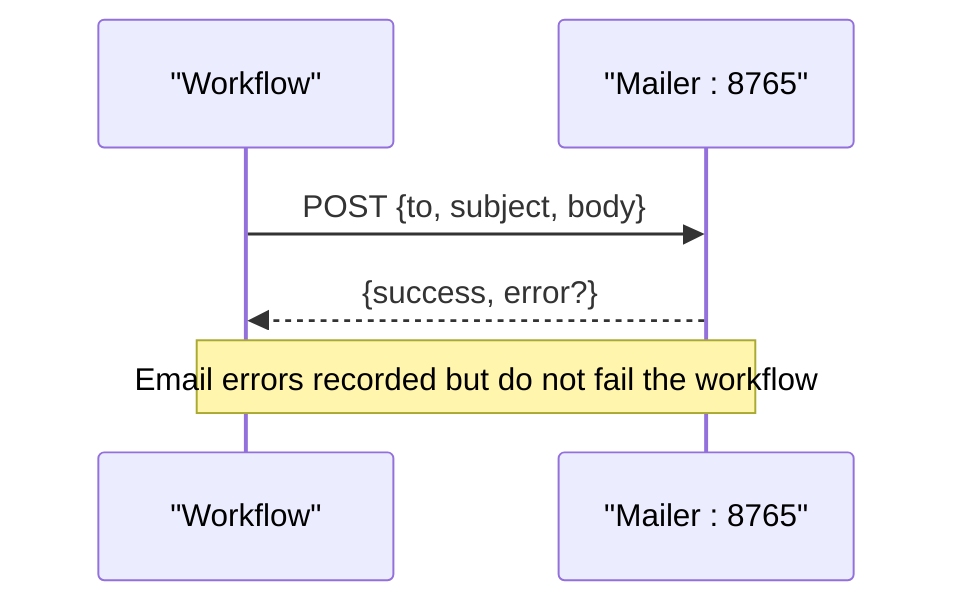
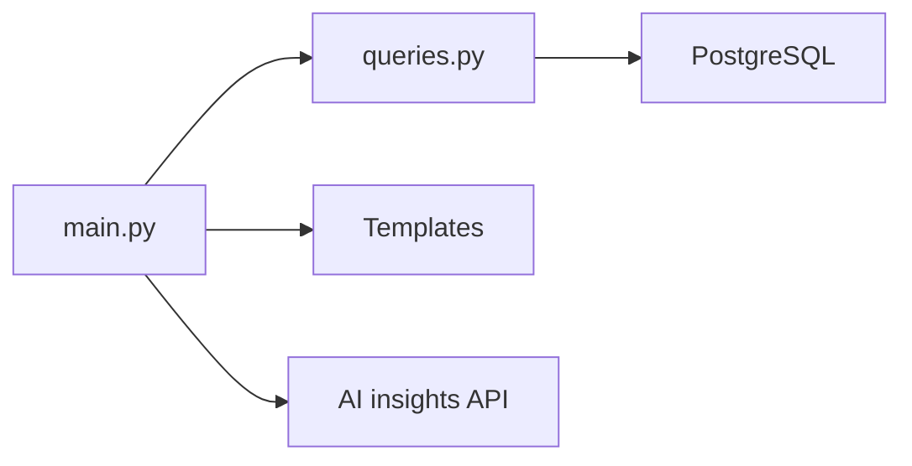
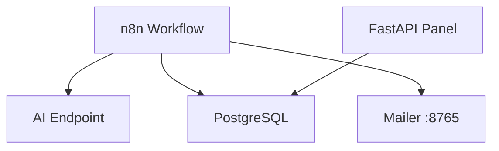

# Call Processing Pipeline

<cite>
**Referenced Files in This Document**
- [atlas-call-intelligence-v1.json](file://docker/n8n/workflows/atlas-call-intelligence-v1.json)
- [audio-analysis-workflow.json](file://docker/n8n/workflows/audio-analysis-workflow.json)
- [main.py](file://docker/panel/app/main.py)
- [queries.py](file://docker/panel/app/queries.py)
- [config.py](file://docker/panel/app/config.py)
- [001_call_intelligence.sql](file://docker/postgres/init/001_call_intelligence.sql)
- [send-real-call-analysis.py](file://docker/scripts/send-real-call-analysis.py)
- [send_email.py](file://docker/mailer/send_email.py)
- [docker-compose.yml](file://docker/docker-compose.yml)
- [test-result.json](file://docker/scripts/test-result.json)
</cite>

## Table of Contents
1. [Introduction](#introduction)
2. [Project Structure](#project-structure)
3. [Core Components](#core-components)
4. [Architecture Overview](#architecture-overview)
5. [Detailed Component Analysis](#detailed-component-analysis)
6. [Dependency Analysis](#dependency-analysis)
7. [Performance Considerations](#performance-considerations)
8. [Troubleshooting Guide](#troubleshooting-guide)
9. [Conclusion](#conclusion)

## Introduction
This document explains the end-to-end call analysis automation pipeline that ingests call data via webhooks, performs AI-driven analysis, persists results to a database, and sends manager notifications by email. It covers input validation, transcript processing, prompt construction, response parsing, data enrichment, quality control flags, error recovery, monitoring points, and scalability considerations for high-volume call processing.

## Project Structure
The system is composed of:
- n8n workflows that orchestrate webhook ingestion, AI calls, persistence, and email delivery
- A FastAPI panel for reporting and dashboards backed by PostgreSQL
- A mailer service for sending emails
- Database schema for per-call analyses and monthly reports
- Scripts for testing and real-world call analysis

**Diagram sources**
- [atlas-call-intelligence-v1.json:12-143](file://docker/n8n/workflows/atlas-call-intelligence-v1.json#L12-L143)
- [audio-analysis-workflow.json:5-78](file://docker/n8n/workflows/audio-analysis-workflow.json#L5-L78)
- [001_call_intelligence.sql:4-45](file://docker/postgres/init/001_call_intelligence.sql#L4-L45)
- [docker-compose.yml:26-79](file://docker/docker-compose.yml#L26-L79)

**Section sources**
- [docker-compose.yml:1-98](file://docker/docker-compose.yml#L1-L98)

## Core Components
- Webhook endpoints receive call payloads with audio/transcript and metadata.
- Prompt builder constructs structured prompts tailored to sales, support, or mixed calls using metadata hints.
- AI request node calls an external model endpoint configured via environment variables.
- Parser validates JSON output, enriches it with workflow metadata, and prepares notifications.
- Database writer persists normalized fields and full JSON analysis with upsert semantics.
- Email sender delivers manager notifications; failures are tolerated without blocking the flow.
- Panel exposes dashboards and APIs to query stored analyses and generate insights.

**Section sources**
- [atlas-call-intelligence-v1.json:12-143](file://docker/n8n/workflows/atlas-call-intelligence-v1.json#L12-L143)
- [main.py:70-189](file://docker/panel/app/main.py#L70-L189)
- [queries.py:6-260](file://docker/panel/app/queries.py#L6-L260)
- [001_call_intelligence.sql:4-45](file://docker/postgres/init/001_call_intelligence.sql#L4-L45)

## Architecture Overview
End-to-end flow from webhook to storage and notification:

**Diagram sources**
- [atlas-call-intelligence-v1.json:12-143](file://docker/n8n/workflows/atlas-call-intelligence-v1.json#L12-L143)
- [docker-compose.yml:26-79](file://docker/docker-compose.yml#L26-L79)
- [main.py:70-189](file://docker/panel/app/main.py#L70-L189)

## Detailed Component Analysis

### Webhook Ingestion and Input Validation
- Accepts multiple field names for audio URL and transcript to accommodate different upstream formats.
- Extracts metadata such as call ID, department hint, agent info, customer info, direction, duration, date, and product context.
- Validates that at least one of transcript or audio URL is present; otherwise raises an error to stop processing early.

**Diagram sources**
- [atlas-call-intelligence-v1.json:26-35](file://docker/n8n/workflows/atlas-call-intelligence-v1.json#L26-L35)

**Section sources**
- [atlas-call-intelligence-v1.json:26-35](file://docker/n8n/workflows/atlas-call-intelligence-v1.json#L26-L35)

### Transcript Processing and Metadata Extraction
- Normalizes incoming fields into a consistent structure.
- Builds a metadata object including call identifiers, department hint, agent and customer details, timing, and product context used to tailor prompts.
- Supports auto-detection when department is not explicitly provided.

**Section sources**
- [atlas-call-intelligence-v1.json:26-35](file://docker/n8n/workflows/atlas-call-intelligence-v1.json#L26-L35)

### AI Prompt Construction
- Constructs a strict JSON schema-based prompt instructing the model to return only valid JSON matching the expected structure.
- Injects context from metadata (product context, department hint, call identity).
- Uses low temperature to encourage deterministic outputs suitable for downstream parsing.

**Diagram sources**
- [atlas-call-intelligence-v1.json:37-45](file://docker/n8n/workflows/atlas-call-intelligence-v1.json#L37-L45)

**Section sources**
- [atlas-call-intelligence-v1.json:37-45](file://docker/n8n/workflows/atlas-call-intelligence-v1.json#L37-L45)

### AI Request and Response Parsing
- Calls the configured AI endpoint with model name and messages.
- Parses the response, stripping markdown fences if present, and attempts JSON parse.
- On parse failure, records a parse_error flag and preserves raw text for debugging.

**Diagram sources**
- [atlas-call-intelligence-v1.json:47-71](file://docker/n8n/workflows/atlas-call-intelligence-v1.json#L47-L71)

**Section sources**
- [atlas-call-intelligence-v1.json:47-71](file://docker/n8n/workflows/atlas-call-intelligence-v1.json#L47-L71)

### Data Enrichment and Quality Control
- Enriches analysis with workflow metadata (call_id, analyzed_at, language, version).
- Ensures transcript full_text is present even if missing from AI output.
- Derives department label and builds a manager notification payload with summary metrics.
- Sets quality_control flags based on parse status and other checks.

**Section sources**
- [atlas-call-intelligence-v1.json:62-71](file://docker/n8n/workflows/atlas-call-intelligence-v1.json#L62-L71)

### Database Storage
- Inserts or updates call_analyses with normalized fields and full JSON analysis using upsert on call_id.
- Stores key scores and ticket priority for reporting and filtering.
- Includes indexes for efficient queries by time, agent, department, and call date.

**Diagram sources**
- [atlas-call-intelligence-v1.json:73-93](file://docker/n8n/workflows/atlas-call-intelligence-v1.json#L73-L93)
- [001_call_intelligence.sql:4-45](file://docker/postgres/init/001_call_intelligence.sql#L4-L45)

**Section sources**
- [atlas-call-intelligence-v1.json:73-93](file://docker/n8n/workflows/atlas-call-intelligence-v1.json#L73-L93)
- [001_call_intelligence.sql:4-45](file://docker/postgres/init/001_call_intelligence.sql#L4-L45)

### Email Notifications
- Builds a readable email body summarizing department, agent, customer, ticket priority, satisfaction, purchase intent, and recommended next steps.
- Sends via HTTP to the mailer service; failures do not block the workflow due to continue-on-fail configuration.
- The mailer uses SMTP settings from environment variables.

**Diagram sources**
- [atlas-call-intelligence-v1.json:105-120](file://docker/n8n/workflows/atlas-call-intelligence-v1.json#L105-L120)
- [docker-compose.yml:62-79](file://docker/docker-compose.yml#L62-L79)
- [send_email.py:9-34](file://docker/mailer/send_email.py#L9-L34)

**Section sources**
- [atlas-call-intelligence-v1.json:105-120](file://docker/n8n/workflows/atlas-call-intelligence-v1.json#L105-L120)
- [send_email.py:9-34](file://docker/mailer/send_email.py#L9-L34)

### Panel Reporting and Insights
- FastAPI panel serves dashboards and APIs to view recent calls, top performers, ready-to-buy leads, unhappy customers, staff performance, satisfaction, successful sales, and monthly reports.
- Aggregates metrics from call_analyses and supports detailed call views.
- Provides an AI insights endpoint that composes a context payload from queries and generates executive insights.

**Diagram sources**
- [main.py:70-189](file://docker/panel/app/main.py#L70-L189)
- [queries.py:6-260](file://docker/panel/app/queries.py#L6-L260)

**Section sources**
- [main.py:70-189](file://docker/panel/app/main.py#L70-L189)
- [queries.py:6-260](file://docker/panel/app/queries.py#L6-L260)

### Handling Different Call Types
- Sales calls: Fill sales_analysis fields including purchase intent, objections, discount estimates, and next steps.
- Support calls: Populate support_analysis with issue category, resolution status, retention risk.
- Mixed calls: Auto-detected when department hint is ambiguous; both sales and support sections may be populated.

Examples of handling are implemented in the prompt construction and response parsing stages where department hints guide the model’s focus and subsequent enrichment maps fields accordingly.

**Section sources**
- [atlas-call-intelligence-v1.json:37-45](file://docker/n8n/workflows/atlas-call-intelligence-v1.json#L37-L45)
- [atlas-call-intelligence-v1.json:62-71](file://docker/n8n/workflows/atlas-call-intelligence-v1.json#L62-L71)

### Monitoring Points
- Workflow nodes: webhook, parse input, prompt builder, AI request, parser/enricher, DB write, email send, response builder.
- Environment variables: AI endpoint URL, model, manager email, SMTP settings.
- Database indices: analyzed_at, agent_id, department, call_date for fast reporting.
- Panel endpoints: stats, top performers, ready-to-buy, unhappy customers, staff performance, satisfaction, successful sales, monthly reports, call detail.

**Section sources**
- [atlas-call-intelligence-v1.json:12-143](file://docker/n8n/workflows/atlas-call-intelligence-v1.json#L12-L143)
- [docker-compose.yml:26-79](file://docker/docker-compose.yml#L26-L79)
- [001_call_intelligence.sql:29-45](file://docker/postgres/init/001_call_intelligence.sql#L29-L45)
- [main.py:70-189](file://docker/panel/app/main.py#L70-L189)

## Dependency Analysis
- n8n workflow depends on:
  - External AI endpoint (configured via API_URL and AI_MODEL)
  - PostgreSQL for persistence
  - Mailer service for email delivery
- Panel depends on:
  - PostgreSQL for data
  - Optional AI endpoint for generating executive insights
- Docker Compose orchestrates services and exposes ports for local development.

**Diagram sources**
- [docker-compose.yml:26-79](file://docker/docker-compose.yml#L26-L79)
- [atlas-call-intelligence-v1.json:47-120](file://docker/n8n/workflows/atlas-call-intelligence-v1.json#L47-L120)
- [main.py:168-172](file://docker/panel/app/main.py#L168-L172)

**Section sources**
- [docker-compose.yml:26-79](file://docker/docker-compose.yml#L26-L79)

## Performance Considerations
- Low temperature in AI requests improves consistency and reduces re-parsing overhead.
- Use of upsert on call_id avoids duplicate writes and simplifies idempotency.
- Database indexing on frequently filtered columns (analyzed_at, agent_id, department, call_date) accelerates dashboard queries.
- Email sending is non-blocking for workflow completion; failures are logged without failing the entire pipeline.
- For high volume:
  - Consider batching AI requests if supported by the model provider.
  - Add retry logic with exponential backoff for transient network errors.
  - Introduce a message queue between webhook and processing to smooth spikes.
  - Partition or archive older call_analyses rows to maintain query performance.
  - Cache frequent dashboard aggregates if needed.

[No sources needed since this section provides general guidance]

## Troubleshooting Guide
Common issues and recovery strategies:
- Invalid input: If neither transcript nor audio URL is provided, the workflow throws an error immediately. Ensure upstream systems send at least one.
- AI parse errors: When the model returns non-JSON or malformed content, parse_error is set and raw_text preserved. Inspect the stored analysis_json to diagnose prompt or model behavior.
- Email delivery failures: The mailer may return errors due to missing SMTP credentials or network issues. Check environment variables (SMTP_HOST, SMTP_PORT, SMTP_USER, SMTP_PASS) and verify the mailer service health. Errors are captured but do not fail the workflow.
- Database write failures: The DB node is configured to continue on failure; check logs and ensure PostgreSQL connectivity and permissions. Upsert semantics prevent duplicates.
- Panel access: If PANEL_PASSWORD is set, authentication is required to access dashboards.

Example error artifact:
- test-result.json demonstrates a scenario with parse_error and email_error, showing how failures are captured and surfaced.

**Section sources**
- [atlas-call-intelligence-v1.json:26-35](file://docker/n8n/workflows/atlas-call-intelligence-v1.json#L26-L35)
- [atlas-call-intelligence-v1.json:62-71](file://docker/n8n/workflows/atlas-call-intelligence-v1.json#L62-L71)
- [atlas-call-intelligence-v1.json:105-120](file://docker/n8n/workflows/atlas-call-intelligence-v1.json#L105-L120)
- [send_email.py:9-34](file://docker/mailer/send_email.py#L9-L34)
- [test-result.json:1-23](file://docker/scripts/test-result.json#L1-L23)

## Conclusion
The call processing pipeline provides a robust, extensible framework for automated call analysis. It standardizes input, leverages AI for rich insights, persists structured results for reporting, and notifies stakeholders via email. With careful configuration, error handling, and monitoring, it can scale to handle high volumes while maintaining reliability and actionable outputs for sales and support teams.