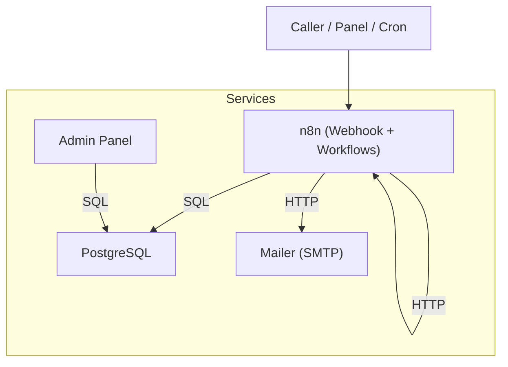
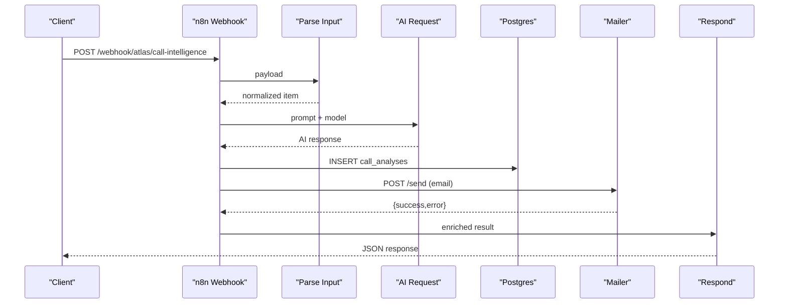
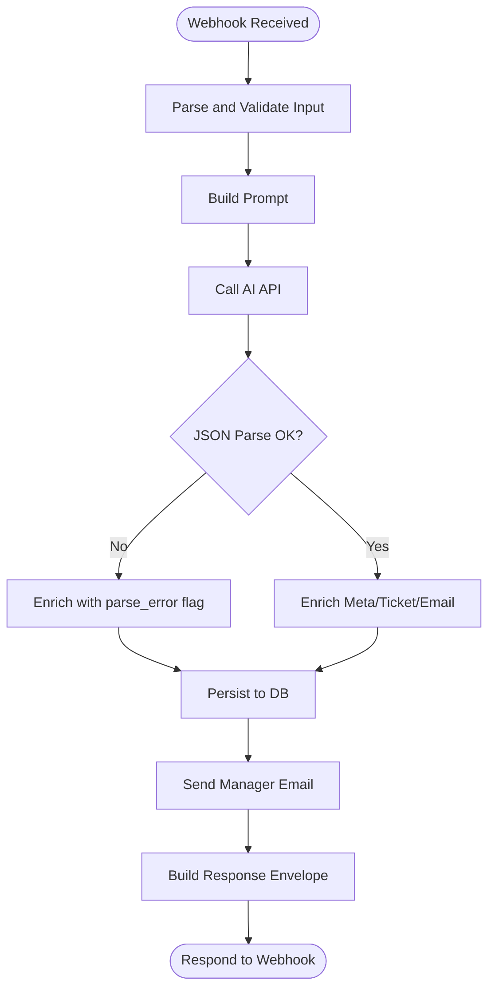
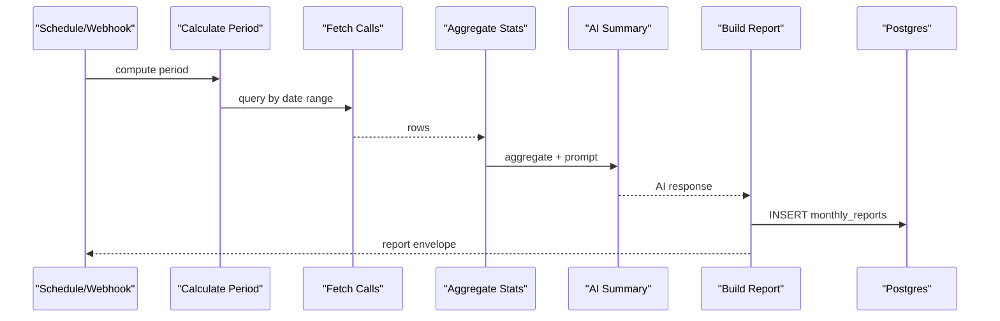
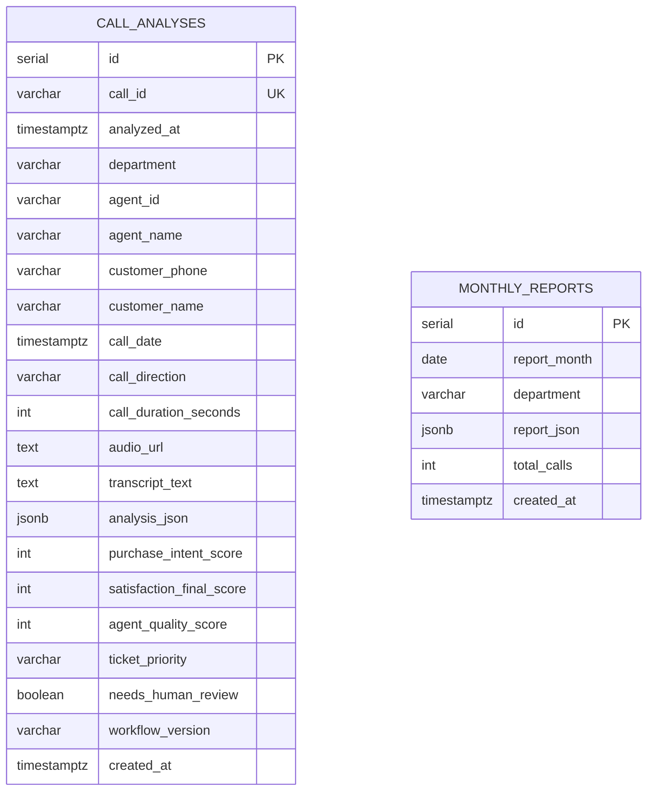
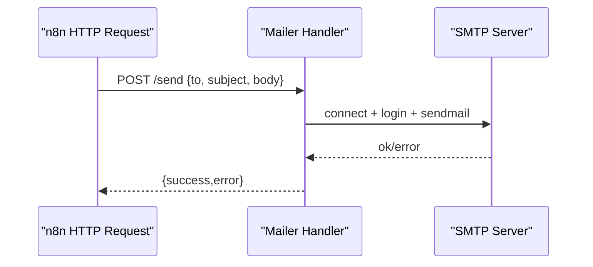
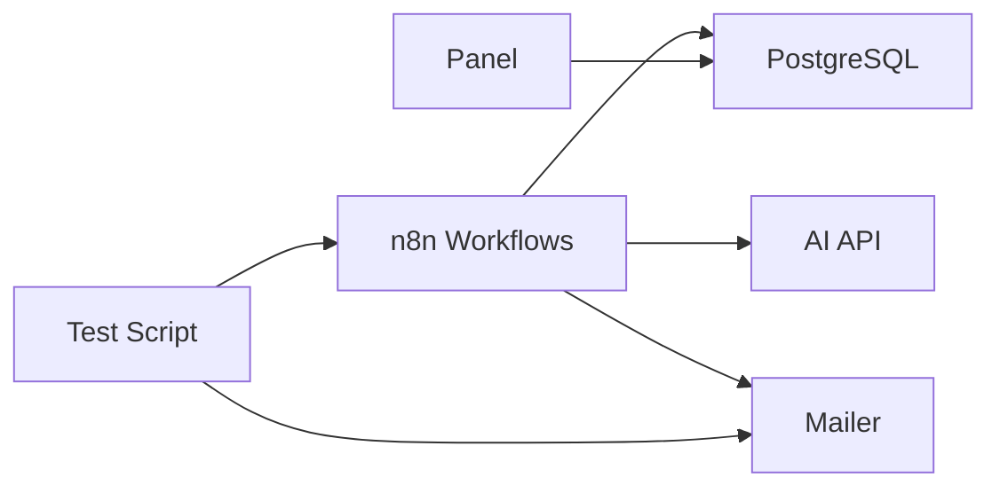

# Monitoring & Debugging

<cite>
**Referenced Files in This Document**
- [docker-compose.yml](file://docker/docker-compose.yml)
- [atlas-call-intelligence-v1.json](file://docker/n8n/workflows/atlas-call-intelligence-v1.json)
- [audio-analysis-workflow.json](file://docker/n8n/workflows/audio-analysis-workflow.json)
- [atlas-call-intelligence-monthly-report.json](file://docker/n8n/workflows/atlas-call-intelligence-monthly-report.json)
- [001_call_intelligence.sql](file://docker/postgres/init/001_call_intelligence.sql)
- [mailer.py](file://docker/mailer/mailer.py)
- [queries.py](file://docker/panel/app/queries.py)
- [run-test.ps1](file://docker/scripts/run-test.ps1)
- [test-result.json](file://docker/scripts/test-result.json)
- [n8nEventLog.log](file://docker/n8n/data/n8nEventLog.log)
</cite>

## Table of Contents
1. Introduction
2. Project Structure
3. Core Components
4. Architecture Overview
5. Detailed Component Analysis
6. Dependency Analysis
7. Performance Considerations
8. Troubleshooting Guide
9. Conclusion
10. Appendices

## Introduction
This document provides a comprehensive guide to monitoring and debugging the Atlas Call Intelligence automation pipelines built with n8n. It explains how to use n8n’s execution logs, error tracking, and workflow outputs to maintain reliable operations. It covers common failure scenarios such as AI API timeouts, database connection issues, and email delivery failures. You will also find practical examples for setting up alerts, monitoring performance metrics, analyzing execution patterns, debugging complex data transformations, troubleshooting webhooks, and optimizing workflows. Production monitoring strategies and incident response procedures are included to help you keep the system resilient under load.

## Project Structure
The system is composed of:
- n8n workflows that orchestrate call analysis, reporting, and notifications
- PostgreSQL for storing per-call analyses and monthly reports
- A Python mailer service for sending manager emails via SMTP
- An admin panel that reads from PostgreSQL to display insights
- Docker Compose to run all services together

**Diagram sources**
- [docker-compose.yml:26-61](file://docker/docker-compose.yml#L26-L61)
- [docker-compose.yml:62-79](file://docker/docker-compose.yml#L62-L79)
- [docker-compose.yml:80-98](file://docker/docker-compose.yml#L80-L98)

**Section sources**
- [docker-compose.yml:1-98](file://docker/docker-compose.yml#L1-L98)

## Core Components
- Webhook-driven call analysis workflow: receives payloads, prepares prompts, calls AI, parses results, persists to PostgreSQL, sends manager email, and responds to the caller.
- Monthly report workflow: scheduled or webhook-triggered; aggregates call data, generates an executive summary via AI, saves the report, and optionally notifies managers.
- Data layer: PostgreSQL tables store call analyses and monthly reports with indexes for efficient queries.
- Notification layer: Python HTTP server exposes an endpoint to send emails via SMTP.
- Observability: n8n event logs capture workflow activations and events; test scripts exercise endpoints and capture responses.

Key responsibilities:
- Input validation and transformation in Code/Function nodes
- External integrations via HTTP Request nodes (AI APIs, mailer)
- Persistence via Postgres nodes
- Reporting and analytics via aggregation functions and SQL queries

**Section sources**
- [atlas-call-intelligence-v1.json:1-159](file://docker/n8n/workflows/atlas-call-intelligence-v1.json#L1-L159)
- [atlas-call-intelligence-monthly-report.json:1-172](file://docker/n8n/workflows/atlas-call-intelligence-monthly-report.json#L1-L172)
- [001_call_intelligence.sql:1-45](file://docker/postgres/init/001_call_intelligence.sql#L1-L45)
- [mailer.py:1-77](file://docker/mailer/mailer.py#L1-L77)
- [queries.py:1-129](file://docker/panel/app/queries.py#L1-L129)

## Architecture Overview
The call analysis pipeline processes incoming webhook requests through a sequence of steps: parse input, build prompt, call AI, validate and enrich output, persist to database, send email, and respond. The monthly report pipeline runs on schedule or webhook, aggregates data, calls AI for executive summary, persists the report, and responds.

**Diagram sources**
- [atlas-call-intelligence-v1.json:10-143](file://docker/n8n/workflows/atlas-call-intelligence-v1.json#L10-L143)
- [docker-compose.yml:26-61](file://docker/docker-compose.yml#L26-L61)
- [mailer.py:36-68](file://docker/mailer/mailer.py#L36-L68)

## Detailed Component Analysis

### Call Analysis Workflow
- Entry point: Webhook node listens at path atlas/call-intelligence.
- Input parsing: Code node normalizes fields and validates required inputs.
- Prompt preparation: Code node builds a structured prompt for the AI model using metadata and transcript.
- AI integration: HTTP Request node calls the configured AI endpoint with model and messages.
- Parsing and enrichment: Code node extracts text, attempts JSON parse, enriches meta and ticket info, and composes email body.
- Persistence: Postgres node inserts or updates call_analyses with robust field mapping.
- Email notification: HTTP Request node posts to the mailer service.
- Response: RespondToWebhook returns a consistent envelope including success flags, call_id, department, email status, and analysis.

**Diagram sources**
- [atlas-call-intelligence-v1.json:10-143](file://docker/n8n/workflows/atlas-call-intelligence-v1.json#L10-L143)

**Section sources**
- [atlas-call-intelligence-v1.json:10-143](file://docker/n8n/workflows/atlas-call-intelligence-v1.json#L10-L143)

### Monthly Report Workflow
- Triggers: ScheduleTrigger runs monthly; Manual Report Webhook allows on-demand generation.
- Period calculation: Function node computes start/end dates based on request or current month.
- Data fetch: Postgres node retrieves records within the period.
- Aggregation: Function node computes department and agent statistics, identifies top performers and coaching needs.
- Executive summary: Function node calls AI to generate Persian-language insights and recommendations.
- Build and save: Function node constructs final report JSON and persists it to monthly_reports.
- Response: RespondToWebhook returns the generated report metadata and content.

**Diagram sources**
- [atlas-call-intelligence-monthly-report.json:11-133](file://docker/n8n/workflows/atlas-call-intelligence-monthly-report.json#L11-L133)

**Section sources**
- [atlas-call-intelligence-monthly-report.json:11-133](file://docker/n8n/workflows/atlas-call-intelligence-monthly-report.json#L11-L133)

### Database Schema and Queries
- Tables:
  - call_analyses: stores per-call metadata, transcript, full analysis JSON, scores, ticket priority, and flags for human review.
  - monthly_reports: stores aggregated report JSON per month and department.
- Indexes: Optimized for time-based queries, agent lookups, department filtering, and report retrieval.
- Panel queries: Provide overview stats, top performers, staff performance, and flagged calls for low satisfaction or review needs.

**Diagram sources**
- [001_call_intelligence.sql:4-45](file://docker/postgres/init/001_call_intelligence.sql#L4-L45)

**Section sources**
- [001_call_intelligence.sql:4-45](file://docker/postgres/init/001_call_intelligence.sql#L4-L45)
- [queries.py:6-23](file://docker/panel/app/queries.py#L6-L23)
- [queries.py:26-129](file://docker/panel/app/queries.py#L26-L129)

### Mailer Service
- Exposes HTTP endpoints to send emails via SMTP.
- Validates configuration and returns structured results indicating success or error details.
- Used by n8n workflows to notify managers about call outcomes and tickets.

**Diagram sources**
- [mailer.py:18-33](file://docker/mailer/mailer.py#L18-L33)
- [mailer.py:36-68](file://docker/mailer/mailer.py#L36-L68)

**Section sources**
- [mailer.py:1-77](file://docker/mailer/mailer.py#L1-L77)

## Dependency Analysis
- n8n depends on:
  - PostgreSQL for persistence
  - AI API endpoint for analysis and summaries
  - Mailer service for email notifications
- Panel depends on PostgreSQL for reading metrics and lists
- Scripts depend on n8n webhook and optional mailer for testing

**Diagram sources**
- [docker-compose.yml:26-98](file://docker/docker-compose.yml#L26-L98)
- [atlas-call-intelligence-v1.json:47-119](file://docker/n8n/workflows/atlas-call-intelligence-v1.json#L47-L119)
- [atlas-call-intelligence-monthly-report.json:51-119](file://docker/n8n/workflows/atlas-call-intelligence-monthly-report.json#L51-L119)
- [run-test.ps1:9-37](file://docker/scripts/run-test.ps1#L9-L37)

**Section sources**
- [docker-compose.yml:26-98](file://docker/docker-compose.yml#L26-L98)
- [run-test.ps1:9-37](file://docker/scripts/run-test.ps1#L9-L37)

## Performance Considerations
- Use indexes on call_analyses for time-range queries and agent/department filters to speed up reporting and dashboards.
- Keep AI request timeouts reasonable; configure explicit timeouts in HTTP Request nodes to avoid hanging executions.
- Batch or limit data in report generation to prevent long-running jobs; consider pagination if datasets grow large.
- Avoid unnecessary retries in workflows; rely on n8n’s retry settings and external queueing if needed.
- Monitor n8n execution durations and error rates via the UI and logs; adjust workflow complexity where possible.

[No sources needed since this section provides general guidance]

## Troubleshooting Guide

### Using n8n Execution Logs and Audit Events
- Check n8n’s event log file for workflow activation and audit events to confirm when workflows were enabled and executed.
- In the n8n UI, open the workflow and inspect “Execution” history to view step-by-step results, inputs, outputs, and errors.
- For failed executions, click into the specific step to see detailed error messages and context.

**Section sources**
- [n8nEventLog.log:1-3](file://docker/n8n/data/n8nEventLog.log#L1-L3)

### Common Failure Scenarios and Fixes

- AI API timeouts or invalid responses
  - Symptoms: parse errors in analysis, missing fields, empty choices/text.
  - Actions: verify API_URL and API_KEY environment variables; add timeout options in HTTP Request nodes; implement fallback logic in Code nodes to handle malformed responses; log raw responses for diagnostics.
  - Evidence: workflows construct prompts and parse AI responses; ensure robust JSON extraction and error flags.

- Database connection issues
  - Symptoms: Postgres node fails to execute queries; workflow halts or continues depending on continueOnFail settings.
  - Actions: verify DB credentials and host/port in docker-compose; ensure PostgreSQL is healthy before n8n starts; check network connectivity and container health checks.
  - Evidence: docker-compose defines DB_TYPE and Postgres credentials; Postgres healthcheck ensures readiness.

- Email delivery failures
  - Symptoms: email_sent false, email_error present; mailer returns SMTP_PASS not configured or SMTP errors.
  - Actions: configure SMTP_HOST, SMTP_PORT, SMTP_USER, SMTP_PASS; ensure mailer container is reachable; validate ATLAS_MANAGER_EMAIL; test via script and inspect mailer logs.
  - Evidence: mailer enforces SMTP_PASS requirement and returns structured errors; test script exercises both n8n and mailer.

- Webhook integration problems
  - Symptoms: 404 on webhook path, malformed payloads, missing required fields.
  - Actions: confirm webhook path matches n8n configuration; validate payload schema; use test script to send sample payloads; inspect parsed fields in Code nodes.
  - Evidence: webhook paths defined in workflows; test script posts to the expected endpoint.

- Complex data transformation bugs
  - Symptoms: incorrect department detection, missing ticket fields, wrong scores.
  - Actions: pin data in function/code nodes during development; log intermediate values; narrow down failing branches; compare against expected schema.
  - Evidence: workflows include multiple Code/Function nodes performing transformations and validations.

### Practical Examples

- Set up alerts for critical failures
  - Add a branch after critical nodes (AI Request, Save to DB, Send Manager Email) to detect errors and trigger alerting via email or webhook to a monitoring system.
  - Use continueOnFail selectively to allow non-critical steps to fail without stopping the entire workflow while still capturing errors.

- Monitor workflow performance metrics
  - Track average execution time, success rate, and error categories by exporting execution logs from n8n or querying stored results.
  - Use panel queries to visualize trends in satisfaction, quality scores, and high-priority tickets.

- Analyze execution patterns
  - Review n8n execution timeline to identify slow steps; optimize by reducing AI payload size, caching repeated computations, or batching requests.
  - Correlate spikes in failures with external service outages or configuration drift.

### Incident Response Procedures
- Immediate triage
  - Identify the failing step from n8n execution logs.
  - Check dependent services: AI API availability, PostgreSQL health, mailer status.
- Containment
  - Temporarily deactivate problematic workflows if they are causing cascading failures.
  - Route traffic to a fallback endpoint or maintenance page if necessary.
- Resolution
  - Fix configuration (e.g., SMTP credentials), patch code logic, or scale external services.
  - Re-run failed executions using n8n’s retry feature or replay from saved inputs.
- Postmortem
  - Document root cause, impact, and remediation steps.
  - Update workflows with better error handling, timeouts, and observability hooks.

**Section sources**
- [atlas-call-intelligence-v1.json:47-119](file://docker/n8n/workflows/atlas-call-intelligence-v1.json#L47-L119)
- [atlas-call-intelligence-monthly-report.json:51-119](file://docker/n8n/workflows/atlas-call-intelligence-monthly-report.json#L51-L119)
- [mailer.py:18-68](file://docker/mailer/mailer.py#L18-L68)
- [docker-compose.yml:20-25](file://docker/docker-compose.yml#L20-L25)
- [run-test.ps1:9-37](file://docker/scripts/run-test.ps1#L9-L37)
- [test-result.json:1-14](file://docker/scripts/test-result.json#L1-L14)

## Conclusion
By leveraging n8n’s execution logs, structured workflow outputs, and robust error handling, you can maintain reliable automation pipelines for call analysis and reporting. Focus on validating inputs, guarding external dependencies with timeouts and retries, persisting key metrics, and proactively monitoring performance. The provided workflows, database schema, and mailer service form a solid foundation for production-grade operations. Apply the troubleshooting and incident response practices outlined here to minimize downtime and improve system resilience.

[No sources needed since this section summarizes without analyzing specific files]

## Appendices

### Quick Reference: Environment Variables and Ports
- n8n: port 5678; DB_TYPE postgresdb; DB credentials; timezone; AI_API_URL, TRANSCRIPTION_API_URL, API_KEY, AI_MODEL, ATLAS_MANAGER_EMAIL, ATLAS_SMTP_FROM
- Postgres: port 5432; user atlas; database atlas
- Mailer: port 8765; SMTP_HOST, SMTP_PORT, SMTP_USER, SMTP_PASS, ATLAS_MANAGER_EMAIL
- Panel: port 8080; DB credentials; AI_MODEL

**Section sources**
- [docker-compose.yml:26-98](file://docker/docker-compose.yml#L26-L98)

### Testing and Validation
- Use the PowerShell test script to send a sample payload to the n8n webhook and capture the response.
- If email sending fails, retry via the local mailer endpoint and inspect the returned error structure.

**Section sources**
- [run-test.ps1:9-37](file://docker/scripts/run-test.ps1#L9-L37)
- [test-result.json:1-14](file://docker/scripts/test-result.json#L1-L14)