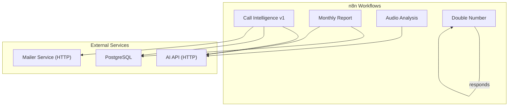
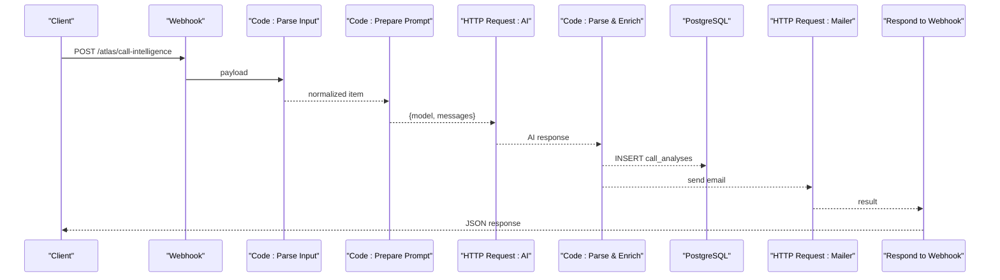
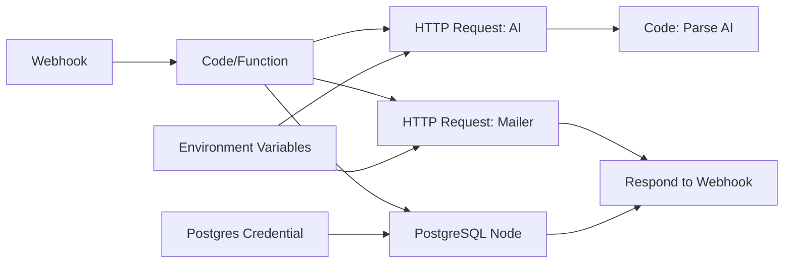
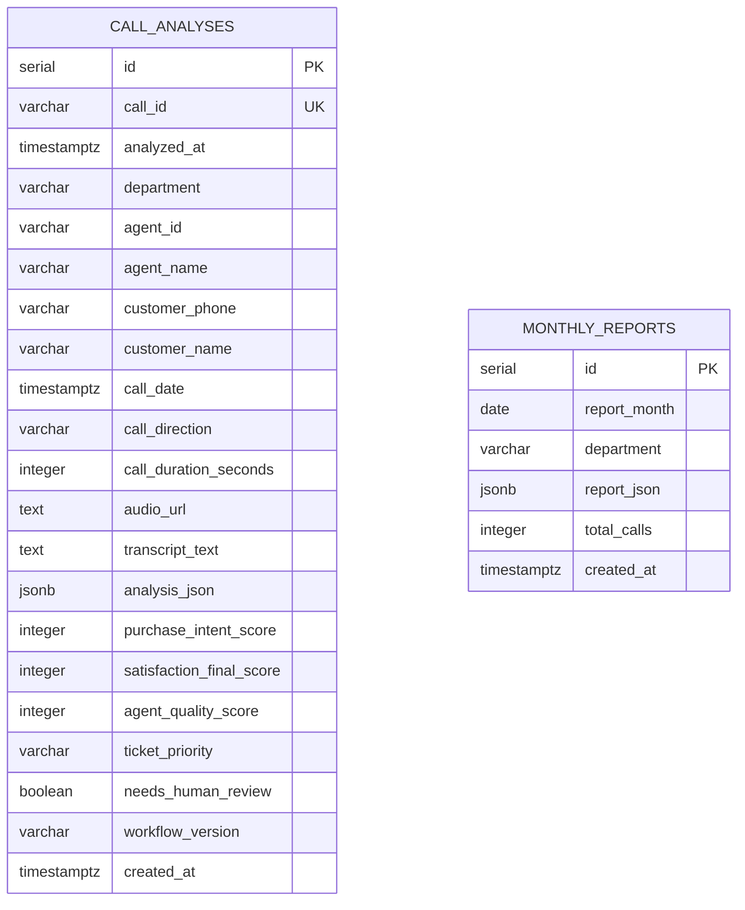

# Node Configuration

<cite>
**Referenced Files in This Document**
- [atlas-call-intelligence-v1.json](file://docker/n8n/workflows/atlas-call-intelligence-v1.json)
- [atlas-call-intelligence-monthly-report.json](file://docker/n8n/workflows/atlas-call-intelligence-monthly-report.json)
- [audio-analysis-workflow.json](file://docker/n8n/workflows/audio-analysis-workflow.json)
- [double-number-workflow.json](file://docker/n8n/workflows/double-number-workflow.json)
- [postgres.json](file://docker/n8n/credentials/postgres.json)
- [001_call_intelligence.sql](file://docker/postgres/init/001_call_intelligence.sql)
- [docker-compose.yml](file://docker/docker-compose.yml)
</cite>

## Table of Contents
1. [Introduction](#introduction)
2. [Project Structure](#project-structure)
3. [Core Components](#core-components)
4. [Architecture Overview](#architecture-overview)
5. [Detailed Component Analysis](#detailed-component-analysis)
6. [Dependency Analysis](#dependency-analysis)
7. [Performance Considerations](#performance-considerations)
8. [Troubleshooting Guide](#troubleshooting-guide)
9. [Conclusion](#conclusion)
10. [Appendices](#appendices)

## Introduction
This document provides detailed configuration guidance for the n8n nodes used across Atlas workflows, focusing on Webhook, Code (and Function), HTTP Request, PostgreSQL, and Respond to Webhook nodes. It explains parameter settings, expression syntax, data transformation patterns, error handling, retry strategies, conditional branching, and performance optimization techniques. Concrete examples are drawn from actual workflow files included in this repository.

## Project Structure
Atlas uses several n8n workflow definitions stored under docker/n8n/workflows. The primary workflows include:
- Call Intelligence v1: end-to-end call analysis pipeline with AI, database persistence, and email notifications
- Monthly Report: scheduled or webhook-triggered aggregation and reporting
- Audio Analysis: lightweight transcript summarization
- Double Number: minimal example demonstrating input parsing and response

The Postgres credentials are defined separately and referenced by workflow nodes. Database schema is initialized via SQL scripts.

**Diagram sources**
- [atlas-call-intelligence-v1.json:10-143](file://docker/n8n/workflows/atlas-call-intelligence-v1.json#L10-L143)
- [atlas-call-intelligence-monthly-report.json:10-133](file://docker/n8n/workflows/atlas-call-intelligence-monthly-report.json#L10-L133)
- [audio-analysis-workflow.json:3-78](file://docker/n8n/workflows/audio-analysis-workflow.json#L3-L78)
- [double-number-workflow.json:3-46](file://docker/n8n/workflows/double-number-workflow.json#L3-L46)
- [postgres.json:1-15](file://docker/n8n/credentials/postgres.json#L1-L15)
- [docker-compose.yml:26-61](file://docker/docker-compose.yml#L26-L61)

**Section sources**
- [atlas-call-intelligence-v1.json:1-160](file://docker/n8n/workflows/atlas-call-intelligence-v1.json#L1-L160)
- [atlas-call-intelligence-monthly-report.json:1-172](file://docker/n8n/workflows/atlas-call-intelligence-monthly-report.json#L1-L172)
- [audio-analysis-workflow.json:1-139](file://docker/n8n/workflows/audio-analysis-workflow.json#L1-L139)
- [double-number-workflow.json:1-80](file://docker/n8n/workflows/double-number-workflow.json#L1-L80)
- [postgres.json:1-15](file://docker/n8n/credentials/postgres.json#L1-L15)
- [docker-compose.yml:1-98](file://docker/docker-compose.yml#L1-L98)

## Core Components
This section summarizes the key node types and their roles in Atlas workflows.

- Webhook: Entry point that accepts inbound payloads and routes them into the workflow. Supports method selection, path configuration, and response mode options.
- Code/Function: JavaScript-based transformations for parsing inputs, building prompts, aggregating statistics, and formatting outputs.
- HTTP Request: Outbound calls to AI services and internal mailer service; supports JSON bodies, environment-driven URLs, and timeouts.
- PostgreSQL: Data persistence and retrieval using parameterized queries and credential bindings.
- Respond to Webhook: Returns structured responses back to the caller.

Key configuration highlights:
- Expressions use $json, $input, $env, and helpers for dynamic values.
- Environment variables provide runtime configuration for endpoints, models, and emails.
- Credentials are bound at the node level for secure database access.

**Section sources**
- [atlas-call-intelligence-v1.json:10-143](file://docker/n8n/workflows/atlas-call-intelligence-v1.json#L10-L143)
- [atlas-call-intelligence-monthly-report.json:10-133](file://docker/n8n/workflows/atlas-call-intelligence-monthly-report.json#L10-L133)
- [audio-analysis-workflow.json:3-78](file://docker/n8n/workflows/audio-analysis-workflow.json#L3-L78)
- [double-number-workflow.json:3-46](file://docker/n8n/workflows/double-number-workflow.json#L3-L46)
- [postgres.json:1-15](file://docker/n8n/credentials/postgres.json#L1-L15)
- [docker-compose.yml:34-54](file://docker/docker-compose.yml#L34-L54)

## Architecture Overview
The primary call intelligence workflow demonstrates a typical pattern:
- Ingest via Webhook
- Parse and validate input with Code
- Build prompt and call AI via HTTP Request
- Parse and enrich results with Code
- Persist to PostgreSQL
- Notify via HTTP Request to mailer
- Respond to Webhook

**Diagram sources**
- [atlas-call-intelligence-v1.json:10-143](file://docker/n8n/workflows/atlas-call-intelligence-v1.json#L10-L143)

**Section sources**
- [atlas-call-intelligence-v1.json:10-143](file://docker/n8n/workflows/atlas-call-intelligence-v1.json#L10-L143)

## Detailed Component Analysis

### Webhook Node
Purpose:
- Accepts inbound requests and triggers workflow execution.
- Configurable HTTP method and path.
- Response mode can be set to return immediately or wait for a downstream node.

Common parameters:
- httpMethod: GET/POST/etc.
- path: URL segment exposed by n8n.
- responseMode: controls when the response is sent.

Expression usage:
- Typically no expressions needed for basic routing; advanced cases may use dynamic paths via expressions.

Error handling:
- Invalid methods or paths will reject requests before workflow runs.
- Use downstream nodes to handle business-level validation errors.

Performance tips:
- Keep payload size small.
- Offload heavy processing to Code or external services.

Examples in repository:
- Primary call intake endpoint
- Manual trigger for monthly report
- Simple test endpoints

**Section sources**
- [atlas-call-intelligence-v1.json:10-24](file://docker/n8n/workflows/atlas-call-intelligence-v1.json#L10-L24)
- [atlas-call-intelligence-monthly-report.json:28-39](file://docker/n8n/workflows/atlas-call-intelligence-monthly-report.json#L28-L39)
- [audio-analysis-workflow.json:3-18](file://docker/n8n/workflows/audio-analysis-workflow.json#L3-L18)
- [double-number-workflow.json:3-18](file://docker/n8n/workflows/double-number-workflow.json#L3-L18)

### Code Node (JavaScript)
Purpose:
- Transform, validate, and enrich data items.
- Construct prompts for AI models.
- Aggregate metrics and format notifications.

Key capabilities:
- Access current item via $input.item.json.
- Access previous node output via $('NodeName').item.json.
- Return new items with transformed json fields.

Expression patterns observed:
- Flexible field mapping with fallbacks for varied input formats.
- Robust JSON parsing with try/catch to handle malformed LLM outputs.
- Building structured objects for downstream nodes.

Error handling:
- Throw explicit errors for invalid inputs to fail fast.
- Wrap risky operations (e.g., JSON.parse) in try/catch and mark parse errors in output.

Performance tips:
- Minimize object creation and string concatenation.
- Avoid heavy computations inside tight loops.

Examples in repository:
- Normalize incoming call payloads
- Build AI prompts with metadata and context
- Parse and validate AI responses and enrich with metadata
- Aggregate monthly statistics and build executive summaries

**Section sources**
- [atlas-call-intelligence-v1.json:25-45](file://docker/n8n/workflows/atlas-call-intelligence-v1.json#L25-L45)
- [atlas-call-intelligence-v1.json:62-72](file://docker/n8n/workflows/atlas-call-intelligence-v1.json#L62-L72)
- [atlas-call-intelligence-monthly-report.json:40-79](file://docker/n8n/workflows/atlas-call-intelligence-monthly-report.json#L40-L79)
- [atlas-call-intelligence-monthly-report.json:80-99](file://docker/n8n/workflows/atlas-call-intelligence-monthly-report.json#L80-L99)
- [audio-analysis-workflow.json:19-31](file://docker/n8n/workflows/audio-analysis-workflow.json#L19-L31)
- [double-number-workflow.json:19-31](file://docker/n8n/workflows/double-number-workflow.json#L19-L31)

### HTTP Request Node
Purpose:
- Make outbound API calls to AI services and internal tools (e.g., mailer).
- Send JSON payloads and receive structured responses.

Parameters:
- method: typically POST
- url: often built from environment variables or expressions
- sendBody/jsonBody: define request payload structure
- options: timeouts and other transport settings

Expression usage:
- Dynamic URLs via $env.* or $workflow.staticData.*
- Dynamic payloads via $json.*

Error handling:
- Network failures and non-2xx responses should be handled downstream.
- Use continueOnFail where appropriate to keep workflows resilient.

Performance tips:
- Set reasonable timeouts for long-running AI calls.
- Reuse credentials and connection pools where possible.

Examples in repository:
- AI chat completions with model and messages
- Sending manager email notifications to an internal mailer service

**Section sources**
- [atlas-call-intelligence-v1.json:47-61](file://docker/n8n/workflows/atlas-call-intelligence-v1.json#L47-L61)
- [atlas-call-intelligence-v1.json:105-120](file://docker/n8n/workflows/atlas-call-intelligence-v1.json#L105-L120)
- [audio-analysis-workflow.json:32-50](file://docker/n8n/workflows/audio-analysis-workflow.json#L32-L50)
- [docker-compose.yml:34-54](file://docker/docker-compose.yml#L34-L54)

### PostgreSQL Node
Purpose:
- Execute parameterized queries against the Atlas database.
- Store per-call analyses and monthly reports.

Parameters:
- operation: executeQuery
- query: SQL with placeholders
- options.queryReplacement: array of values bound to placeholders
- credentials: binds to a named credential entry

Expression usage:
- Values derived from upstream nodes via $json.*
- Date/time values constructed inline

Error handling:
- Enable continueOnFail for non-critical writes to avoid blocking the flow.
- Validate data before writing to reduce constraint violations.

Performance tips:
- Use batch inserts where feasible.
- Ensure indexes exist for frequent filters (already present in schema).

Examples in repository:
- Upsert call analysis records with rich JSONB payload
- Save monthly report aggregates

**Section sources**
- [atlas-call-intelligence-v1.json:73-93](file://docker/n8n/workflows/atlas-call-intelligence-v1.json#L73-L93)
- [atlas-call-intelligence-monthly-report.json:100-120](file://docker/n8n/workflows/atlas-call-intelligence-monthly-report.json#L100-L120)
- [postgres.json:1-15](file://docker/n8n/credentials/postgres.json#L1-L15)
- [001_call_intelligence.sql:4-45](file://docker/postgres/init/001_call_intelligence.sql#L4-L45)

### Respond to Webhook Node
Purpose:
- Return a JSON response to the caller of a webhook-triggered workflow.

Parameters:
- respondWith: typically json
- responseBody: expression referencing current item’s json

Expression usage:
- Compose final response shape including success flags, IDs, and optional error details.

Error handling:
- Always include success/error indicators for clients to handle gracefully.

Examples in repository:
- Final response after call analysis and email notification
- Simple echo-style responses in sample workflows

**Section sources**
- [atlas-call-intelligence-v1.json:132-143](file://docker/n8n/workflows/atlas-call-intelligence-v1.json#L132-L143)
- [audio-analysis-workflow.json:64-78](file://docker/n8n/workflows/audio-analysis-workflow.json#L64-L78)
- [double-number-workflow.json:32-46](file://docker/n8n/workflows/double-number-workflow.json#L32-L46)

## Dependency Analysis
Workflows depend on:
- Environment variables for AI endpoints and models
- Postgres credentials for database operations
- Internal mailer service for email delivery

**Diagram sources**
- [docker-compose.yml:34-54](file://docker/docker-compose.yml#L34-L54)
- [postgres.json:1-15](file://docker/n8n/credentials/postgres.json#L1-L15)
- [atlas-call-intelligence-v1.json:10-143](file://docker/n8n/workflows/atlas-call-intelligence-v1.json#L10-L143)

**Section sources**
- [docker-compose.yml:34-54](file://docker/docker-compose.yml#L34-L54)
- [postgres.json:1-15](file://docker/n8n/credentials/postgres.json#L1-L15)
- [atlas-call-intelligence-v1.json:10-143](file://docker/n8n/workflows/atlas-call-intelligence-v1.json#L10-L143)

## Performance Considerations
- Timeouts: Configure HTTP Request timeouts for AI calls to prevent hanging workflows.
- Batching: For large datasets, consider batching database writes to reduce round-trips.
- Indexing: Schema includes useful indexes for time-based and department queries.
- Expression efficiency: Prefer direct property access over complex regex replacements when possible.
- Error resilience: Use continueOnFail for non-critical steps like email notifications to maintain throughput.

[No sources needed since this section provides general guidance]

## Troubleshooting Guide

### Webhook
Symptoms:
- 404 on expected path
- Wrong HTTP method rejected

Checks:
- Verify path and method match workflow configuration.
- Confirm n8n instance is running and accessible.

**Section sources**
- [atlas-call-intelligence-v1.json:10-24](file://docker/n8n/workflows/atlas-call-intelligence-v1.json#L10-L24)
- [audio-analysis-workflow.json:3-18](file://docker/n8n/workflows/audio-analysis-workflow.json#L3-L18)
- [double-number-workflow.json:3-18](file://docker/n8n/workflows/double-number-workflow.json#L3-L18)

### Code Node
Symptoms:
- Workflow fails due to invalid input
- Malformed AI response causes parse errors

Checks:
- Ensure required fields exist with fallbacks.
- Wrap JSON.parse in try/catch and propagate parse_error flag.
- Log intermediate values using n8n logs if available.

**Section sources**
- [atlas-call-intelligence-v1.json:25-45](file://docker/n8n/workflows/atlas-call-intelligence-v1.json#L25-L45)
- [atlas-call-intelligence-v1.json:62-72](file://docker/n8n/workflows/atlas-call-intelligence-v1.json#L62-L72)
- [atlas-call-intelligence-monthly-report.json:40-79](file://docker/n8n/workflows/atlas-call-intelligence-monthly-report.json#L40-L79)

### HTTP Request Node
Symptoms:
- Timeout errors
- Non-2xx status codes
- Missing headers or auth

Checks:
- Validate environment variables for API_URL, API_KEY, and model.
- Increase timeout for long-running AI calls.
- Inspect request body and headers for correctness.

**Section sources**
- [atlas-call-intelligence-v1.json:47-61](file://docker/n8n/workflows/atlas-call-intelligence-v1.json#L47-L61)
- [atlas-call-intelligence-v1.json:105-120](file://docker/n8n/workflows/atlas-call-intelligence-v1.json#L105-L120)
- [audio-analysis-workflow.json:32-50](file://docker/n8n/workflows/audio-analysis-workflow.json#L32-L50)
- [docker-compose.yml:34-54](file://docker/docker-compose.yml#L34-L54)

### PostgreSQL Node
Symptoms:
- Query errors due to missing columns or types
- Duplicate key conflicts

Checks:
- Confirm schema matches queries (call_analyses, monthly_reports).
- Use parameterized queries to avoid injection and type issues.
- Handle unique constraints with upsert logic.

**Section sources**
- [atlas-call-intelligence-v1.json:73-93](file://docker/n8n/workflows/atlas-call-intelligence-v1.json#L73-L93)
- [atlas-call-intelligence-monthly-report.json:100-120](file://docker/n8n/workflows/atlas-call-intelligence-monthly-report.json#L100-L120)
- [001_call_intelligence.sql:4-45](file://docker/postgres/init/001_call_intelligence.sql#L4-L45)

### Respond to Webhook Node
Symptoms:
- Empty or malformed response
- Missing success/error fields

Checks:
- Ensure responseBody references a valid item with expected shape.
- Include success flags and error details for client handling.

**Section sources**
- [atlas-call-intelligence-v1.json:132-143](file://docker/n8n/workflows/atlas-call-intelligence-v1.json#L132-L143)
- [audio-analysis-workflow.json:64-78](file://docker/n8n/workflows/audio-analysis-workflow.json#L64-L78)
- [double-number-workflow.json:32-46](file://docker/n8n/workflows/double-number-workflow.json#L32-L46)

## Conclusion
Atlas workflows demonstrate robust patterns for ingesting data via Webhooks, transforming it with Code, calling AI services through HTTP Request, persisting results with PostgreSQL, and notifying stakeholders via email. They incorporate practical error handling, environment-driven configuration, and performance-conscious design. By following the guidelines and troubleshooting steps outlined here, you can extend and optimize these workflows for additional use cases while maintaining reliability and clarity.

[No sources needed since this section summarizes without analyzing specific files]

## Appendices

### Data Models

**Diagram sources**
- [001_call_intelligence.sql:4-45](file://docker/postgres/init/001_call_intelligence.sql#L4-L45)

### Example Workflows Overview
- Call Intelligence v1: End-to-end call analysis with AI, DB storage, and email notification
- Monthly Report: Scheduled or manual generation of aggregated insights
- Audio Analysis: Lightweight transcript summarization
- Double Number: Minimal example for testing webhook and code nodes

**Section sources**
- [atlas-call-intelligence-v1.json:1-160](file://docker/n8n/workflows/atlas-call-intelligence-v1.json#L1-L160)
- [atlas-call-intelligence-monthly-report.json:1-172](file://docker/n8n/workflows/atlas-call-intelligence-monthly-report.json#L1-L172)
- [audio-analysis-workflow.json:1-139](file://docker/n8n/workflows/audio-analysis-workflow.json#L1-L139)
- [double-number-workflow.json:1-80](file://docker/n8n/workflows/double-number-workflow.json#L1-L80)