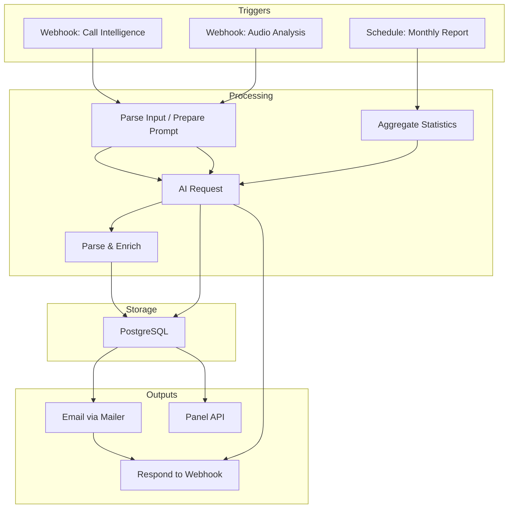
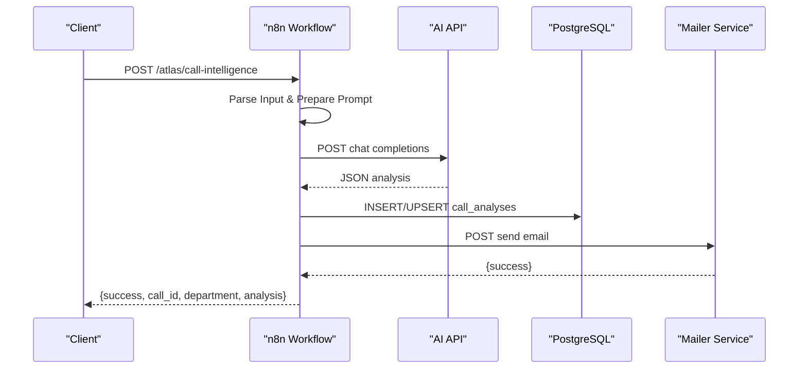
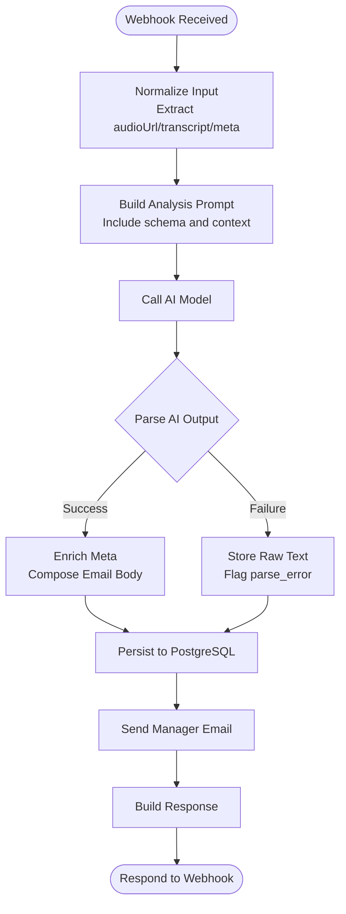
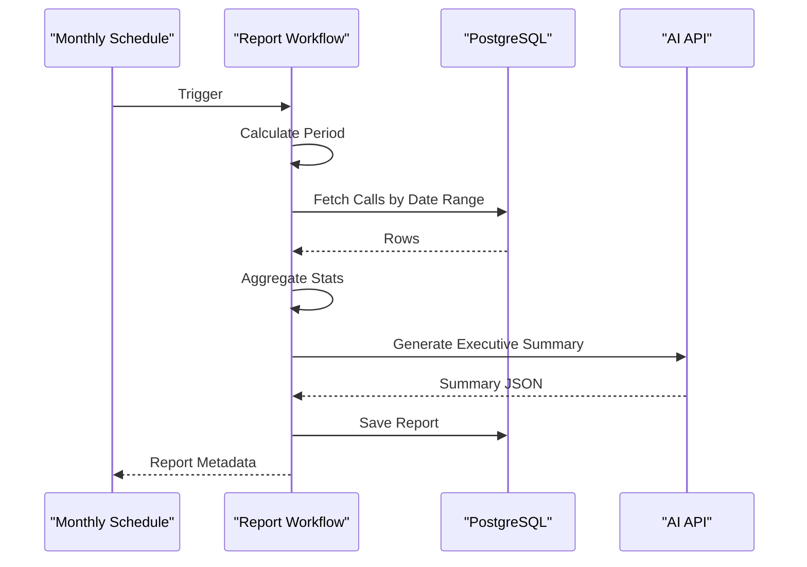
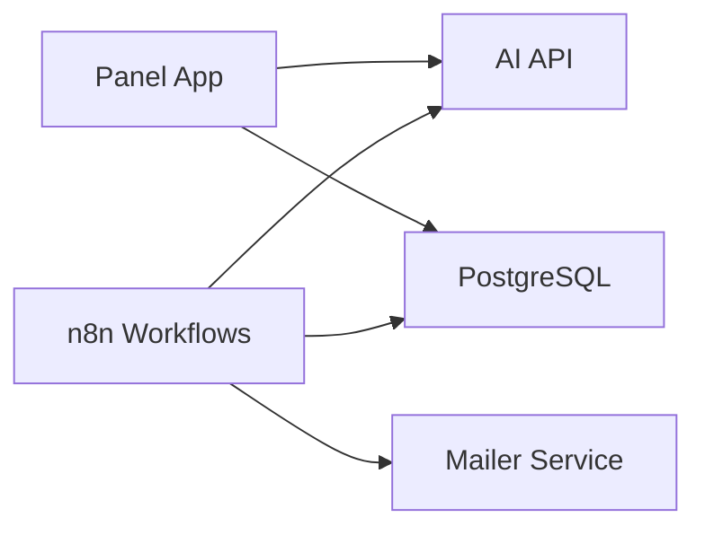

# Workflow Automation

<cite>
**Referenced Files in This Document**
- [atlas-call-intelligence-v1.json](file://docker/n8n/workflows/atlas-call-intelligence-v1.json)
- [audio-analysis-workflow.json](file://docker/n8n/workflows/audio-analysis-workflow.json)
- [atlas-call-intelligence-monthly-report.json](file://docker/n8n/workflows/atlas-call-intelligence-monthly-report.json)
- [double-number-workflow.json](file://docker/n8n/workflows/double-number-workflow.json)
- [001_call_intelligence.sql](file://docker/postgres/init/001_call_intelligence.sql)
- [postgres.json](file://docker/n8n/credentials/postgres.json)
- [docker-compose.yml](file://docker/docker-compose.yml)
- [mailer.py](file://docker/mailer/mailer.py)
- [main.py](file://docker/panel/app/main.py)
- [send-real-call-analysis.py](file://docker/scripts/send-real-call-analysis.py)
</cite>

## Table of Contents
1. [Introduction](#introduction)
2. [Project Structure](#project-structure)
3. [Core Components](#core-components)
4. [Architecture Overview](#architecture-overview)
5. [Detailed Component Analysis](#detailed-component-analysis)
6. [Dependency Analysis](#dependency-analysis)
7. [Performance Considerations](#performance-considerations)
8. [Troubleshooting Guide](#troubleshooting-guide)
9. [Conclusion](#conclusion)
10. [Appendices](#appendices)

## Introduction
This document explains the n8n-based workflow automation system for call processing pipelines and business logic execution. It covers how workflows are created, configured, triggered, and how data is transformed across nodes to produce actionable insights from call transcripts and audio. The system integrates with AI models for analysis, a PostgreSQL database for persistence, an email service for notifications, and a web panel for visualization. Concrete examples are drawn from actual workflow files that implement call analysis, audio processing, and monthly report generation. Configuration options for AI model integration, error handling, and retry strategies are documented, along with debugging techniques, monitoring approaches, and performance optimization guidance.

## Project Structure
The project organizes workflows, credentials, database schema, services, and scripts under docker directories:
- Workflows: JSON definitions for n8n workflows (call intelligence, audio analysis, monthly reports, simple utilities).
- Credentials: Database connection configuration for n8n.
- Database: PostgreSQL initialization scripts defining tables and seed data.
- Services: n8n runtime, mailer HTTP service, and a FastAPI panel application.
- Scripts: Standalone Python tools for testing and sending real call analyses.

**Diagram sources**
- [atlas-call-intelligence-v1.json:10-155](file://docker/n8n/workflows/atlas-call-intelligence-v1.json#L10-L155)
- [audio-analysis-workflow.json:3-125](file://docker/n8n/workflows/audio-analysis-workflow.json#L3-L125)
- [atlas-call-intelligence-monthly-report.json:11-160](file://docker/n8n/workflows/atlas-call-intelligence-monthly-report.json#L11-L160)
- [001_call_intelligence.sql:4-45](file://docker/postgres/init/001_call_intelligence.sql#L4-L45)
- [mailer.py:36-68](file://docker/mailer/mailer.py#L36-L68)
- [main.py:166-170](file://docker/panel/app/main.py#L166-L170)

**Section sources**
- [docker-compose.yml:26-61](file://docker/docker-compose.yml#L26-L61)
- [postgres.json:1-15](file://docker/n8n/credentials/postgres.json#L1-L15)
- [001_call_intelligence.sql:1-45](file://docker/postgres/init/001_call_intelligence.sql#L1-L45)

## Core Components
- Call Intelligence Workflow: Ingests call metadata and transcript or audio URL, builds an analysis prompt, calls an AI endpoint, parses and validates results, persists to PostgreSQL, sends manager email, and responds to the webhook.
- Audio Analysis Workflow: A simpler flow that prepares a prompt from a transcript, calls an AI endpoint, formats the response, and returns it.
- Monthly Report Workflow: Scheduled and manually triggerable; computes period, fetches calls, aggregates statistics by department and agent, generates an executive summary via AI, saves the report, and exposes a manual webhook response.
- Utility Workflow: Demonstrates basic input validation and transformation using a code node.

Key capabilities:
- Trigger setup via webhooks and cron schedules.
- Data transformation through code/function nodes.
- External integrations via HTTP requests (AI APIs, mailer).
- Persistence via PostgreSQL with upsert semantics.
- Error handling flags and optional continuation on failure.

**Section sources**
- [atlas-call-intelligence-v1.json:10-155](file://docker/n8n/workflows/atlas-call-intelligence-v1.json#L10-L155)
- [audio-analysis-workflow.json:3-125](file://docker/n8n/workflows/audio-analysis-workflow.json#L3-L125)
- [atlas-call-intelligence-monthly-report.json:11-160](file://docker/n8n/workflows/atlas-call-intelligence-monthly-report.json#L11-L160)
- [double-number-workflow.json:4-79](file://docker/n8n/workflows/double-number-workflow.json#L4-L79)

## Architecture Overview
The system orchestrates call analytics through n8n workflows that:
- Accept inputs via webhooks or schedules.
- Transform and enrich data using code/function nodes.
- Invoke AI models over HTTP for analysis and summarization.
- Persist structured results into PostgreSQL.
- Notify managers via an HTTP mailer service.
- Expose endpoints consumed by a web panel.

**Diagram sources**
- [atlas-call-intelligence-v1.json:10-155](file://docker/n8n/workflows/atlas-call-intelligence-v1.json#L10-L155)
- [mailer.py:36-68](file://docker/mailer/mailer.py#L36-L68)
- [001_call_intelligence.sql:4-45](file://docker/postgres/init/001_call_intelligence.sql#L4-L45)

## Detailed Component Analysis

### Call Intelligence Workflow
End-to-end flow:
- Webhook receives payload with audio URL or transcript and metadata.
- Code node normalizes fields and constructs metadata.
- Function node builds a detailed analysis prompt including context and schema constraints.
- HTTP request invokes AI model with model name and messages.
- Code node parses AI output, enforces schema, enriches meta, and composes email body.
- PostgreSQL node persists analysis with upsert on call_id.
- Optional email notification via mailer.
- Respond to webhook with result status and enriched data.

Configuration highlights:
- AI model selection via environment variable; default model specified in workflow.
- Manager email address via environment variable.
- Database credentials stored in n8n credentials file.

Error handling:
- Validation errors thrown early if required fields are missing.
- Database operation marked to continue on failure to avoid blocking downstream steps.
- Email sending marked to continue on failure; final response includes email success flag.

**Diagram sources**
- [atlas-call-intelligence-v1.json:10-155](file://docker/n8n/workflows/atlas-call-intelligence-v1.json#L10-L155)

**Section sources**
- [atlas-call-intelligence-v1.json:10-155](file://docker/n8n/workflows/atlas-call-intelligence-v1.json#L10-L155)
- [postgres.json:1-15](file://docker/n8n/credentials/postgres.json#L1-L15)
- [docker-compose.yml:34-51](file://docker/docker-compose.yml#L34-L51)

### Audio Analysis Workflow
Simplified pipeline:
- Webhook triggers with transcript.
- Function node prepares a concise prompt for categorization and key takeaways.
- HTTP request calls AI model.
- Function node formats diverse response shapes into a unified structure.
- Respond to webhook with analysis.

Use cases:
- Quick transcription summaries.
- Category detection for routing or tagging.

**Section sources**
- [audio-analysis-workflow.json:3-125](file://docker/n8n/workflows/audio-analysis-workflow.json#L3-L125)

### Monthly Report Workflow
Scheduled and manual triggers:
- Cron runs monthly at a fixed hour.
- Manual webhook allows ad-hoc report generation.
- Calculate report period based on current date or provided parameters.
- Fetch calls within the period from PostgreSQL.
- Aggregate statistics by department and agent, compute averages and counts.
- Generate executive summary via AI with structured prompt.
- Build final report JSON and compose email body.
- Save report to monthly_reports table.
- Respond to manual webhook with report details.

**Diagram sources**
- [atlas-call-intelligence-monthly-report.json:11-160](file://docker/n8n/workflows/atlas-call-intelligence-monthly-report.json#L11-L160)
- [001_call_intelligence.sql:34-45](file://docker/postgres/init/001_call_intelligence.sql#L34-L45)

**Section sources**
- [atlas-call-intelligence-monthly-report.json:11-160](file://docker/n8n/workflows/atlas-call-intelligence-monthly-report.json#L11-L160)

### Utility Workflow: Double Number
Demonstrates minimal workflow:
- Webhook accepts a number.
- Code node validates and doubles it.
- Responds with original and result.

Use case:
- Testing webhook connectivity and code node behavior.

**Section sources**
- [double-number-workflow.json:4-79](file://docker/n8n/workflows/double-number-workflow.json#L4-L79)

## Dependency Analysis
External dependencies and integration points:
- AI API: Configured via environment variables; invoked via HTTP requests in multiple workflows.
- PostgreSQL: Used for persistent storage of call analyses and monthly reports; credentials defined in n8n credentials file.
- Mailer Service: HTTP server exposing /send endpoint; used to send emails via SMTP.
- Panel Application: FastAPI app providing dashboards and APIs to view call data and generate insights.

**Diagram sources**
- [docker-compose.yml:26-98](file://docker/docker-compose.yml#L26-L98)
- [postgres.json:1-15](file://docker/n8n/credentials/postgres.json#L1-L15)
- [mailer.py:36-68](file://docker/mailer/mailer.py#L36-L68)
- [main.py:166-170](file://docker/panel/app/main.py#L166-L170)

**Section sources**
- [docker-compose.yml:26-98](file://docker/docker-compose.yml#L26-L98)
- [postgres.json:1-15](file://docker/n8n/credentials/postgres.json#L1-L15)
- [mailer.py:36-68](file://docker/mailer/mailer.py#L36-L68)
- [main.py:166-170](file://docker/panel/app/main.py#L166-L170)

## Performance Considerations
- Batch processing: Use function/code nodes to aggregate large datasets before calling AI to reduce token usage and latency.
- Caching: Cache frequent prompts or responses where appropriate to minimize redundant AI calls.
- Timeouts: Configure HTTP timeouts for external calls to prevent hanging executions.
- Indexing: Ensure database indexes support common queries (e.g., by date ranges and departments).
- Concurrency: Limit concurrent workflow executions to avoid overwhelming AI APIs or databases.
- Model selection: Choose smaller or faster models for high-volume tasks; reserve larger models for complex analysis.

[No sources needed since this section provides general guidance]

## Troubleshooting Guide
Common issues and resolutions:
- Invalid input: Ensure required fields like transcript or audio URL are present; workflows throw explicit errors when missing.
- AI parsing failures: Workflows attempt to strip markdown and parse JSON; fallback stores raw text and flags parse errors.
- Database write failures: Marked to continue on failure; check logs and credentials if inserts fail.
- Email delivery failures: Continue on failure; verify SMTP settings and mailer service availability.
- Environment variables: Confirm API_URL, API_KEY, AI_MODEL, and ATLAS_MANAGER_EMAIL are set correctly in n8n container.

Debugging techniques:
- Inspect node outputs in n8n UI to validate transformations.
- Test webhooks directly with sample payloads.
- Validate SQL queries against the database schema.
- Check mailer logs for SMTP errors.
- Use panel APIs to verify persisted data and generated reports.

**Section sources**
- [atlas-call-intelligence-v1.json:25-120](file://docker/n8n/workflows/atlas-call-intelligence-v1.json#L25-L120)
- [atlas-call-intelligence-monthly-report.json:40-120](file://docker/n8n/workflows/atlas-call-intelligence-monthly-report.json#L40-L120)
- [mailer.py:36-68](file://docker/mailer/mailer.py#L36-L68)
- [docker-compose.yml:34-51](file://docker/docker-compose.yml#L34-L51)

## Conclusion
The n8n workflow automation system provides a robust pipeline for call analysis, audio processing, and monthly reporting. It combines flexible triggers, powerful data transformation, AI-driven insights, reliable persistence, and actionable notifications. By following the configuration guidelines and troubleshooting steps outlined here, workflow designers can create effective automations while developers can extend capabilities with confidence.

[No sources needed since this section summarizes without analyzing specific files]

## Appendices

### Example: Real Call Analysis Script
A standalone script demonstrates deep Persian call analysis using an AI model and email delivery:
- Reads a transcript file.
- Builds a comprehensive prompt for analysis.
- Calls the AI API and parses JSON output.
- Composes a detailed email and sends it via the mailer service.

This script complements the n8n workflows by enabling offline or batch analysis scenarios.

**Section sources**
- [send-real-call-analysis.py:17-96](file://docker/scripts/send-real-call-analysis.py#L17-L96)
- [send-real-call-analysis.py:98-196](file://docker/scripts/send-real-call-analysis.py#L98-L196)