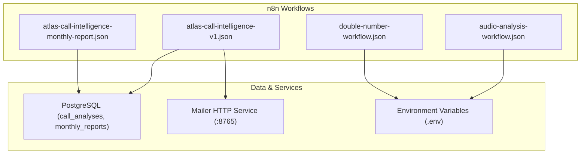
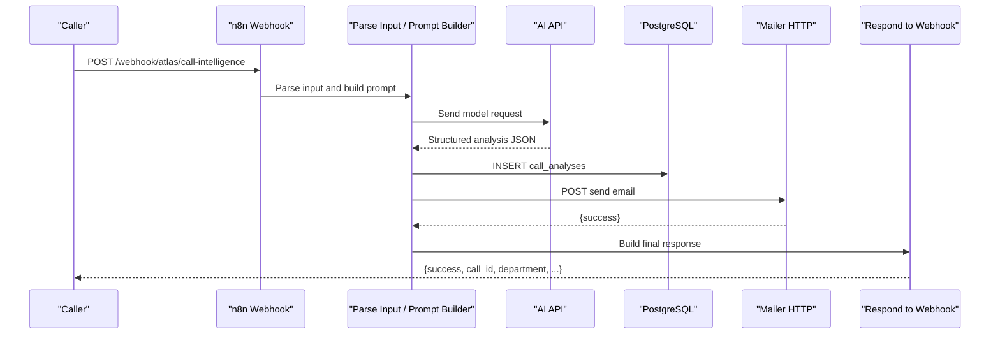
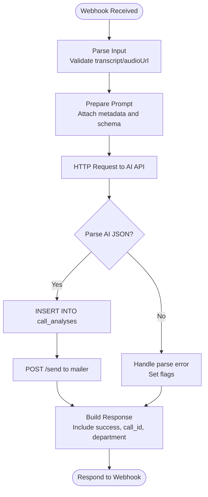
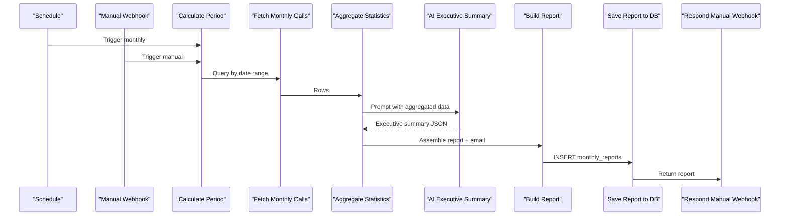
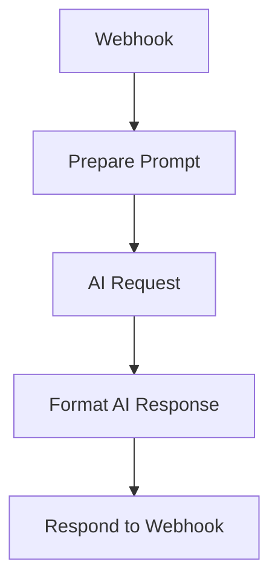
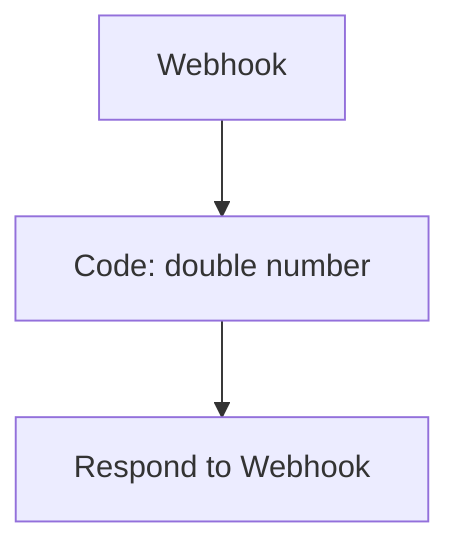
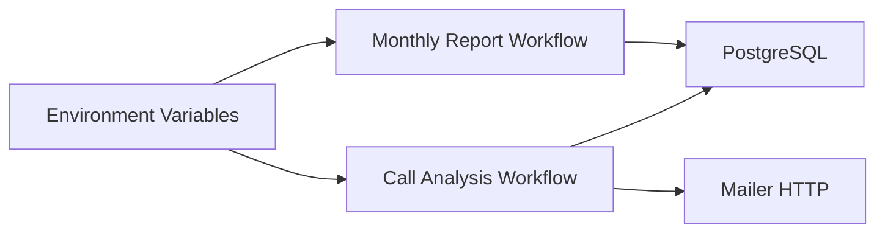

# Workflow Creation

<cite>
**Referenced Files in This Document**
- [atlas-call-intelligence-v1.json](file://docker/n8n/workflows/atlas-call-intelligence-v1.json)
- [atlas-call-intelligence-monthly-report.json](file://docker/n8n/workflows/atlas-call-intelligence-monthly-report.json)
- [audio-analysis-workflow.json](file://docker/n8n/workflows/audio-analysis-workflow.json)
- [double-number-workflow.json](file://docker/n8n/workflows/double-number-workflow.json)
- [double-number-export.json](file://docker/n8n/workflows/double-number-export.json)
- [README.md](file://03_Products/Atlas Call Intelligence/V1/README.md)
- [schema.json](file://03_Products/Atlas Call Intelligence/V1/schema.json)
- [001_call_intelligence.sql](file://docker/postgres/init/001_call_intelligence.sql)
- [docker-compose.yml](file://docker/docker-compose.yml)
- [mailer.py](file://docker/mailer/mailer.py)
</cite>

## Table of Contents
1. Introduction
2. Project Structure
3. Core Components
4. Architecture Overview
5. Detailed Component Analysis
6. Dependency Analysis
7. Performance Considerations
8. Troubleshooting Guide
9. Conclusion
10. Appendices

## Introduction
This document explains how to create and maintain n8n workflows for the Atlas Call Intelligence system, focusing on call processing pipelines and business logic automation. It covers workflow structure, node types, connection patterns, webhook configuration, data flow between nodes, and end-to-end examples for building a basic call analysis pipeline that includes input parsing, AI processing, database storage, and email notification. It also documents workflow settings, execution order, tags, versioning, and best practices for organization and naming.

## Project Structure
The repository provides production-ready n8n workflow definitions under docker/n8n/workflows, a product specification and schema under 03_Products/Atlas Call Intelligence/V1, database schema under docker/postgres/init, and environment orchestration via docker/docker-compose.yml. The mailer service is implemented as a small HTTP server in docker/mailer.

**Diagram sources**
- [atlas-call-intelligence-v1.json:1-160](file://docker/n8n/workflows/atlas-call-intelligence-v1.json#L1-L160)
- [atlas-call-intelligence-monthly-report.json:1-172](file://docker/n8n/workflows/atlas-call-intelligence-monthly-report.json#L1-L172)
- [audio-analysis-workflow.json:1-139](file://docker/n8n/workflows/audio-analysis-workflow.json#L1-L139)
- [double-number-workflow.json:1-80](file://docker/n8n/workflows/double-number-workflow.json#L1-L80)
- [001_call_intelligence.sql:1-45](file://docker/postgres/init/001_call_intelligence.sql#L1-L45)
- [docker-compose.yml:26-57](file://docker/docker-compose.yml#L26-L57)
- [mailer.py:1-77](file://docker/mailer/mailer.py#L1-L77)

**Section sources**
- [docker-compose.yml:26-57](file://docker/docker-compose.yml#L26-L57)
- [001_call_intelligence.sql:1-45](file://docker/postgres/init/001_call_intelligence.sql#L1-L45)

## Core Components
- Webhook triggers: Accept inbound calls or manual report requests.
- Code/Function nodes: Parse inputs, build prompts, aggregate statistics, format responses.
- HTTP Request nodes: Call AI models and external services (e.g., mailer).
- Database nodes: Persist call analyses and monthly reports to PostgreSQL.
- Respond nodes: Return structured JSON back to callers.
- Schedule trigger: Run monthly reporting automatically.

Key workflow files:
- Real-time call analysis pipeline: [atlas-call-intelligence-v1.json](file://docker/n8n/workflows/atlas-call-intelligence-v1.json)
- Monthly reporting pipeline: [atlas-call-intelligence-monthly-report.json](file://docker/n8n/workflows/atlas-call-intelligence-monthly-report.json)
- Simple audio analysis example: [audio-analysis-workflow.json](file://docker/n8n/workflows/audio-analysis-workflow.json)
- Minimal code-only example: [double-number-workflow.json](file://docker/n8n/workflows/double-number-workflow.json)

**Section sources**
- [atlas-call-intelligence-v1.json:1-160](file://docker/n8n/workflows/atlas-call-intelligence-v1.json#L1-L160)
- [atlas-call-intelligence-monthly-report.json:1-172](file://docker/n8n/workflows/atlas-call-intelligence-monthly-report.json#L1-L172)
- [audio-analysis-workflow.json:1-139](file://docker/n8n/workflows/audio-analysis-workflow.json#L1-L139)
- [double-number-workflow.json:1-80](file://docker/n8n/workflows/double-number-workflow.json#L1-L80)

## Architecture Overview
The system ingests call metadata and transcripts via webhooks, enriches them with AI-driven insights, persists results to PostgreSQL, and optionally notifies managers via email. A separate monthly report workflow aggregates historical data and generates executive summaries.

**Diagram sources**
- [atlas-call-intelligence-v1.json:1-160](file://docker/n8n/workflows/atlas-call-intelligence-v1.json#L1-L160)
- [mailer.py:1-77](file://docker/mailer/mailer.py#L1-L77)
- [001_call_intelligence.sql:1-45](file://docker/postgres/init/001_call_intelligence.sql#L1-L45)

## Detailed Component Analysis

### Real-Time Call Analysis Pipeline
This workflow processes incoming call data, builds an AI prompt, stores results, and sends manager notifications.

- Trigger: Webhook at path atlas/call-intelligence
- Data parsing: Extracts audio URL, transcript, and metadata; validates required fields
- Prompt preparation: Builds a strict JSON schema prompt for the AI model
- AI request: Calls configured AI endpoint using environment variables
- Validation and enrichment: Parses AI output, normalizes fields, sets defaults
- Storage: Inserts into call_analyses table with upsert behavior
- Notification: Sends email via local mailer HTTP service
- Response: Returns structured result including success flags and analysis summary

**Diagram sources**
- [atlas-call-intelligence-v1.json:1-160](file://docker/n8n/workflows/atlas-call-intelligence-v1.json#L1-L160)

**Section sources**
- [atlas-call-intelligence-v1.json:1-160](file://docker/n8n/workflows/atlas-call-intelligence-v1.json#L1-L160)
- [001_call_intelligence.sql:1-45](file://docker/postgres/init/001_call_intelligence.sql#L1-L45)
- [mailer.py:1-77](file://docker/mailer/mailer.py#L1-L77)

### Monthly Reporting Pipeline
This workflow computes monthly statistics from stored call analyses, generates an AI-powered executive summary, saves the report, and responds to manual triggers.

- Triggers: Cron schedule (monthly) and manual webhook
- Period calculation: Determines start/end dates based on year/month or defaults to previous month
- Data fetch: Queries call_analyses within the period
- Aggregation: Computes per-department and per-agent metrics
- AI summary: Requests executive summary in Persian using aggregated data
- Report build: Assembles structured report and email body
- Storage: Saves monthly_reports record
- Response: Returns report payload

**Diagram sources**
- [atlas-call-intelligence-monthly-report.json:1-172](file://docker/n8n/workflows/atlas-call-intelligence-monthly-report.json#L1-L172)

**Section sources**
- [atlas-call-intelligence-monthly-report.json:1-172](file://docker/n8n/workflows/atlas-call-intelligence-monthly-report.json#L1-L172)
- [001_call_intelligence.sql:1-45](file://docker/postgres/init/001_call_intelligence.sql#L1-L45)

### Audio Analysis Example
A minimal workflow demonstrating transcription-based analysis with a simple function node and HTTP request.

- Webhook receives transcript
- Function builds a concise prompt
- HTTP request calls AI endpoint
- Function formats response
- Respond returns result

**Diagram sources**
- [audio-analysis-workflow.json:1-139](file://docker/n8n/workflows/audio-analysis-workflow.json#L1-L139)

**Section sources**
- [audio-analysis-workflow.json:1-139](file://docker/n8n/workflows/audio-analysis-workflow.json#L1-L139)

### Minimal Code Example
Shows a simple transformation using a Code node and immediate response.

- Webhook receives number
- Code doubles it
- Respond returns result

**Diagram sources**
- [double-number-workflow.json:1-80](file://docker/n8n/workflows/double-number-workflow.json#L1-L80)

**Section sources**
- [double-number-workflow.json:1-80](file://docker/n8n/workflows/double-number-workflow.json#L1-L80)

## Dependency Analysis
Workflows depend on:
- Environment variables for AI endpoints and credentials
- PostgreSQL for persistent storage
- Mailer HTTP service for email delivery
- Optional static data for local development

**Diagram sources**
- [docker-compose.yml:34-50](file://docker/docker-compose.yml#L34-L50)
- [atlas-call-intelligence-v1.json:1-160](file://docker/n8n/workflows/atlas-call-intelligence-v1.json#L1-L160)
- [atlas-call-intelligence-monthly-report.json:1-172](file://docker/n8n/workflows/atlas-call-intelligence-monthly-report.json#L1-L172)
- [mailer.py:1-77](file://docker/mailer/mailer.py#L1-L77)

**Section sources**
- [docker-compose.yml:34-50](file://docker/docker-compose.yml#L34-L50)

## Performance Considerations
- Use parameterized queries and indexes already defined in the schema to optimize reads/writes.
- Keep AI payloads minimal; pass only necessary context to reduce latency and cost.
- Enable continueOnFail on non-critical steps (e.g., email) to avoid blocking core flows.
- Batch operations where possible; for monthly reports, aggregate before sending to AI to minimize calls.
- Tune timeouts for external services to prevent long-running hangs.

[No sources needed since this section provides general guidance]

## Troubleshooting Guide
Common issues and resolutions:
- Missing transcript/audioUrl: Ensure at least one is provided; validation will fail otherwise.
- AI parse errors: If the model returns unexpected text, the workflow handles parse failures and flags them; check raw_text in analysis.
- Database write failures: The workflow marks continueOnFail; verify credentials and connectivity.
- Email delivery failures: Check SMTP configuration and ensure ATLAS_MANAGER_EMAIL is set; review mailer logs.
- Timezone issues: Ensure GENERIC_TIMEZONE and TZ are set correctly for scheduling.

**Section sources**
- [atlas-call-intelligence-v1.json:1-160](file://docker/n8n/workflows/atlas-call-intelligence-v1.json#L1-L160)
- [mailer.py:1-77](file://docker/mailer/mailer.py#L1-L77)
- [docker-compose.yml:34-50](file://docker/docker-compose.yml#L34-L50)

## Conclusion
The Atlas Call Intelligence workflows demonstrate a robust pattern for building call processing pipelines in n8n: ingest via webhooks, transform with code/function nodes, integrate AI for insight generation, persist to PostgreSQL, and notify stakeholders via email. The monthly reporting workflow shows how to aggregate historical data and produce actionable summaries. By following the documented structure, naming conventions, and best practices, teams can extend these workflows to support additional integrations and analytics while maintaining clarity and reliability.

[No sources needed since this section summarizes without analyzing specific files]

## Appendices

### How to Create a New Workflow from Scratch
- Start with a Webhook node to accept input.
- Add a Code or Function node to parse and validate inputs.
- Insert an HTTP Request node to call your AI model or other services.
- Add a Database node to store results.
- Optionally add another HTTP Request to send notifications.
- Finish with a Respond node to return structured output.
- Set executionOrder to v1 and add descriptive tags.

**Section sources**
- [atlas-call-intelligence-v1.json:1-160](file://docker/n8n/workflows/atlas-call-intelligence-v1.json#L1-L160)
- [atlas-call-intelligence-monthly-report.json:1-172](file://docker/n8n/workflows/atlas-call-intelligence-monthly-report.json#L1-L172)

### Configure Webhook Triggers
- Define method (GET/POST), path, and response mode.
- For real-time processing, use responseNode to return immediately after completion.
- For batch jobs, combine with ScheduleTrigger or manual webhook.

**Section sources**
- [atlas-call-intelligence-v1.json:1-160](file://docker/n8n/workflows/atlas-call-intelligence-v1.json#L1-L160)
- [atlas-call-intelligence-monthly-report.json:1-172](file://docker/n8n/workflows/atlas-call-intelligence-monthly-report.json#L1-L172)

### Set Up Data Flow Between Nodes
- Pass JSON objects through $input.item.json and $json references.
- Use runOnceForEachItem for item-level transformations.
- Map fields carefully when inserting into PostgreSQL using queryReplacement.

**Section sources**
- [atlas-call-intelligence-v1.json:1-160](file://docker/n8n/workflows/atlas-call-intelligence-v1.json#L1-L160)
- [atlas-call-intelligence-monthly-report.json:1-172](file://docker/n8n/workflows/atlas-call-intelligence-monthly-report.json#L1-L172)

### Step-by-Step: Basic Call Analysis Workflow
- Ingest: POST to webhook with audioUrl or transcript plus metadata.
- Parse: Normalize fields and validate presence of required data.
- Prompt: Build a strict JSON schema prompt for the AI model.
- AI: Call the configured endpoint and parse the response.
- Store: Insert into call_analyses with upsert semantics.
- Notify: Send email via mailer HTTP service.
- Respond: Return success, call_id, department, and summary.

**Section sources**
- [atlas-call-intelligence-v1.json:1-160](file://docker/n8n/workflows/atlas-call-intelligence-v1.json#L1-L160)
- [001_call_intelligence.sql:1-45](file://docker/postgres/init/001_call_intelligence.sql#L1-L45)
- [mailer.py:1-77](file://docker/mailer/mailer.py#L1-L77)

### Workflow Settings, Execution Order, Tags, Versioning
- executionOrder: v1 ensures consistent node execution sequencing.
- tags: Group workflows by domain (e.g., atlas, call-intelligence, monthly-report).
- versioning: Maintain workflow_version in outputs and consider exporting versions for auditability.

**Section sources**
- [atlas-call-intelligence-v1.json:1-160](file://docker/n8n/workflows/atlas-call-intelligence-v1.json#L1-L160)
- [atlas-call-intelligence-monthly-report.json:1-172](file://docker/n8n/workflows/atlas-call-intelligence-monthly-report.json#L1-L172)
- [double-number-export.json:1-1](file://docker/n8n/workflows/double-number-export.json#L1-L1)

### Organization and Naming Conventions
- Name workflows descriptively (e.g., “Atlas Call Intelligence v1”).
- Use consistent paths for webhooks (e.g., atlas/call-intelligence).
- Tag workflows by product and purpose for discoverability.
- Keep schemas stable; reference schema.json for output contracts.

**Section sources**
- [atlas-call-intelligence-v1.json:1-160](file://docker/n8n/workflows/atlas-call-intelligence-v1.json#L1-L160)
- [schema.json:1-153](file://03_Products/Atlas Call Intelligence/V1/schema.json#L1-L153)

### Best Practices for Maintainable Pipelines
- Validate inputs early and fail fast with clear errors.
- Centralize environment variables for endpoints and credentials.
- Use continueOnFail for non-critical side effects like email.
- Keep AI prompts focused and schema-constrained.
- Index frequently queried columns in PostgreSQL.
- Log key events and include workflow_version in outputs for traceability.

**Section sources**
- [docker-compose.yml:34-50](file://docker/docker-compose.yml#L34-L50)
- [001_call_intelligence.sql:1-45](file://docker/postgres/init/001_call_intelligence.sql#L1-L45)
- [atlas-call-intelligence-v1.json:1-160](file://docker/n8n/workflows/atlas-call-intelligence-v1.json#L1-L160)